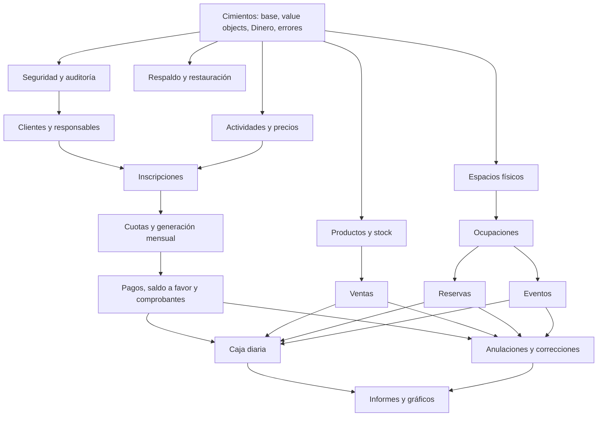

# 🏟️ Sistema de Gestión — Complejo Deportivo

> Sistema web para reemplazar el papel y lapicera en la administración diaria del complejo:
> clientes, actividades, cuotas, pagos, ventas, reservas, eventos, caja diaria, informes,
> seguridad y respaldo.

<p>
  
  
  
  
</p>

---

## 📑 Tabla de contenidos
1. [Qué es este sistema](#1-qué-es-este-sistema)
2. [Documentos del proyecto (fuente de verdad)](#2-documentos-del-proyecto-fuente-de-verdad)
3. [Reglas de oro de arquitectura](#3-reglas-de-oro-de-arquitectura)
4. [Arquitectura y estructura del proyecto](#4-arquitectura-y-estructura-del-proyecto)
5. [Modelo de dominio en una página](#5-modelo-de-dominio-en-una-página)
6. [Mapa de dependencias entre módulos](#6-mapa-de-dependencias-entre-módulos)
7. [Tecnologías](#7-tecnologías)
8. [Hoja de ruta — 16 semanas](#8-hoja-de-ruta--16-semanas)
9. [Criterios de aceptación de la Versión 1.0](#9-criterios-de-aceptación-de-la-versión-10)
10. [Después de la 1.0](#10-después-de-la-10)
11. [Qué cambió respecto al README anterior](#11-qué-cambió-respecto-al-readme-anterior)
---

## 1. Qué es este sistema
El complejo se administra hoy con papel y lapicera, y eso genera problemas concretos:
no se sabe con certeza quién pagó, quién debe ni qué mes debe, se pierde información,
hay errores en las cuentas, no hay historial confiable de pagos ni de ventas, y no hay
forma rápida de saber cuánto ingresó cada día ni por qué área.

El objetivo de la **Versión 1.0** es resolver todo eso con una herramienta web **ordenada,
segura y fácil de usar** para personas sin experiencia técnica.

**Áreas del complejo que cubre el sistema:**

| Espacio físico | Usos |
|---|---|
| Cancha de fútbol 5 | Alquiler, escuela de fútbol, cumpleaños deportivos, educación física escolar |
| Piso intermedio | Taekwondo |
| Salón infantil (2.º piso) | Cumpleaños infantiles y eventos particulares |
| Confitería / cafetería | Venta de productos |

**Los 17 módulos de la Versión 1.0:** Clientes · Responsables · Actividades · Inscripciones ·
Cuotas · Pagos (con saldo a favor) · Productos/Confitería · Ventas · Reservas de cancha ·
Cumpleaños y eventos · Caja diaria · Informes · Gráficos · Usuarios y roles · Seguridad y
privacidad · Auditoría · Respaldo de información.
---

## 2. Documentos del proyecto (fuente de verdad)
El análisis funcional ya está hecho y es **la autoridad** sobre cualquier duda. Si esta guía
y un documento se contradicen, **gana el documento**.

| Documento | Para qué sirve |
|---|---|
| `documentacion/alcance-version-1.md` | Qué entra y qué no en la V1, módulos, roles, criterios de aceptación |
| `documentacion/entidades.md` | Modelo de dominio completo: clases, value objects, aggregates, puertos, eventos, enums |
| `documentacion/reglas-negocio.md` | Reglas numeradas (`RN-XXX-NN`) listas para convertir en validaciones y pruebas |
| `documentacion/flujo-1` … `flujo-13` | Los 13 flujos de negocio paso a paso |

> 📌 **Convención clave de las reglas:** cada regla tiene un código como `RN-PAG-07`. Usá ese
> código en el nombre de tus pruebas (`test_RN_PAG_07_...`) y en los comentarios de validación.
> Así cada regla del negocio queda trazada hasta el código que la implementa.

> 📌 Cada semana de la [hoja de ruta](#9-hoja-de-ruta--16-semanas) indica **qué construir**,
> **cuándo está terminado** y a **qué documento del proyecto mirar** para los detalles finos
> (reglas, atributos, estados). La guía dice *qué* hacer; los documentos dicen *exactamente cómo*.
---

## 3. Reglas de oro de arquitectura
Estas decisiones atraviesan **todo** el sistema. Internalizalas antes de escribir código,
porque corregirlas tarde cuesta carísimo. (Salen de `reglas-negocio.md`, sección `RN-GEN`.)

| # | Regla | Por qué importa |
|---|---|---|
| 1 | **El dinero nunca es `double` ni `float`.** Se usa el value object `Dinero` (BigDecimal, escala 2, redondeo `HALF_UP`). | Evita errores de centavos en cuotas, saldos y caja. |
| 2 | **No se borra nada con valor económico o histórico.** Las bajas son estados inactivos; las correcciones son *anulaciones*. | El historial es la base de la auditoría y la confianza. |
| 3 | **Toda operación económica queda registrada** con fecha, hora, concepto, monto, método de pago y **usuario responsable**. | Regla central del sistema. |
| 4 | **Operaciones de varios pasos = una sola transacción atómica.** Si falla una parte, no se guarda nada. | Nunca quedan una reserva sin su pago, o un pago sin su movimiento de caja. |
| 5 | **Toda anulación guarda motivo, usuario, fecha y hora.** | Trazabilidad de errores. |
| 6 | **Bloqueo optimista (`@Version`) en toda entidad mutable.** | Evita pisar datos en escrituras simultáneas. |
| 7 | **El dominio no depende de frameworks.** Define *puertos* (interfaces); la infraestructura los implementa. | Arquitectura hexagonal: el negocio es testeable y estable. |
| 8 | **Mensajes claros, nunca errores técnicos al usuario final.** | El sistema lo usan personas sin formación técnica. |
| 9 | **Las personas eventuales** (no registradas) pueden comprar, reservar, pagar y hacer eventos, **pero no acumulan saldo a favor ni deuda** en la V1. | Mantiene el modelo financiero coherente. |
---

## 4. Arquitectura y estructura del proyecto
El sistema usa **Domain-Driven Design + arquitectura hexagonal (Ports & Adapters)**. No es
un CRUD de entidades anémicas: la lógica vive en el dominio y la base de datos / la web son
detalles intercambiables conectados por puertos.

### Capas
```
┌──────────────────────────────────────────────────────────────┐
│  api / web        Controllers REST · DTOs · Mappers · Errores │  ← adaptador de entrada
├──────────────────────────────────────────────────────────────┤
│  aplicacion       Casos de uso · orquesta transacciones       │  ← coordina el dominio
├──────────────────────────────────────────────────────────────┤
│  dominio          Entidades · Value Objects · Reglas ·        │  ← NÚCLEO, sin frameworks
│                   Puertos (interfaces) · Eventos · Políticas  │
├──────────────────────────────────────────────────────────────┤
│  infraestructura  JPA · Spring Security · Backup · Config     │  ← adaptadores de salida
│                   (IMPLEMENTAN los puertos del dominio)        │
└──────────────────────────────────────────────────────────────┘
```

### Estructura de paquetes recomendada
```text
com.complejo.deportivo
├── dominio/
│   ├── comun/            EntidadBase, AuditoriaEntidad, Persona, Dinero, NombrePersona,
│   │                     DocumentoIdentidad, Contacto, PeriodoMensual, RangoHorario...
│   ├── seguridad/        Usuario, Rol, Permiso, Sesion + puerto PasswordHasher
│   ├── auditoria/        AuditoriaOperacion + puertos AuditoriaPort / AuditoriaConsultaPort
│   ├── cliente/          Cliente, Responsable, ResponsableDelCliente,
│   │                     SaldoAFavorCliente, MovimientoSaldoCliente + repositorios (puertos)
│   ├── espacio/          EspacioFisico, OcupacionEspacio
│   ├── actividad/        Actividad, PrecioMensualActividad
│   ├── inscripcion/      Inscripcion
│   ├── cuota/            Cuota, GeneracionCuota, DetalleGeneracionCuota, RecargoPorMora
│   ├── pago/             Pago, AplicacionPago, DetalleMetodoPago, ComprobanteOperacion
│   ├── caja/             CajaDiaria, MovimientoCaja
│   ├── producto/         CategoriaProducto, Producto, MovimientoStock
│   ├── venta/            Venta, DetalleVenta
│   ├── reserva/          Reserva
│   ├── evento/           Evento, ServicioEvento
│   ├── backup/           BackupSistema, RestauracionBackup + puerto ProveedorBackup
│   ├── configuracion/    ConfiguracionSistema, ConfiguracionCuotas, ConfiguracionBackup
│   └── ...               (eventos de dominio y enums dentro de cada paquete)
├── aplicacion/           Un servicio de aplicación por flujo de negocio
├── infraestructura/
│   ├── persistencia/     Repositorios JPA que implementan los puertos del dominio
│   ├── seguridad/        BCryptPasswordHasher, configuración de Spring Security
│   ├── backup/           Implementación de ProveedorBackup (mysqldump, etc.)
│   └── config/           Configuración general
└── api/
    ├── rest/             Controllers
    ├── dto/              DTOs de entrada y salida (jamás exponer entidades)
    ├── mapper/           Conversión entidad ⇄ DTO
    └── error/            GlobalExceptionHandler, ReglaNegocioException, etc.
```

> 🔑 **Idea central:** los *repositorios* y servicios técnicos (hashing, backup, auditoría)
> se declaran como **interfaces en el dominio** y se **implementan en infraestructura**. Así el
> dominio nunca importa Spring ni JPA.

### Pieza clave: el value object `Dinero`
Es la decisión arquitectónica que el README viejo no tenía y que evita la mayoría de los
bugs económicos. A grandes rasgos:

```java
@Embeddable
public final class Dinero {
    private final BigDecimal monto;   // escala 2, redondeo HALF_UP
    private final String moneda;      // p. ej. "ARS"

    // sumar/restar solo si comparten moneda; si no, se rechaza la operación
    // expone CERO, esMayorACero(), etc. Nunca se construye desde double.
}
```
---

## 5. Modelo de dominio en una página
El detalle completo (atributos, factory methods, reglas por entidad) está en `entidades.md`.
Este es el mapa mental:

- **Jerarquía base:** `EntidadBase` → `AuditoriaEntidad` → (`Persona`, `OperacionBase`,
  `OperacionCobrableBase`, `OperacionConEspacioFisico`). Toda entidad arrastra id, versión y
  datos de auditoría (`creadoPorId`, `creadoEn`, etc.).
- **Personas:** `Cliente` y `Responsable` extienden `Persona`. Se vinculan por
  `ResponsableDelCliente` (N:M). El cliente **no** guarda listas de inscripciones/cuotas: se
  consultan por repositorio.
- **Cobrables:** lo que *debe pagarse* (`Cuota`, `Venta`, `Reserva`, `Evento`) implementa
  `Cobrable` y `ReceptorDePago`, con `importeTotal` / `importePagado` / `estadoCobro`.
- **Pagos:** un `Pago` puede repartirse entre varios cobrables (`AplicacionPago`) y usar
  varios métodos (`DetalleMetodoPago`). Todo pago genera un `MovimientoCaja`.
- **Saldo a favor:** vive en `SaldoAFavorCliente` (1:1 con cliente) y su historial en
  `MovimientoSaldoCliente`. Solo aplica a **cuotas futuras del mismo cliente**.
- **Espacios:** `EspacioFisico` se bloquea con `OcupacionEspacio`. **Reservas y eventos no
  validan superposición entre sí directamente: validan contra ocupaciones.** Por eso el módulo
  de espacios/ocupaciones se construye **antes** que reservas y eventos.
- **Caja:** `CajaDiaria` (estados `ABIERTA`/`CERRADA`) agrupa `MovimientoCaja`. El campo
  `AreaComplejo` permite agrupar ingresos por área de forma confiable (no por texto libre).
- **Transversales:** `Usuario`/`Rol`/`Permiso`/`Sesion` (seguridad), `AuditoriaOperacion`,
  `ComprobanteOperacion` + `SecuenciaComprobante`, `BackupSistema`, `ConfiguracionSistema`.
---

## 6. Mapa de dependencias entre módulos
El **orden de construcción** importa: cada módulo depende de los que están "debajo".
Construí de abajo hacia arriba.


---

## 7. Tecnologías
| Capa | Herramientas |
|---|---|
| Lenguaje / build | Java · Maven |
| Backend | Spring Boot · Spring Web · Spring Data JPA · Spring Validation · Spring Security |
| Base de datos | MySQL |
| Frontend | HTML · CSS · JavaScript · Chart.js (gráficos) |
| Control de versiones | Git |
| Utilidades de desarrollo | Lombok · DevTools · Postman/Insomnia · DBeaver/MySQL Workbench |

**Fuera de alcance técnico de la V1:** app móvil, framework frontend avanzado, microservicios,
facturación electrónica, integración con AFIP/bancos, pagos online, notificaciones automáticas.
---

## 8. Hoja de ruta — 16 semanas

> El plan es **~16 semanas / ~112 días**. Creció respecto del plan original de 84 días porque
> ahora incluye seguridad, saldo a favor, ocupaciones, anulaciones y respaldo como parte de la
> V1. Cada semana cierra con un commit.

### 🗓️ Semana 1 — Diseño pendiente, entorno y repositorio
**El análisis funcional ya está hecho.** Esta semana solo se completa lo que falta y se prepara el terreno.

- **✅ Día 1 — Repasar la fuente de verdad.** Leer `alcance-version-1.md`, `entidades.md` y `reglas-negocio.md`. Entender el modelo de dominio y las reglas de oro.
- **✅ Día 2 — Repasar los 13 flujos.** Poder explicar en voz alta cómo se mueve cada peso que entra al complejo.
- **✅ Día 3 — Validar reglas críticas.** Releer `RN-GEN`, `RN-PAG`, `RN-CAJ`, `RN-ANU`. Anotar dudas.
- **✅ Día 4 — Crear `documentacion/pantallas.md`**. Listar las pantallas y qué hace cada una.
- **Día 5 — Instalar y verificar entorno:** JDK, Maven, MySQL, IDE, Git, Postman. Probar `java -version`, `mvn -version`, `git --version`.
- **Día 6 — Crear estructura de carpetas** (`backend/`, `frontend/`, `documentacion/`, `base-datos/`) e iniciar Git con primer commit.
- **Día 7 — Repaso de la semana.**

> **Terminado cuando:** existe `pantallas.md`, el entorno responde y el repositorio está iniciado.
> `git commit -m "Análisis completo y entorno preparado"`

### 🗓️ Semana 2 — Cimientos del backend y arquitectura
- **Día 8** — Crear el proyecto Maven con Spring Boot; clase principal levanta sin errores.
- **Día 9** — Configurar `pom.xml` (web, data-jpa, validation, security, mysql-connector, lombok, devtools) y `mvn clean install`.
- **Día 10** — Crear la estructura de paquetes hexagonal de la sección 5 (vacía pero completa).
- **Día 11** — Conectar MySQL: crear base `complejo_deportivo` y configurar `application.properties`.
- **Día 12** — Implementar las clases base: `EntidadBase` (id + `@Version`) y `AuditoriaEntidad`.
- **Día 13** — Implementar los value objects fundamentales, empezando por **`Dinero`** (¡con sus pruebas!), `NombrePersona`, `DocumentoIdentidad`, `Contacto`.
- **Día 14** — Manejo global de errores: `GlobalExceptionHandler`, `ErrorResponseDTO`, `RecursoNoEncontradoException`, `ReglaNegocioException`. Endpoint `/api/test`.

> **Terminado cuando:** la app levanta, conecta a MySQL, tiene clases base + `Dinero` probado y errores claros.
> `git commit -m "Cimientos y arquitectura base"`

### 🗓️ Semana 3 — Seguridad, usuarios y auditoría (Flujo 12)
Se hace temprano porque **toda entidad necesita saber qué usuario la creó/modificó**.
- **Día 15** — Entidades `Usuario`, `Rol`, `Permiso`; roles iniciales `ADMINISTRADOR`, `ENCARGADO`, `EMPLEADO`, `CONSULTA`.
- **Día 16** — Puerto `PasswordHasher` en el dominio + implementación BCrypt en infraestructura. **Nunca guardar contraseñas en texto plano.**
- **Día 17** — `Sesion` y login (usuario + contraseña). Devolver token/sesión.
- **Día 18** — Proteger endpoints por rol con Spring Security; cada rol accede solo a lo permitido (ver matriz de roles en `alcance`, sección 7).
- **Día 19** — `AuditoriaOperacion` + puertos `AuditoriaPort` / `AuditoriaConsultaPort`. Conectar `creadoPorId`/`actualizadoPorId` al usuario de la sesión.
- **Día 20** — Pantalla/endpoints de consulta de auditoría con `FiltroAuditoria` (fecha, usuario, tipo de operación).
- **Día 21** — Repaso: crear usuarios de cada rol, iniciar sesión, verificar permisos y registro de auditoría.

> **Terminado cuando:** hay login funcional, permisos por rol y auditoría registrando operaciones.
> `git commit -m "Seguridad, usuarios y auditoría"`

### 🗓️ Semana 4 — Clientes, responsables y saldo a favor (Flujo 1)
- **Día 22** — `Cliente` (extiende `Persona`) con factory methods `conDocumento` / `sinDocumento`.
- **Día 23** — `Responsable` y vínculo `ResponsableDelCliente` (N:M, con parentesco en el vínculo).
- **Día 24** — `SaldoAFavorCliente` (1:1, inicia en cero al crear el cliente). Repositorios (puertos) + adaptadores JPA.
- **Día 25** — DTOs y `ClienteService` (alta, edición, baja lógica → estado `INACTIVO`, nunca borrar).
- **Día 26** — Controller de clientes y responsables: alta, búsqueda por nombre/apellido/DNI, ficha del cliente.
- **Día 27** — Validaciones (`RN-CLI`): fecha de nacimiento no futura, DNI no duplicado si se carga, etc.
- **Día 28** — Repaso del módulo de clientes.

> **Terminado cuando:** se crean clientes con/sin responsable, se buscan, se dan de baja sin borrar, y el saldo a favor arranca en cero.
> `git commit -m "Clientes, responsables y saldo a favor inicial"`

### 🗓️ Semana 5 — Espacios físicos y actividades (Flujos 9 y 1)
- **Día 29** — `EspacioFisico` (cancha, sala de Taekwondo, salón infantil, confitería).
- **Día 30** — CRUD de espacios (sin borrar: inactivar).
- **Día 31** — `Actividad` con su `TipoActividad`, edades mín/máx y espacio asociado.
- **Día 32** — `PrecioMensualActividad`: el precio puede cambiar, pero el histórico se conserva.
- **Día 33** — CRUD de actividades + carga de actividades iniciales (fútbol, taekwondo, alquiler, etc.).
- **Día 34** — Validaciones de actividad y precios (`RN-ACT`, `RN-PRE`).
- **Día 35** — Repaso.

> **Terminado cuando:** existen espacios y actividades con precios versionados.
> `git commit -m "Espacios físicos y actividades"`

### 🗓️ Semana 6 — Inscripciones y cuotas (Flujos 1 y 2)
- **Día 36** — `Inscripcion` (estados `ACTIVA`, `SUSPENDIDA`, `FINALIZADA`).
- **Día 37** — `InscripcionService`: validar cliente, actividad, edad, precio > 0, día de vencimiento válido.
- **Día 38** — Controller de inscripciones + consulta de inscripciones por cliente.
- **Día 39** — `Cuota` (extiende `OperacionCobrableBase`): `importeTotal`, `importePagado`, `estadoCobro`.
- **Día 40** — Estados de cuota (`PENDIENTE`/`PARCIAL`/`PAGADA`/`ANULADA`) **y por separado** `EstadoVencimiento` (`AL_DIA`/`VENCIDA`/`SIN_DEUDA`).
- **Día 41** — Crear cuota manual + repositorio de cuotas (por cliente, estado, período).
- **Día 42** — Repaso.

> **Terminado cuando:** se inscribe un cliente y se crea una cuota manual correctamente.
> `git commit -m "Inscripciones y entidad cuota"`

### 🗓️ Semana 7 — Generación mensual de cuotas (Flujo 2)
- **Día 43** — `GeneracionCuota` + `DetalleGeneracionCuota` con estados (`PREVISUALIZACION`, `EN_PROCESO`, `CONFIRMADA`, `FALLIDA`, `ANULADA`).
- **Día 44** — **Previsualización:** mostrar qué cuotas se generarían para un período, con motivos de omisión (`OMITIDA_DUPLICADO`, `OMITIDA_SIN_PRECIO`, etc.).
- **Día 45** — **Confirmación atómica:** generar las cuotas en una sola transacción, evitando duplicados (mismo cliente + actividad + período).
- **Día 46** — `RecargoPorMora` y estado `VENCIDA` por servicio programado (según configuración).
- **Día 47** — `GET /api/clientes/{id}/estado-cuenta`: total adeudado, cuotas pendientes/parciales/vencidas.
- **Día 48** — Pruebas de generación (`RN-GCU`).
- **Día 49** — Repaso.

> **Terminado cuando:** se previsualiza y confirma la generación mensual sin duplicados y se consulta la deuda exacta de un cliente.
> `git commit -m "Generación mensual de cuotas y mora"`

### 🗓️ Semana 8 — Pagos, saldo a favor y comprobantes (Flujo 3)
- **Día 50** — `Pago` (extiende `OperacionBase`) + `DetalleMetodoPago` (un pago puede combinar métodos).
- **Día 51** — `AplicacionPago`: un pago puede saldar **varias** cuotas; recalcular `importePagado`/`estadoCobro`.
- **Día 52** — Pago parcial y pago completo de cuota (cambia saldo y estado).
- **Día 53** — Excedente → **saldo a favor**: `MovimientoSaldoCliente` (`GENERACION_SALDO_A_FAVOR`).
- **Día 54** — Aplicar saldo a favor a cuota futura (`AplicacionSaldoFavorCuota`) **sin** duplicar ingreso en caja.
- **Día 55** — `ComprobanteOperacion` + `SecuenciaComprobante` (numeración sin huecos).
- **Día 56** — Historial de pagos por cliente y por fecha.
- **Día 57** — Pruebas (`RN-PAG`, `RN-SAL`).
- **Día 58** — Repaso.

> **Terminado cuando:** se cobran cuotas en partes y métodos varios, el excedente genera saldo a favor y se aplica a cuotas futuras correctamente.
> `git commit -m "Pagos, saldo a favor y comprobantes"`

### 🗓️ Semana 9 — Caja diaria (Flujo 7)
- **Día 59** — `CajaDiaria` (estados `ABIERTA`/`CERRADA`) y apertura del día.
- **Día 60** — `MovimientoCaja` con `AreaComplejo`; cada pago/venta/seña genera su movimiento.
- **Día 61** — Consulta de caja del día: total, detalle, cliente/persona, concepto, hora, usuario.
- **Día 62** — Agrupar ingresos **por método de pago**.
- **Día 63** — Agrupar ingresos **por área del complejo** (usando `AreaComplejo`, no texto libre).
- **Día 64** — Cierre de caja diaria.
- **Día 65** — Repaso (`RN-CAJ`).

> **Terminado cuando:** se abre, consulta (por método y por área) y cierra la caja del día, y todo ingreso aparece reflejado.
> `git commit -m "Caja diaria con apertura y cierre"`

### 🗓️ Semana 10 — Productos, stock y ventas (Flujos 10 y 4)
- **Día 66** — `CategoriaProducto` y `Producto` (precio, stock actual/mínimo, estado).
- **Día 67** — CRUD de productos (inactivar, no borrar) + consulta de **stock bajo**.
- **Día 68** — `MovimientoStock` y **ajustes de inventario** (reposición, corrección ±, pérdida, devolución).
- **Día 69** — `Venta` (cobrable) + `DetalleVenta`; calcular subtotales y total.
- **Día 70** — Vender descontando stock; venta a cliente registrado **o** a persona eventual.
- **Día 71** — Conectar venta con caja (área `CONFITERIA_CAFETERIA`).
- **Día 72** — Repaso (`RN-PRO`, `RN-VEN`).

> **Terminado cuando:** se administran productos, se controlan ajustes/stock bajo y se venden impactando en caja.
> `git commit -m "Productos, stock y ventas de confitería"`

### 🗓️ Semana 11 — Ocupaciones y reservas de cancha (Flujos 9 y 5)
- **Día 73** — `OcupacionEspacio` + puerto `ValidacionDisponibilidadDeEspacio` (núcleo anti-superposición).
- **Día 74** — Registrar ocupaciones internas: actividad fija, educación física recurrente, mantenimiento, bloqueo manual.
- **Día 75** — `Reserva` (extiende `OperacionConEspacioFisico`, usa `ParticipanteOperacion`).
- **Día 76** — Crear reserva validando disponibilidad **contra ocupaciones** (no permitir superposición por espacio + fecha + horario).
- **Día 77** — Seña de reserva (genera pago + movimiento de caja; estado `SEÑADA`).
- **Día 78** — Pagar saldo de reserva → estado `PAGADA`.
- **Día 79** — Cancelar reserva con tratamiento del dinero (`RETENIDO`, `DEVOLUCION_*`, `REPROGRAMADO`...).
- **Día 80** — Repaso (`RN-ESP`, `RN-REV`).

> **Terminado cuando:** no se puede superponer una reserva, se cobra seña y saldo, y la cancelación conserva historial.
> `git commit -m "Ocupaciones y reservas de cancha"`

### 🗓️ Semana 12 — Cumpleaños y eventos (Flujo 6)
- **Día 81** — `Evento` (extiende `OperacionConEspacioFisico`) + `ServicioEvento`.
- **Día 82** — Reglas de evento: edades del salón infantil (3–7), cumpleaños deportivo varones/mixto, sin superposición.
- **Día 83** — CRUD de eventos validando disponibilidad contra ocupaciones.
- **Día 84** — Seña de evento (pago + caja).
- **Día 85** — Pago final del evento → `PAGADO`.
- **Día 86** — Cancelación/reprogramación de evento con tratamiento del dinero.
- **Día 87** — Repaso (`RN-EVT`).

> **Terminado cuando:** se crean cumpleaños y eventos, se cobran señas y saldos, y no se superponen con otras ocupaciones.
> `git commit -m "Cumpleaños y eventos"`

### 🗓️ Semana 13 — Anulaciones y correcciones (Flujo 11)
- **Día 88** — `CancelacionOperacion` y patrón de anulación con motivo + usuario + fecha/hora.
- **Día 89** — Anular **pago**: recalcular deuda de la(s) cuota(s); si generó saldo a favor, debitarlo (`ANULACION_SALDO_A_FAVOR`).
- **Día 90** — Anular **venta**: restaurar stock.
- **Día 91** — Anular pagos de **reserva/evento**: recalcular saldo pendiente.
- **Día 92** — Reflejar toda anulación en caja como movimiento de tipo `ANULACION`.
- **Día 93** — Repaso (`RN-ANU`).

> **Terminado cuando:** cualquier operación cargada por error se anula sin perder historial y los saldos/stock/caja quedan consistentes.
> `git commit -m "Anulaciones y correcciones"`

### 🗓️ Semana 14 — Informes y gráficos (Flujo 8)
- **Día 94** — Informe diario de ingresos (total, detalle, por método, por área, quién pagó).
- **Día 95** — Informe de deudas (cliente, actividad, meses adeudados, total).
- **Día 96** — Informe de productos más vendidos y de ventas de confitería.
- **Día 97** — Informe de ingresos por área (rango de fechas) e informe de reservas/eventos.
- **Día 98** — Endpoints con datos listos para **Chart.js** (`{labels, values}`).
- **Día 99** — Gráficos: ingresos por área, por método, productos más vendidos, deuda por actividad.
- **Día 100** — Repaso (`RN-INF`).

> **Terminado cuando:** los informes y gráficos muestran datos reales y consistentes con la caja.
> `git commit -m "Informes y gráficos"`

### 🗓️ Semana 15 — Respaldo y restauración (Flujo 13)
- **Día 101** — `ConfiguracionBackup` + puerto `ProveedorBackup` en el dominio.
- **Día 102** — Implementación del backup (p. ej. `mysqldump`) + `BackupSistema` con checksum.
- **Día 103** — Backup manual y backup automático (frecuencia configurable).
- **Día 104** — `RestauracionBackup`: restaurar y registrar resultado.
- **Día 105** — **Probar una restauración real** en un entorno separado y documentar el procedimiento.
- **Día 106** — Repaso (`RN-BCK`).

> **Terminado cuando:** se genera, verifica y restaura un backup, y el procedimiento queda documentado.
> `git commit -m "Respaldo y restauración"`

### 🗓️ Semana 16 — Frontend, pruebas integrales y cierre 1.0
- **Día 107** — Frontend base: páginas HTML por pantalla + `css/styles.css` + `js/api.js`.
- **Día 108** — Conectar frontend con la API (login, listar clientes reales).
- **Día 109** — Pantallas de cobro, venta, reservas, eventos y caja.
- **Día 110** — Pantallas de informes con gráficos.
- **Día 111** — **Prueba integral del circuito completo** (ver [criterios de aceptación](#10-criterios-de-aceptación-de-la-versión-10)).
- **Día 112** — Repaso de usabilidad, ajustes finales y versión estable.

> **Terminado cuando:** se completa de punta a punta el circuito de aceptación de la V1.
> `git commit -m "Primera versión completa del sistema (1.0)"`
---

## 9. Criterios de aceptación de la Versión 1.0
La V1.0 está terminada cuando el sistema permite completar **este circuito completo** sin errores
(resumen de `alcance-version-1.md`, sección 15):

1. Crear cliente y responsable, y asociarlos.
2. Crear actividad e inscribir al cliente.
3. Generar la cuota mensual.
4. Registrar un pago **parcial** → la cuota queda `PARCIAL`.
5. Registrar el resto → la cuota queda `PAGADA`; consultar la deuda actualizada.
6. Registrar un pago con excedente → se genera **saldo a favor** y se aplica a una cuota futura.
7. Crear un producto, vender a cliente y a persona eventual, y ver el **stock descontado** y el stock bajo.
8. Crear una reserva, cobrar **seña** y luego el saldo (sin superposición de horarios).
9. Crear un evento infantil, cobrar seña y pago final.
10. **Anular** una operación cargada por error y ver saldos/stock/caja recalculados.
11. Consultar la **caja diaria** con ingresos por método y por área.
12. Consultar informes (deudas, productos más vendidos) y **gráficos**.
13. Iniciar sesión y verificar que cada **rol** accede solo a lo permitido.
14. Generar y restaurar un **backup**.
---

## 10. Después de la 1.0
Una vez estable la V1, se pueden evaluar: facturación electrónica / AFIP, recordatorios y envío
automático por WhatsApp/email, reservas y pagos online, app móvil, exportación a Excel/PDF,
impresión de tickets, control de proveedores/gastos, asistencia a clases e historial deportivo,
y un panel avanzado de estadísticas.
---

## 11. Qué cambió respecto al README anterior
Para que quede claro por qué este README reemplaza al anterior:

| Tema | README viejo | README actualizado |
|---|---|---|
| **Arquitectura** | Entidades anémicas con campos públicos; capas básicas | DDD + hexagonal: value objects, aggregates, puertos, eventos, bloqueo optimista |
| **Dinero** | Montos sueltos (riesgo de `double`) | Value object `Dinero` (BigDecimal, escala 2, `HALF_UP`) |
| **Seguridad/roles/auditoría** | "Después del día 84" (opcional) | Parte de la V1 y se construye temprano (Semana 3) |
| **Saldo a favor** | No existía | Módulo completo (`SaldoAFavorCliente`, `MovimientoSaldoCliente`) |
| **Espacios y ocupaciones** | Reservas/eventos validaban solos | `OcupacionEspacio` centraliza la anti-superposición; se construye antes |
| **Generación de cuotas** | Generación directa | Previsualización → confirmación atómica, con motivos de omisión y mora |
| **Pagos** | Un pago = una cuota | Un pago puede saldar varias cuotas y combinar métodos (`AplicacionPago`, `DetalleMetodoPago`) |
| **Caja** | Solo una consulta | `CajaDiaria` con apertura/cierre y agrupación por `AreaComplejo` |
| **Anulaciones** | Mínimas | Flujo 11 completo (recalcula deuda/stock/saldo, refleja en caja) |
| **Comprobantes** | No existían | `ComprobanteOperacion` + `SecuenciaComprobante` |
| **Respaldo** | "Día 94", suelto | Flujo 13 como parte de la V1, con restauración probada |
| **Fuente de verdad** | El README era el plan | El README guía; `alcance`/`entidades`/`reglas`/`flujos` mandan |
| **Duración** | 84 días | ~112 días / 16 semanas (alcance real mayor) |
---

<p align="center"><sub>
Regla central del sistema · <b>Toda operación económica queda registrada con fecha, hora, concepto, monto, método de pago y usuario responsable.</b>
</sub></p>
