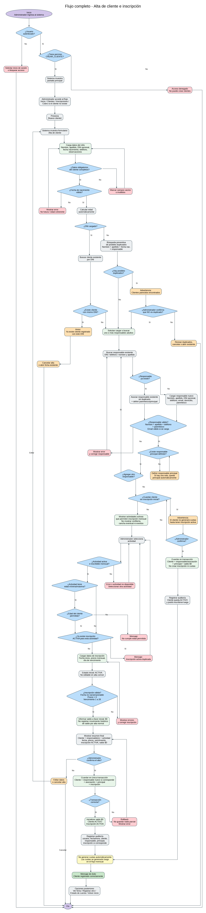

# Flujo 1 - Alta de cliente e inscripción

---
## Objetivo
Permitir que el administrador registre un nuevo cliente del complejo deportivo, cargue sus datos personales, asocie uno
o más responsables adultos y lo inscriba a una o más actividades disponibles. Este flujo tiene como finalidad reemplazar
la inscripción manual en papel, centralizar la información del niño, vincularlo con su responsable y dejar preparada su
situación para futuras cuotas, pagos, informes, controles de deuda e historial económico.

>Este flujo también deberá dejar preparado al cliente para manejar saldo a favor. Todo cliente nuevo deberá iniciar
con saldo a favor igual a cero.
---

## Actor Principal
Administrador del sistema. El usuario deberá estar autenticado y contar con permiso para crear clientes, por ejemplo:

- Permiso requerido: CREAR_CLIENTE.
---

## Situación Inicial
Llega al complejo una madre, padre, tutor o adulto responsable con intención de anotar a un niño en una actividad.
Las actividades iniciales que pueden requerir inscripción son, por ejemplo:

- Escuela de fútbol.
- Taekwondo.

No todos los servicios del complejo requieren inscripción como cliente. Por ejemplo, una persona que alquila una cancha
de manera eventual, compra en confitería o reserva un evento no necesariamente debe ser registrada como cliente permanente.
---

## Condición para iniciar el Flujo
El administrador debe ingresar al sistema con un usuario autorizado y acceder al módulo de clientes.
El sistema debe permitir iniciar este flujo desde:

- Pantalla de inicio.
- Módulo de clientes.
- Módulo de inscripciones.
- Pantalla de cobro, si al buscar un cliente se detecta que todavía no existe.
---

## Pantalla inicial
La pantalla de clientes deberá mostrar opciones claras:

- Nuevo cliente.
- Buscar cliente.
- Clientes activos.
- Clientes inactivos.
- Ver deuda.
- Ver historial.
- Ver saldo a favor.

Para este flujo, el administrador seleccionará:
- [Nuevo cliente]
---

## Pantalla - Nuevo cliente

    Datos del niño

    Nombre*:             [ Mateo              ]
    Apellido*:           [ Gómez              ]
    DNI:                 [ 50123456           ]
    Fecha nacimiento*:   [ 12/04/2018         ]
    Teléfono:            [                    ]
    Observaciones:       [ Apto médico entregado ]
    ----------------------------------------------

    Datos del responsable

    Buscar responsable existente:
    DNI o teléfono:      [                    ] [Buscar]

    Nombre*:             [ Laura              ]
    Apellido*:           [ Pérez              ]
    DNI:                 [ 30111222           ]
    Teléfono*:           [ 11-5555-5555       ]
    Email:               [ laura@email.com    ]
    Domicilio:           [ Calle 123          ]
    Parentesco*:         [ Madre              ]
    Responsable principal: [ Sí               ]

    [Agregar otro responsable]
    ---------------------------------------------

    Actividad

    Actividad:           [ Escuela de fútbol  ]
    Fecha inicio*:       [ 01/05/2026         ]
    Precio mensual*:     [ $30.000            ]
    Día vencimiento*:    [ 10                 ]
    Estado inicial:      ACTIVA

    Nota: el sistema solo deberá mostrar actividades activas que permitan inscripción mensual.

    Saldo a favor inicial: $0

    [Guardar cliente]
    [Cancelar]

>Los campos marcados con `*` son obligatorios. El sistema deberá mostrar visualmente cuando un campo obligatorio esté
vacío o tenga un valor inválido.
---

## Pasos del flujo

    1. El administrador ingresa al sistema.
    2. El sistema valida que el usuario esté autenticado y tenga permiso CREAR_CLIENTE.
    3. El sistema muestra la pantalla principal.
    4. El administrador ingresa al módulo "Clientes".
    5. El administrador presiona el botón:
        - [ Nuevo cliente ]

    6. El sistema muestra el formulario de alta de cliente.
    7. El administrador carga los datos personales del niño:

       - Nombre.
       - Apellido.
       - DNI, si corresponde.
       - Fecha de nacimiento.
       - Teléfono de contacto, si corresponde.
       - Observaciones generales.

    8. El sistema valida que los datos obligatorios estén completos.
    9. El sistema valida que la fecha de nacimiento no sea futura y que permita calcular una edad coherente.
    10. El sistema calcula automáticamente la edad del cliente en base a la fecha de nacimiento.
    11. El sistema verifica si ya existe un cliente con el mismo DNI, si el DNI fue cargado.
    12. Si ya existe un cliente con ese DNI, el sistema muestra un aviso:
        - [ "Ya existe un cliente registrado con este DNI." ]

    13. El administrador puede cancelar el alta o abrir la ficha del cliente existente.
    14. Si el DNI no fue cargado, el sistema realiza una búsqueda preventiva de posibles duplicados usando:

        - Nombre.
        - Apellido.
        - Fecha de nacimiento.
        - Responsable asociado, si ya fue cargado.

    15. Si el sistema encuentra posibles duplicados sin DNI, deberá mostrar una advertencia:
        - [ "Encontramos clientes parecidos. Revisá si el cliente ya existe antes de continuar." ]

    16. El administrador puede revisar los posibles duplicados, cancelar el alta, abrir un cliente existente o continuar bajo confirmación.
    17. Si no existe un cliente duplicado o el administrador confirma que no corresponde a un duplicado, el sistema permite continuar.
    18. El sistema solicita cargar o buscar uno o más responsables adultos.
    19. El administrador puede buscar un responsable existente por:

        - DNI.
        - Teléfono.
        - Nombre y apellido.

    20. Si el responsable ya existe, el sistema deberá permitir asociarlo al cliente sin crear un responsable duplicado.
    21. Si el responsable no existe, el administrador carga los datos del responsable principal:

        - Nombre.
        - Apellido.
        - DNI, si corresponde.
        - Teléfono.
        - Email.
        - Domicilio.
        - Parentesco o relación con el niño.

    22. El sistema valida que el responsable tenga al menos nombre, apellido, teléfono y parentesco.
    21.1. Si se carga email, el sistema valida que tenga un formato válido.
    21.2. Todo cliente deberá tener un responsable principal. Si solo se carga un responsable, quedará como principal automáticamente.
    23. El sistema permite agregar más responsables si corresponde.
    24. El administrador presiona:
        - [ Continuar a inscripción ]

    25. El sistema muestra solo las actividades activas que permiten inscripción mensual.
    26. No deberán mostrarse actividades eventuales o no inscribibles, por ejemplo:

        - Confitería.
        - Alquiler eventual de cancha.
        - Cumpleaños particulares.
        - Eventos ocasionales.

    27. El administrador selecciona una actividad.
    28. El sistema verifica si la actividad tiene edad mínima o edad máxima.
    29. Si la actividad tiene restricción de edad, el sistema compara la edad del cliente con la edad permitida.
    30. Si la edad no es válida, el sistema muestra un mensaje de error. Ejemplo:
        - [ "El cliente no cumple con la edad permitida para esta actividad." ]

    31. Si la edad es válida o la actividad no tiene restricción de edad, el sistema permite continuar.
    32. El sistema verifica que el cliente no tenga ya una inscripción ACTIVA para la misma actividad.
    33. Si ya existe una inscripción activa para esa actividad, el sistema muestra un mensaje:
        - [ "El cliente ya tiene una inscripción activa en esta actividad." ]

    34. Si no existe inscripción activa duplicada, el administrador carga los datos de inscripción:

        - Fecha de inicio.
        - Precio mensual.
        - Día de vencimiento.

    35. La inscripción inicial quedará en estado ACTIVA por defecto.
    36. El estado inicial no deberá ser editable durante el alta común, salvo que exista un permiso o flujo especial.
    37. El sistema valida que la fecha de inicio no esté vacía.
    38. El sistema valida que la fecha de inicio no sea absurda o demasiado anterior sin confirmación del administrador.
    39. El sistema valida que el precio mensual sea mayor a cero.
    40. El sistema valida que el día de vencimiento sea válido.
    41. Para la primera versión, el día de vencimiento debería estar entre 1 y 28, para evitar problemas con meses más cortos.
    42. El sistema informa que el cliente iniciará con saldo a favor igual a cero.
    43. El saldo inicial en cero no deberá generar un movimiento histórico de saldo, porque no hubo dinero ingresado ni ajuste manual.
    44. El administrador revisa un resumen antes de guardar.
    45. El resumen muestra:

        - Datos del cliente.
        - Datos del responsable.
        - Actividad seleccionada.
        - Fecha de inicio.
        - Precio mensual.
        - Día de vencimiento.
        - Estado inicial de inscripción: ACTIVA.
        - Saldo a favor inicial: $0.

    46. El administrador confirma el alta.
    47. El sistema guarda en una única transacción:

        - Cliente.
        - Responsable nuevo, si corresponde.
        - Asociación entre cliente y responsable.
        - Responsable principal del cliente.
        - Inscripción, si el alta incluye inscripción.

    48. Si falla cualquiera de las operaciones anteriores, el sistema no deberá guardar nada parcialmente.
    49. El sistema inicializa el saldo a favor del cliente en cero.
    50. El cliente queda en estado ACTIVO.
    51. Si se creó inscripción, la inscripción queda en estado ACTIVA.
    52. El sistema registra auditoría de la operación, guardando:

        - Usuario que creó el cliente.
        - Fecha y hora.
        - Cliente creado.
        - Responsable creado o asociado.
        - Responsable principal definido.
        - Inscripción creada, si corresponde.

    53. El sistema muestra un mensaje de éxito:
        - [ "Cliente registrado correctamente." ]

    54. El sistema muestra opciones posteriores:

        - Ver ficha del cliente.
        - Registrar otro cliente.
        - Ir a estado de cuenta.
        - Volver al inicio.
---

## Subflujo opcional - Crear cliente sin inscripción inicial

Este flujo principal está pensado para alta de cliente e inscripción. Sin embargo, el sistema podrá permitir cargar un
cliente sin inscripción cuando el administrador todavía no conoce la actividad, el precio o la fecha de inicio.

    1. El administrador carga los datos del cliente.
    2. El administrador carga o asocia al menos un responsable.
    3. El sistema exige definir un responsable principal.
    4. El administrador selecciona la opción:
        - [Guardar cliente sin inscripción]

    5. El sistema muestra una advertencia:
        - [ "El cliente quedará registrado, pero no generará cuotas hasta tener una inscripción activa." ]

    6. El administrador confirma.
    7. El sistema guarda:
        - Cliente.
        - Responsable nuevo, si corresponde.
        - Asociación cliente-responsable.
        - Responsable principal.
        - Saldo a favor inicial en cero.

    8. El sistema no crea inscripción.
    9. El sistema no genera cuotas.
    10. El sistema registra auditoría.
    11. El cliente queda en estado ACTIVO y podrá inscribirse más adelante.
---

## Decisiones importantes

- ¿El administrador está autenticado?
- ¿El administrador tiene permiso para crear clientes?
- ¿Los datos obligatorios del cliente están completos?
- ¿El cliente ya existe por DNI?
- Si no tiene DNI, ¿existen posibles duplicados por nombre, apellido, fecha de nacimiento y responsable?
- ¿El responsable ya existe por DNI, teléfono, nombre o apellido?
- ¿Debe crearse un responsable nuevo o asociar uno existente?
- ¿La actividad está activa?
- ¿La actividad permite inscripción mensual?
- ¿La actividad tiene edad mínima o máxima?
- ¿La edad del cliente es válida?
- ¿Ya existe una inscripción activa para el mismo cliente y actividad?
- ¿La fecha de inicio es válida?
- ¿El precio mensual es mayor a cero?
- ¿El día de vencimiento es válido?
- ¿El cliente debe iniciar con saldo a favor igual a cero?
- ¿Corresponde registrar movimiento histórico de saldo? En alta normal con saldo cero, no corresponde.
- ¿Se creará una inscripción inicial o solo se guardará el cliente?
- ¿Existe un responsable principal definido?
- ¿El administrador confirma el alta?
---

## Datos que intervienen

- Cliente.
- Responsable.
- ClienteResponsable.
- Actividad.
- Inscripción.
- Saldo a favor del cliente.
- MovimientoSaldoCliente, solo para ajustes o movimientos reales posteriores.
- Usuario administrador.
- Auditoria.
---

## Impacto en entidades

- Actividad debe tener un atributo que indique si permite inscripción mensual.
- Actividad debe tener un atributo que indique si genera cuota mensual.
- Inscripción debe tener estado.
- Cliente debe tener saldoAFavorCuotas.
- Responsable debe permitir búsqueda por teléfono y DNI.
- ClienteResponsable debe guardar el parentesco o relación con el niño.
- ClienteResponsable debe indicar si el responsable es principal.
- Si se implementa historial de saldo a favor, no deberá crearse un movimiento inicial cuando el saldo sea cero.

## Reglas de negocio detectadas

- No se deben borrar clientes definitivamente.
- Los clientes dados de baja deberán quedar como inactivos.
- Un cliente puede tener uno o más responsables.
- Un responsable puede estar asociado a uno o más clientes.
- Una inscripción debe estar asociada a un cliente y a una actividad.
- Solo se podrán seleccionar actividades activas.
- Solo deberán mostrarse actividades que permitan inscripción mensual.
- No deberán mostrarse actividades eventuales, como confitería, alquiler de cancha o eventos particulares.
- Si una actividad tiene edad mínima o máxima, el sistema debe validar la edad.
- La fecha de nacimiento debe permitir calcular la edad del cliente.
- La fecha de nacimiento no podrá ser futura.
- Si se carga email, deberá tener formato válido.
- El precio mensual de la inscripción debe ser mayor a cero.
- El día de vencimiento debe ser válido.
- Una inscripción nueva debe iniciar en estado ACTIVA por defecto.
- El estado inicial de la inscripción solo podrá modificarse desde un flujo especial o con permiso avanzado.
- El sistema debe evitar duplicados evidentes, especialmente por DNI.
- Si el cliente no tiene DNI, el sistema debe advertir posibles duplicados por nombre, apellido, fecha de nacimiento y responsable.
- Si el responsable ya existe, el sistema debe permitir asociarlo sin duplicarlo.
- No se podrá crear una inscripción activa duplicada para el mismo cliente y actividad.
- Una inscripción nueva debe quedar ACTIVA por defecto.
- Todo cliente nuevo debe iniciar con saldo a favor igual a cero.
- La ficha del cliente debe mostrar deuda total y saldo a favor disponible.
- El saldo a favor inicial en cero no debe generar movimiento histórico de saldo.
- La creación del cliente, responsable, relación e inscripción debe ejecutarse en una única transacción.
- El sistema deberá registrar auditoría al crear cliente, responsable, relación cliente-responsable e inscripción.
- Todo cliente deberá tener al menos un responsable principal.
- Si se carga un solo responsable, quedará como responsable principal automáticamente.
- El alta de cliente e inscripción no generará cuotas automáticamente.
- Las cuotas se generarán desde el flujo de generación mensual de cuotas.
- El sistema podrá permitir crear cliente sin inscripción, pero ese cliente no generará cuotas hasta tener una inscripción activa.
- Si falla una parte de la operación, no debe guardarse nada parcialmente.
- El sistema debe mostrar mensajes claros para usuarios sin experiencia.
---

## Resultado final
El sistema registra un nuevo cliente activo, lo asocia a uno o más responsables adultos, define un responsable principal,
crea una inscripción activa a una actividad que permita inscripción mensual cuando corresponda y deja inicializado su 
saldo a favor en cero. La operación se realiza de forma transaccional: si falla el guardado del cliente, responsable, 
relación o inscripción, no se conserva información parcial. El saldo inicial en cero no genera movimiento histórico de 
saldo. El cliente queda listo para participar en futuros procesos del sistema, como generación de cuotas mensuales, 
cobro de cuotas, aplicación de saldo a favor, consulta de deuda, historial de pagos e informes. Este flujo no genera 
cuotas automáticamente; las cuotas se generarán posteriormente desde el flujo de generación mensual de cuotas.

