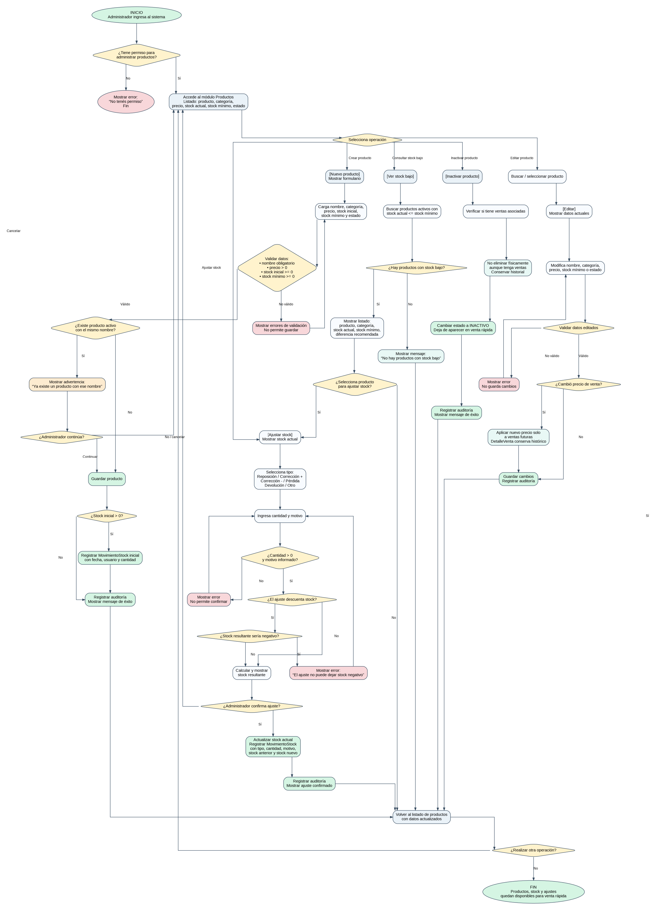

# Flujo 10 - ABM de productos, stock y ajustes de inventario

---
## Objetivo
Permitir que el administrador registre, edite, active, inactive y controle productos de confitería/cafetería, incluyendo
precio de venta, stock actual, stock mínimo, ajustes de inventario y consulta de productos con stock bajo.

Este flujo es necesario porque el Flujo 4 permite vender productos, pero para poder venderlos primero deben existir en el
sistema con precio y stock correctamente cargados.
---

## Actor principal
    Administrador del sistema.
---

## Situación inicial
El complejo vende productos como bebidas, golosinas, snacks y productos de cafetería. Actualmente ese control se realiza
de forma manual. El sistema debe permitir saber:

- Qué productos existen.
- Cuál es el precio de venta actual.
- Cuánto stock hay.
- Qué productos tienen stock bajo.
- Qué ajustes se hicieron sobre el stock.
- Quién modificó precios o cantidades.
---

## Condición para iniciar el flujo
El administrador debe tener permiso para administrar productos. El encargado puede tener permiso parcial para consultar
stock y cargar reposiciones, si el administrador lo permite.
---

## Pantalla - Productos

    Productos

    -------------------------------------------------------------------------------------
    Producto            Categoría       Precio       Stock actual     Stock mínimo Estado
    -------------------------------------------------------------------------------------
    Coca Cola           Bebidas         $2.000       24               6            ACTIVO
    Alfajor             Golosinas       $1.500       4                10           ACTIVO
    Café                Cafetería       $1.200       30               5            ACTIVO
    -------------------------------------------------------------------------------------

    [Nuevo producto]
    [Ver stock bajo]
    [Ajustar stock]
---

## Pantalla - Nuevo producto

    Nuevo producto

    Nombre:             [ Coca Cola                 ]
    Categoría:          [ Bebidas                   ]
    Precio de venta:    [ $2.000                    ]
    Stock inicial:      [ 24                         ]
    Stock mínimo:       [ 6                          ]
    Estado:             [ ACTIVO                    ]

    [Guardar producto]
    [Cancelar]
---

## Pantalla - Ajuste de stock

    Ajuste de stock

    Producto:           [ Alfajor                   ]
    Stock actual:       4

    Tipo de ajuste:     [ Reposición                ]
    Cantidad:           [ 20                        ]
    Motivo:             [ Compra a proveedor        ]

    Stock resultante:   24

    [Confirmar ajuste]
    [Cancelar]
---

## Pasos del flujo - Crear producto

    1. El administrador ingresa al sistema.
    2. Accede al módulo "Productos".
    3. Presiona:
        - [Nuevo producto]

    4. El sistema muestra el formulario de producto.
    5. El administrador carga:
        - Nombre.
        - Categoría.
        - Precio de venta.
        - Stock inicial.
        - Stock mínimo.
        - Estado.

    6. El sistema valida que el nombre no esté vacío.
    7. El sistema valida que el precio de venta sea mayor a cero.
    8. El sistema valida que el stock inicial no sea negativo.
    9. El sistema valida que el stock mínimo no sea negativo.
    10. El sistema verifica si ya existe un producto activo con el mismo nombre.
    11. Si existe, muestra advertencia:
        - "Ya existe un producto con ese nombre."

    12. El administrador puede cancelar o continuar si corresponde.
    13. El administrador confirma.
    14. El sistema guarda el producto.
    15. Si el stock inicial es mayor a cero, el sistema registra un MovimientoStock inicial.
    16. El sistema registra auditoría.
    17. El sistema muestra mensaje de éxito.
---

## Pasos del flujo - Editar producto

    1. El administrador busca un producto.
    2. Selecciona:
        - [Editar]

    3. El sistema muestra los datos actuales.
    4. El administrador puede modificar:
        - Nombre.
        - Categoría.
        - Precio de venta.
        - Stock mínimo.
        - Estado.

    5. El sistema valida los datos.
    6. Si cambia el precio de venta, el nuevo precio se aplicará solo a ventas futuras.
    7. Las ventas anteriores conservarán su precio histórico en DetalleVenta.
    8. El administrador confirma.
    9. El sistema guarda los cambios.
    10. El sistema registra auditoría.
---

## Pasos del flujo - Ajustar stock

    1. El administrador accede al módulo "Productos".
    2. Selecciona un producto.
    3. Presiona:
        - [Ajustar stock]

    4. El sistema muestra stock actual.
    5. El administrador selecciona tipo de ajuste:
        - Reposición.
        - Corrección positiva.
        - Corrección negativa.
        - Pérdida.
        - Devolución.
        - Otro.

    6. El administrador ingresa cantidad.
    7. El administrador ingresa motivo.
    8. El sistema valida que la cantidad sea mayor a cero.
    9. Si el ajuste descuenta stock, el sistema valida que no deje stock negativo.
    10. El sistema muestra stock resultante.
    11. El administrador confirma.
    12. El sistema actualiza stock actual.
    13. El sistema registra MovimientoStock.
    14. El sistema registra auditoría.
---

## Subflujo - Consultar productos con stock bajo

    1. El administrador ingresa al módulo "Productos".
    2. Presiona:
        - [Ver stock bajo]

    3. El sistema busca productos activos cuyo stock actual sea menor o igual al stock mínimo.
    4. El sistema muestra listado:
        - Producto.
        - Categoría.
        - Stock actual.
        - Stock mínimo.
        - Diferencia recomendada.
    5. El administrador puede seleccionar un producto y ajustar stock.
---

## Subflujo - Inactivar producto

    1. El administrador selecciona un producto.
    2. Presiona:
        - [Inactivar]

    3. El sistema verifica si el producto tiene ventas asociadas.
    4. Aunque tenga ventas, no lo elimina.
    5. El sistema cambia estado a INACTIVO.
    6. El producto deja de aparecer en venta rápida.
    7. El historial de ventas se conserva.
    8. El sistema registra auditoría.
---

## Ejemplo 1 - Producto nuevo

    Producto:
        - Coca Cola.
    Precio:
        - $2.000.
    Stock inicial:
        - 24.
    Stock mínimo:
        - 6.

    Resultado:
        - Producto activo.
        - Disponible para venta rápida.
        - Stock actual: 24.
---

## Ejemplo 2 - Stock bajo

    Producto:
        - Alfajor.
    Stock actual:
        - 4.
    Stock mínimo:
        - 10.

    Resultado:
        - El producto aparece en el informe de stock bajo.
---

## Ejemplo 3 - Ajuste por reposición

    Producto:
        - Alfajor.
    Stock actual:
        - 4.
    Reposición:
        - 20.

    Resultado:
        - Stock final: 24.
        - Se registra MovimientoStock por +20.
---

## Decisiones importantes

- ¿El usuario tiene permiso para administrar productos?
- ¿El producto ya existe?
- ¿El precio es válido?
- ¿El stock inicial es válido?
- ¿El stock mínimo es válido?
- ¿El ajuste deja stock negativo?
- ¿El producto debe estar activo o inactivo?
- ¿El administrador confirma la operación?
---

## Datos que intervienen

- Producto.
- CategoriaProducto.
- MovimientoStock.
- Usuario administrador.
- Auditoria.
---

## Reglas de negocio detectadas

- No se podrá crear producto sin nombre.
- No se podrá crear producto con precio cero o negativo.
- No se podrá cargar stock negativo.
- El stock mínimo no podrá ser negativo.
- Un producto con ventas asociadas no deberá eliminarse definitivamente.
- Un producto inactivo no deberá aparecer en venta rápida.
- Cambiar el precio del producto no deberá modificar ventas anteriores.
- Toda venta guardará precio unitario histórico en DetalleVenta.
- Todo ajuste de stock deberá registrar motivo, fecha, usuario y cantidad.
- Un producto tendrá stock bajo si stock actual <= stock mínimo.
---

## Resultado final
El sistema permite administrar productos de confitería/cafetería, controlar stock, detectar productos con stock bajo y
registrar ajustes de inventario. Con este flujo completo, el Flujo 4 de venta rápida puede funcionar correctamente y
descontar stock de productos existentes.

