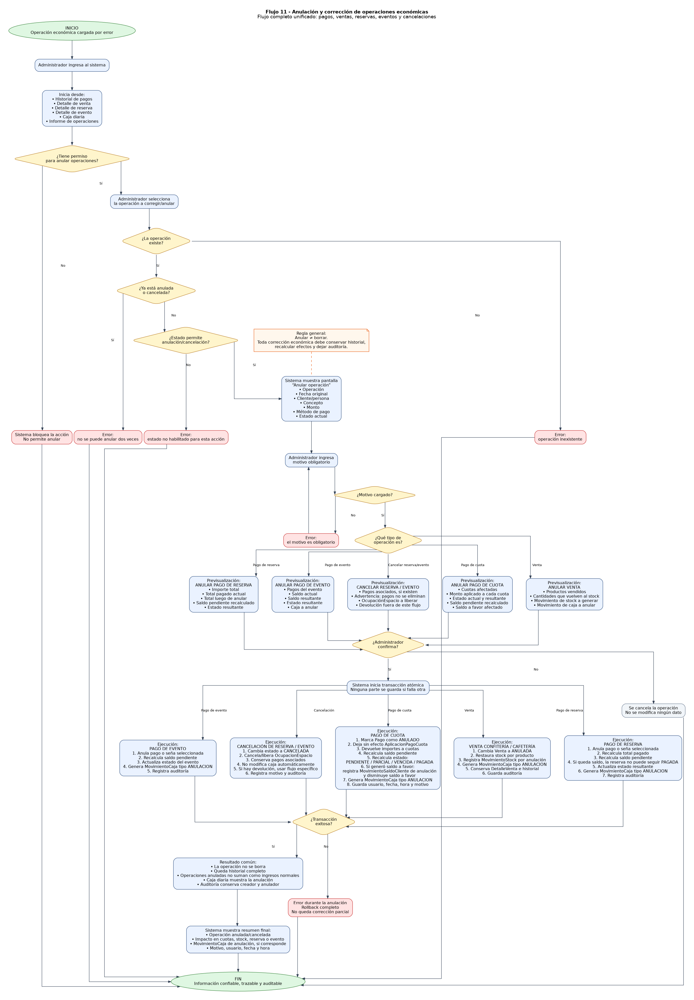

# Flujo 11 - Anulación y corrección de operaciones económicas

---
## Objetivo
Permitir que el administrador anule operaciones económicas cargadas por error sin eliminar historial, recalculando saldos,
restaurando stock cuando corresponda y registrando el impacto en caja diaria mediante movimientos de anulación.

Este flujo es obligatorio porque el alcance de la versión 1.0 establece que pagos, ventas, reservas y eventos no deben
eliminarse cuando tienen impacto económico. Si algo fue cargado mal, debe anularse con motivo, fecha, hora y usuario.
---

## Actor principal
    Administrador del sistema.
---

## Situación inicial
Una operación fue cargada por error. Ejemplos:

    - Se registró un pago con monto incorrecto.
    - Se cobró una cuota equivocada.
    - Se cargó una venta duplicada.
    - Se vendió un producto incorrecto.
    - Se cargó una seña de reserva por método de pago incorrecto.
    - Se cargó un pago de evento que no correspondía.
    - Se generó saldo a favor por error.
---

## Condición para iniciar el flujo
El usuario debe tener permiso para anular operaciones. En principio, solo el administrador debería poder anular operaciones
críticas. El encargado podría hacerlo solo si el administrador le otorga permiso.

El sistema debe permitir iniciar este flujo desde:

- Historial de pagos.
- Detalle de venta.
- Detalle de reserva.
- Detalle de evento.
- Caja diaria.
- Informe de operaciones.
---

## Regla general de anulación
Anular no significa borrar. Cuando una operación se anula:

- La operación original queda en estado ANULADA.
- Se conserva el historial.
- Se registra motivo.
- Se registra usuario que anuló.
- Se registra fecha y hora de anulación.
- Se recalculan saldos afectados.
- Se genera movimiento de caja de anulación si hubo dinero real involucrado.
- Se restauran efectos secundarios si corresponde.
---

## Pantalla - Anular operación

    Anular operación

    Operación:           Pago #152
    Fecha original:      10/06/2026 18:30
    Cliente/persona:     Mateo Gómez
    Concepto:            Cuota fútbol
    Monto:               $30.000
    Método de pago:      Efectivo
    Estado actual:       REGISTRADO

    Motivo de anulación:
    [ Se cargó al cliente equivocado                           ]

    Advertencia:
    Esta acción no eliminará el registro. La operación quedará anulada y se recalcularán los saldos relacionados.

    [Confirmar anulación]
    [Cancelar]
---

## Subflujo 11.1 - Anular pago de cuota

    1. El administrador abre el historial de pagos o la caja diaria.
    2. Selecciona un pago.
    3. Presiona:
        - [Anular pago]

    4. El sistema verifica que el pago esté en estado REGISTRADO.
    5. El sistema muestra datos del pago.
    6. El administrador ingresa motivo obligatorio.
    7. El sistema muestra una previsualización:
        - Cuotas afectadas.
        - Monto aplicado a cada cuota.
        - Estado actual.
        - Estado que tendrá luego de anular.
        - Saldo pendiente recalculado.
        - Saldo a favor afectado, si corresponde.

    8. El administrador confirma.
    9. El sistema marca el pago como ANULADO.
    10. El sistema anula o deja sin efecto sus AplicacionPagoCuota.
    11. El sistema devuelve a cada cuota el monto que había sido aplicado.
    12. El sistema recalcula estado de cada cuota:
        - PENDIENTE.
        - PARCIAL.
        - VENCIDA.
        - PAGADA, si aún tiene otros pagos válidos que la cubren.

    13. Si el pago generó saldo a favor, el sistema registra un MovimientoSaldoCliente de anulación.
    14. El sistema disminuye el saldo a favor si corresponde.
    15. El sistema genera MovimientoCaja de tipo ANULACION por el monto del pago.
    16. El sistema guarda fecha, hora, usuario y motivo.
    17. El sistema muestra resumen final.
---

## Subflujo 11.2 - Anular venta de confitería/cafetería

    1. El administrador abre el detalle de una venta.
    2. Presiona:
        - [Anular venta]

    3. El sistema verifica que la venta esté REGISTRADA.
    4. El sistema muestra productos vendidos y cantidades.
    5. El administrador ingresa motivo obligatorio.
    6. El sistema muestra previsualización:
        - Productos que volverán al stock.
        - Cantidades a restaurar.
        - Movimiento de caja que se anulará.

    7. El administrador confirma.
    8. El sistema cambia la venta a estado ANULADA.
    9. El sistema restaura stock de cada producto.
    10. El sistema registra MovimientoStock por anulación.
    11. El sistema genera MovimientoCaja de tipo ANULACION por el total de la venta.
    12. El sistema guarda auditoría.
    13. El sistema muestra resumen final.
---

## Subflujo 11.3 - Anular pago de reserva

    1. El administrador abre una reserva.
    2. Selecciona el pago o seña que quiere anular.
    3. Presiona:
        - [Anular pago]

    4. El sistema muestra datos del pago.
    5. El administrador ingresa motivo.
    6. El sistema previsualiza:
        - Importe total de la reserva.
        - Total pagado actual.
        - Total pagado luego de anular.
        - Saldo pendiente recalculado.
        - Estado resultante.

    7. El administrador confirma.
    8. El sistema anula el pago.
    9. El sistema recalcula total pagado y saldo pendiente.
    10. Si saldo pendiente queda mayor a cero, la reserva no puede quedar PAGADA.
    11. El sistema genera MovimientoCaja de ANULACION.
    12. El sistema registra auditoría.
---

## Subflujo 11.4 - Anular pago de evento

    1. El administrador abre un evento.
    2. Selecciona el pago o seña que quiere anular.
    3. Ingresa motivo.
    4. El sistema previsualiza saldo resultante.
    5. El administrador confirma.
    6. El sistema anula el pago.
    7. El sistema recalcula saldo pendiente del evento.
    8. El sistema actualiza estado del evento.
    9. El sistema genera MovimientoCaja de ANULACION.
    10. El sistema registra auditoría.
---

## Subflujo 11.5 - Cancelar reserva o evento

    1. El administrador abre la reserva o evento.
    2. Presiona:
        - [Cancelar]

    3. El sistema verifica si existen pagos asociados.
    4. Si no existen pagos, permite cancelar directamente.
    5. Si existen pagos, advierte:
        - "Esta operación tiene pagos asociados. Los pagos no serán eliminados."

    6. El administrador ingresa motivo.
    7. El sistema cambia estado a CANCELADA.
    8. El sistema cancela o libera la OcupacionEspacio asociada.
    9. Los pagos quedan registrados en su historial.
    10. Si se necesita devolver dinero, deberá registrarse una anulación o egreso según la política definida.
    11. El sistema registra auditoría.
---

## Ejemplo 1 - Anulación de pago de cuota

    Pago original:
        - Mateo Gómez.
        - Cuota mayo fútbol.
        - $30.000.
        - Efectivo.

    Error:
        - Se cargó al cliente equivocado.

    Resultado:
        - Pago queda ANULADO.
        - Cuota vuelve a quedar pendiente o parcial.
        - Caja muestra movimiento de anulación.
        - Se guarda motivo y usuario.
---

## Ejemplo 2 - Anulación de venta

    Venta original:
        - Coca Cola x2.
        - Alfajor x1.
        - Total $5.500.

    Resultado:
        - Venta queda ANULADA.
        - Stock de Coca Cola aumenta en 2.
        - Stock de Alfajor aumenta en 1.
        - Caja muestra anulación por $5.500.
---

## Decisiones importantes

- ¿El usuario tiene permiso para anular?
- ¿La operación existe?
- ¿La operación ya está anulada?
- ¿La operación tiene movimientos asociados?
- ¿Qué saldos deben recalcularse?
- ¿Se debe restaurar stock?
- ¿Se debe generar movimiento de caja de anulación?
- ¿El motivo fue cargado?
- ¿El administrador confirma?
---

## Datos que intervienen

- Pago.
- AplicacionPagoCuota.
- Cuota.
- Venta.
- DetalleVenta.
- Producto.
- MovimientoStock.
- Reserva.
- Evento.
- MovimientoCaja.
- MovimientoSaldoCliente.
- OcupacionEspacio.
- Usuario administrador.
- Auditoria.
---

## Reglas de negocio detectadas

- Las operaciones económicas no se eliminan.
- Toda anulación requiere motivo.
- Toda anulación requiere usuario, fecha y hora.
- Anular pago de cuota recalcula deuda.
- Anular venta restaura stock.
- Anular pago de reserva recalcula saldo de reserva.
- Anular pago de evento recalcula saldo de evento.
- Toda anulación económica debe reflejarse en caja diaria.
- No se puede anular dos veces la misma operación.
- Las operaciones anuladas no deben sumarse como ingresos normales.
- La auditoría debe conservar quién creó y quién anuló.
---

## Resultado final
El sistema permite corregir errores sin borrar historial. Cada anulación deja trazabilidad completa, actualiza los saldos
afectados, restaura stock cuando corresponde y refleja el impacto en caja diaria. Esto permite mantener la información
confiable y auditable.

