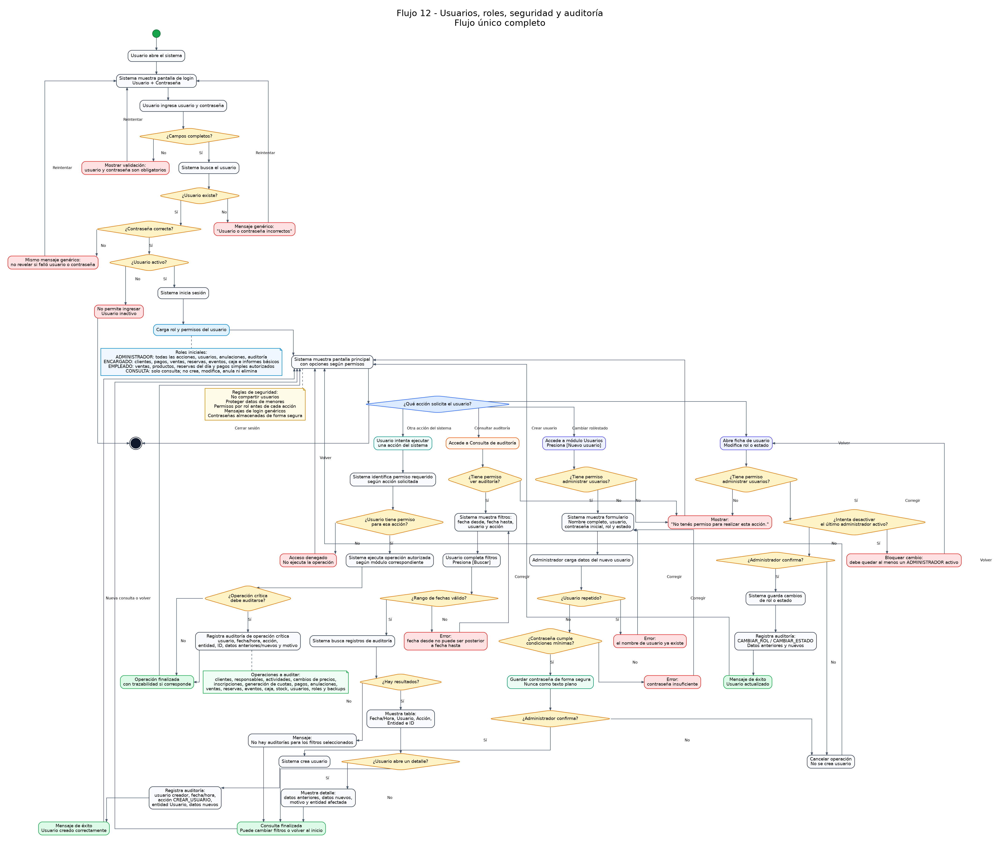

# Flujo 12 - Usuarios, roles, seguridad y auditoría

---
## Objetivo
Permitir que el sistema controle qué personas pueden ingresar, qué acciones puede realizar cada usuario y qué operaciones
quedan registradas para auditoría. Este flujo tiene como finalidad proteger la información del complejo, especialmente
datos de menores de edad, pagos, caja diaria, anulaciones, informes y configuraciones críticas.
---

## Actor principal
    Administrador del sistema.
---

## Actores secundarios
    Encargado, empleado y usuario de consulta.
---

## Situación inicial
El sistema será utilizado por una o varias personas dentro del complejo. No todos deben tener los mismos permisos.
Roles iniciales:

- ADMINISTRADOR.
- ENCARGADO.
- EMPLEADO.
- CONSULTA.
---

## Condición para iniciar el flujo
Debe existir al menos un usuario administrador inicial. Este usuario podrá crear otros usuarios y asignar roles.

---

## Pantalla - Login

    Iniciar sesión

    Usuario:       [ admin                   ]
    Contraseña:    [ ********                ]

    [Ingresar]

    Mensaje:
        Si olvidaste tu contraseña, consultá al administrador del sistema.
---

## Pantalla - Usuarios

    Usuarios

    ----------------------------------------------------------------
    Usuario          Nombre              Rol             Estado
    ----------------------------------------------------------------
    admin            Administrador       ADMINISTRADOR   ACTIVO
    caja1            Empleado caja       EMPLEADO        ACTIVO
    encargado1       Encargado tarde     ENCARGADO       ACTIVO
    ----------------------------------------------------------------

    [Nuevo usuario]
---

## Pantalla - Nuevo usuario

    Nuevo usuario

    Nombre completo:     [ Laura Pérez             ]
    Usuario:             [ laura                   ]
    Contraseña inicial:  [ ********                ]
    Rol:                 [ ENCARGADO               ]
    Estado:              [ ACTIVO                  ]

    [Guardar usuario]
    [Cancelar]
---

## Pasos del flujo - Inicio de sesión

    1. El usuario abre el sistema.
    2. El sistema muestra pantalla de login.
    3. El usuario ingresa usuario y contraseña.
    4. El sistema valida que los campos no estén vacíos.
    5. El sistema busca el usuario.
    6. Si el usuario no existe, muestra mensaje genérico:
        - "Usuario o contraseña incorrectos."

    7. Si la contraseña es incorrecta, muestra el mismo mensaje genérico.
    8. Si el usuario está inactivo, el sistema no permite ingresar.
    9. Si los datos son correctos, el sistema inicia sesión.
    10. El sistema carga permisos según el rol.
    11. El sistema muestra la pantalla principal.
---

## Pasos del flujo - Crear usuario

    1. El administrador ingresa al sistema.
    2. Accede al módulo "Usuarios".
    3. Presiona:
        - [Nuevo usuario]

    4. El sistema muestra formulario.
    5. El administrador carga:
        - Nombre completo.
        - Nombre de usuario.
        - Contraseña inicial.
        - Rol.
        - Estado.

    6. El sistema valida que el usuario no esté repetido.
    7. El sistema valida que la contraseña cumpla condiciones mínimas.
    8. El sistema guarda la contraseña de forma segura, no como texto plano.
    9. El administrador confirma.
    10. El sistema crea el usuario.
    11. El sistema registra auditoría.
---

## Pasos del flujo - Cambiar rol o estado

    1. El administrador abre la ficha de usuario.
    2. Modifica rol o estado.
    3. El sistema valida que no se desactive el último administrador activo.
    4. El administrador confirma.
    5. El sistema guarda cambios.
    6. El sistema registra auditoría.
---

## Permisos iniciales por rol

ADMINISTRADOR:
- Puede realizar todas las acciones.
- Puede administrar usuarios.
- Puede modificar precios.
- Puede anular operaciones.
- Puede ver auditoría.

ENCARGADO:
- Puede registrar clientes.
- Puede modificar datos básicos.
- Puede cobrar cuotas.
- Puede vender productos.
- Puede registrar reservas y eventos.
- Puede consultar caja diaria.
- Puede consultar informes básicos.
- No puede administrar usuarios.

EMPLEADO:
- Puede registrar ventas.
- Puede consultar productos.
- Puede registrar pagos simples si se autoriza.
- Puede consultar reservas del día.
- No puede ver informes completos.
- No puede anular operaciones críticas.

CONSULTA:
- Puede ver informes.
- Puede ver caja diaria.
- Puede consultar clientes.
- No puede crear, modificar, anular ni eliminar información.
---

## Concepto central - Auditoría
La auditoría registra acciones importantes realizadas por usuarios.

Datos mínimos:
- Usuario.
- Fecha y hora.
- Acción realizada.
- Entidad afectada.
- ID de entidad afectada.
- Datos anteriores, si corresponde.
- Datos nuevos, si corresponde.
- Motivo, si corresponde.
---

## Operaciones a auditar

- Creación de clientes.
- Modificación de clientes.
- Baja de clientes.
- Registro de responsables.
- Creación o modificación de actividades.
- Cambios de precios.
- Inscripciones.
- Generación de cuotas.
- Registro de pagos.
- Anulación de pagos.
- Registro y anulación de ventas.
- Registro y cancelación de reservas.
- Registro y cancelación de eventos.
- Movimientos de caja.
- Ajustes de stock.
- Cambios de usuario o rol.
- Backups manuales.
---

## Pantalla - Consulta de auditoría

    Auditoría

    Filtros:
        Fecha desde:      [ 01/06/2026 ]
        Fecha hasta:      [ 30/06/2026 ]
        Usuario:          [ Todos      ]
        Acción:           [ Todas      ]

    [Buscar]

    Resultado:
    -------------------------------------------------------------------------
    Fecha/Hora          Usuario       Acción               Entidad     ID
    -------------------------------------------------------------------------
    01/06/2026 10:15    admin         CREAR_CLIENTE        Cliente     25
    01/06/2026 10:30    admin         REGISTRAR_PAGO       Pago        81
    01/06/2026 11:00    admin         ANULAR_VENTA         Venta       12
    -------------------------------------------------------------------------
---

## Decisiones importantes

- ¿El usuario existe?
- ¿La contraseña es correcta?
- ¿El usuario está activo?
- ¿El usuario tiene permiso para la acción solicitada?
- ¿La operación debe auditarse?
- ¿Se está intentando desactivar el último administrador?
- ¿La contraseña se guarda de forma segura?
- ¿El usuario final recibe un mensaje claro?
---

## Datos que intervienen

- Usuario.
- Rol.
- Permiso.
- Auditoria.
- SesionUsuario.
---

## Reglas de negocio detectadas

- Cada usuario debe ingresar con usuario y contraseña.
- No se deben compartir usuarios.
- Las contraseñas no deben guardarse como texto plano.
- No todos los usuarios pueden ver o modificar todo.
- Los datos de menores deben estar protegidos.
- Los pagos y anulaciones deben registrar usuario responsable.
- No se puede desactivar el último administrador activo.
- Toda operación crítica debe auditarse.
- Los mensajes de login no deben revelar si falló usuario o contraseña por separado.
---

## Resultado final
El sistema permite iniciar sesión, controlar permisos por rol, proteger información sensible y auditar operaciones críticas.
Esto permite saber quién hizo cada cambio, quién registró cada pago, quién anuló operaciones y quién modificó datos
importantes del sistema.

