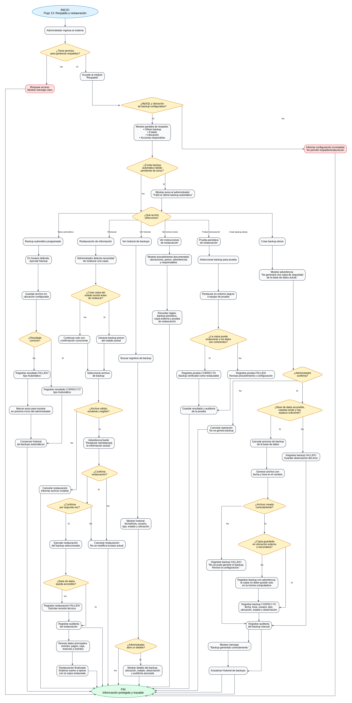

# Flujo 13 - Respaldo y restauración de información

---
## Objetivo
Permitir que el administrador realice o verifique copias de seguridad de la base de datos, documente el procedimiento de
respaldo y pueda restaurar información en caso de error, daño del equipo, pérdida de datos o actualización fallida.

Este flujo es obligatorio porque el alcance de la versión 1.0 indica que la información no debe depender de una sola
computadora y que los backups deben poder restaurarse correctamente.
---

## Actor principal
    Administrador del sistema.
---

## Situación inicial
El sistema comenzará a reemplazar el uso de papel y lapicera. Por lo tanto, la base de datos pasará a contener información
crítica:

- Clientes.
- Responsables.
- Inscripciones.
- Cuotas.
- Pagos.
- Ventas.
- Stock.
- Reservas.
- Eventos.
- Caja diaria.
- Usuarios.
- Auditoría.

>Si esa información se pierde, el complejo puede perder historial económico y operativo.
---

## Condición para iniciar el flujo
El administrador debe tener permiso para gestionar respaldos. El sistema debe tener configurada la conexión a MySQL y una
ubicación segura para guardar copias.
---

## Reglas generales de respaldo

- Se debe realizar backup periódico de la base de datos.
- Antes de actualizar el sistema se debe realizar un backup.
- La copia no debe guardarse únicamente en la misma computadora.
- Se debe guardar al menos una copia externa.
- Se debe probar periódicamente que el backup pueda restaurarse.
- El procedimiento debe estar documentado.
- Cada backup manual debe quedar auditado.
---

## Pantalla - Respaldo de información

    Respaldo de información

    Último backup realizado:
        Fecha:        01/06/2026 23:00
        Estado:       Correcto
        Ubicación:    Disco externo / carpeta backups

    Acciones:

    [Crear backup ahora]
    [Ver historial de backups]
    [Ver instrucciones de restauración]
---

## Pantalla - Historial de backups

    Historial de backups

    ---------------------------------------------------------------------------
    Fecha/Hora          Usuario        Tipo        Estado       Ubicación
    ---------------------------------------------------------------------------
    01/06/2026 23:00    Sistema        Automático  Correcto     /backups/...
    02/06/2026 18:30    admin          Manual      Correcto     /backups/...
    ---------------------------------------------------------------------------
---

## Pasos del flujo - Backup manual

    1. El administrador ingresa al sistema.
    2. Accede al módulo "Respaldo".
    3. Presiona:
        - [Crear backup ahora]

    4. El sistema muestra advertencia:
        - "Se generará una copia de seguridad de la base de datos actual."

    5. El administrador confirma.
    6. El sistema ejecuta el proceso de backup.
    7. El sistema genera un archivo con fecha y hora en el nombre.
    8. El sistema verifica que el archivo haya sido creado.
    9. El sistema registra:
        - Fecha y hora.
        - Usuario.
        - Tipo de backup.
        - Ubicación.
        - Estado.
        - Observación.

    10. Si el backup fue correcto, muestra:
        - "Backup generado correctamente."

    11. Si falló, muestra:
        - "No se pudo generar el backup. Revise la configuración."

    12. El sistema registra auditoría.
---

## Pasos del flujo - Backup automático

    1. El sistema tiene configurada una tarea automática.
    2. En el horario definido, ejecuta backup de la base de datos.
    3. Guarda el archivo en la ubicación configurada.
    4. Registra resultado:
        - Correcto.
        - Fallido.

    5. Si falla, el sistema debe mostrar aviso al administrador en el próximo inicio.
    6. El sistema conserva historial de backups.
---

## Pasos del flujo - Restauración de información

    1. El administrador detecta que necesita restaurar una copia.
    2. Antes de restaurar, se recomienda hacer una copia del estado actual.
    3. El administrador selecciona el archivo de backup.
    4. El sistema muestra advertencia fuerte:

        "Restaurar una copia reemplazará la información actual. Esta acción debe realizarse con cuidado."

    5. El administrador confirma.
    6. El sistema solicita confirmación adicional.
    7. El sistema ejecuta restauración.
    8. El sistema verifica que la base de datos quede accesible.
    9. El sistema registra auditoría.
    10. El administrador revisa datos principales:
        - Clientes.
        - Pagos.
        - Caja.
        - Reservas.
        - Eventos.
---

## Ejemplo 1 - Backup antes de actualizar
Situación: Se va a instalar una nueva versión del sistema.
Acción: El administrador realiza backup manual.
Resultado: Si la actualización falla, se puede volver al estado anterior.
---

## Ejemplo 2 - Pérdida de equipo principal
Situación: La computadora principal deja de funcionar.
Acción: Se instala el sistema en otra computadora y se restaura el último backup.
Resultado: El complejo recupera la información cargada hasta la fecha del backup.
---

## Decisiones importantes

- ¿El usuario tiene permiso para crear backup?
- ¿La base de datos está accesible?
- ¿La carpeta de destino existe?
- ¿Hay espacio suficiente?
- ¿El archivo de backup se creó correctamente?
- ¿El backup fue copiado a una ubicación externa?
- ¿La restauración fue confirmada?
- ¿Se auditó la operación?
---

## Datos que intervienen

- Backup.
- Usuario administrador.
- Auditoria.
- ConfiguracionBackup.
---

## Reglas de negocio detectadas

- Debe existir backup periódico.
- Debe realizarse backup antes de actualizar el sistema.
- No se debe depender de una sola computadora.
- Las copias deben guardarse en ubicación externa o secundaria.
- Se debe probar restauración periódicamente.
- Todo backup manual debe quedar auditado.
- Toda restauración debe requerir confirmación fuerte.
- La restauración debe ser realizada solo por administrador.
---

## Resultado final
El sistema cuenta con un procedimiento claro de respaldo y restauración. Esto reduce el riesgo de pérdida de información y
permite que el complejo pueda confiar en el sistema como reemplazo del papel.

