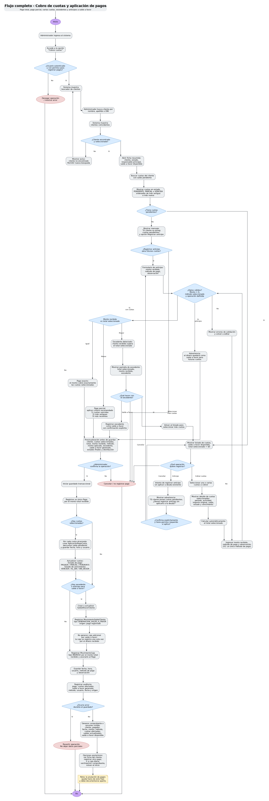

# Flujo 3 - Cobro de cuotas y aplicación de pagos

---
## Objetivo
Permitir que el administrador registre el pago total o parcial de una o varias cuotas de un cliente, actualizando
automáticamente el saldo pendiente de cada cuota, el estado correspondiente y la caja diaria. Este flujo tiene como
finalidad controlar con precisión qué cliente pagó, qué cuotas pagó, cuánto pagó por cada cuota, qué método de pago utilizó,
si quedó deuda pendiente o si generó saldo a favor.

El sistema no debe limitarse a cobrar una sola cuota por operación, ya que en la práctica un responsable puede pagar varios
meses juntos, pagar parcialmente una deuda, pagar una cuota futura ya generada o dejar dinero adelantado para futuras
cuotas que todavía no existen. Por este motivo, el flujo también debe permitir registrar anticipos como saldo a favor,
incluso cuando el cliente no tenga cuotas pendientes.

Para la primera versión, el pago podrá registrarse con un único método de pago. Sin embargo, el diseño deberá quedar
preparado para soportar más adelante pagos combinados, por ejemplo:

    - $20.000 en efectivo.
    - $10.000 por transferencia.
---

## Actor principal
    Administrador del sistema.
---

## Situación inicial
Un responsable se acerca al complejo para pagar una o varias cuotas de un cliente. El cliente puede tener:

- Una cuota pendiente.
- Varias cuotas pendientes.
- Una cuota parcialmente pagada.
- Cuotas vencidas.
- Cuotas futuras ya generadas.
- Saldo a favor previo.
- Ninguna deuda, pero intención de dejar dinero adelantado como anticipo.

El pago puede utilizarse para:

- Pagar una cuota completa.
- Pagar varias cuotas completas.
- Pagar parcialmente una o varias cuotas.
- Cubrir cuotas vencidas.
- Cubrir cuotas futuras ya generadas.
- Generar saldo a favor si el monto recibido supera el total seleccionado.
- Registrar un anticipo como saldo a favor cuando no existan cuotas pendientes o no se seleccione ninguna cuota.
---

## Condición para iniciar el flujo
Para poder realizar este flujo, deben existir previamente:

- Cliente registrado.
- Usuario administrador con permiso para registrar pagos.
- Métodos de pago configurados.

Las cuotas generadas serán necesarias solo cuando el pago se aplique a cuotas existentes. Si el cliente no posee cuotas
pendientes, el sistema podrá registrar un anticipo como saldo a favor para futuras cuotas.

Para la versión 1, cada operación de pago usará un solo método de pago. Como mejora futura, el sistema podrá permitir
múltiples métodos de pago dentro de una misma operación mediante un detalle de métodos.

El sistema deberá permitir iniciar este flujo desde:

- Pantalla principal.
- Módulo de clientes.
- Ficha del cliente.
- Módulo de cuotas.
- Módulo de caja.
- Informe de deudas.
---

## Pantalla - Cobrar cuotas

Buscar cliente:

        ------------------------------------------------
        [ Mateo Gómez                         ] [Buscar]
        ------------------------------------------------
    
Resultado:
    
        Cliente: Mateo Gómez
        Estado: Activo
        Responsable: Laura Pérez
        Saldo a favor disponible: $0
    
        Cuotas con saldo pendiente:
        -----------------------------------------------------------------------
        Seleccionar   Período      Actividad             Estado      Saldo
        -----------------------------------------------------------------------
        [ ]           Abril 2026   Escuela de fútbol     VENCIDA     $30.000
        [ ]           Mayo 2026    Escuela de fútbol     PENDIENTE   $30.000
        [ ]           Mayo 2026    Taekwondo             PENDIENTE   $26.000
        -----------------------------------------------------------------------
    
        Total seleccionado: $0
    
        Monto recibido:     [                ]
        Método de pago:     [ Efectivo       ]
        Observación:        [                ]
    
        [Registrar pago]
        [Registrar anticipo]
        [Cancelar]
---

## Ejemplo visual

    Cliente: Mateo Gómez

    Cuotas seleccionadas:
    -----------------------------------------------------------------------
    Seleccionar   Período      Actividad             Estado      Saldo
    -----------------------------------------------------------------------
    [x]           Abril 2026   Escuela de fútbol     VENCIDA     $30.000
    [x]           Mayo 2026    Escuela de fútbol     PENDIENTE   $30.000
    [ ]           Mayo 2026    Taekwondo             PENDIENTE   $26.000
    -----------------------------------------------------------------------

    Total seleccionado: $60.000

    Monto recibido:     [ $60.000       ]
    Método de pago:     [ Efectivo      ]

    [Registrar pago]
    [Cancelar]
---

## Pasos del flujo

    1. El administrador ingresa al sistema.
    2. El administrador accede a la opción "Cobrar cuotas".
    3. El sistema valida que el usuario esté autenticado y tenga permiso para registrar pagos.
    4. El sistema muestra un buscador de clientes.
    5. El administrador busca al cliente por:

       - Nombre.
       - Apellido.
       - DNI.

    6. El sistema muestra los clientes coincidentes.
    7. El administrador selecciona el cliente correcto.
    8. El sistema abre una ficha resumida del cliente.
    9. El sistema muestra:

       - Nombre y apellido del cliente.
       - Estado del cliente.
       - Responsable principal, si existe.
       - Saldo a favor disponible, si existe.
       - Cuotas con saldo pendiente.

    10. El sistema busca todas las cuotas del cliente que tengan saldo pendiente.
    11. Las cuotas mostradas pueden estar en estado:

        - PENDIENTE.
        - PARCIAL.
        - VENCIDA.

    12. El sistema ordena las cuotas recomendablemente de la más antigua a la más nueva.
    13. Si el cliente no tiene cuotas pendientes, el sistema muestra:
        - [ "El cliente no posee cuotas pendientes." ]

    14. Si el cliente no tiene cuotas pendientes, el sistema también muestra:
        - [ Registrar anticipo para futuras cuotas ]

    15. Si el cliente tiene saldo a favor, el sistema también debe mostrarlo.
    16. El administrador selecciona una o varias cuotas que desea cobrar, salvo que esté registrando únicamente un anticipo.
    17. Por cada cuota seleccionada, el sistema muestra:

        - Período.
        - Actividad.
        - Importe original.
        - Saldo pendiente.
        - Estado.
        - Fecha de vencimiento.

    18. El sistema calcula automáticamente el total seleccionado.
    19. El administrador ingresa el monto recibido.
    20. El administrador selecciona el método de pago:

        - Efectivo.
        - Débito.
        - Crédito.
        - Transferencia.
        - Mercado Pago.
        - Otro.

    21. Para la primera versión, el pago tendrá un único método de pago.
    22. Como mejora futura, el sistema podrá permitir dividir el pago en más de un método. Ejemplo:

        - $20.000 en efectivo.
        - $10.000 por transferencia.

    23. El administrador puede cargar una observación opcional.
    24. El sistema valida que se cumpla al menos una de estas condiciones:

        - Hay una o varias cuotas seleccionadas.
        - El administrador eligió registrar un anticipo para futuras cuotas.

    25. El sistema valida que el monto recibido sea mayor a cero.
    26. El sistema valida que se haya seleccionado un método de pago.
    27. Si hay cuotas seleccionadas, el sistema compara el monto recibido contra el total seleccionado.
    28. Si el monto recibido es igual al total seleccionado, el sistema interpreta que el pago cubre exactamente las cuotas seleccionadas.
    29. Si el monto recibido es menor al total seleccionado, el sistema interpreta que se trata de un pago parcial.
    30. Si el monto recibido es mayor al total seleccionado, el sistema detecta un excedente.
    31. En caso de excedente, el sistema muestra una advertencia:
        - [ "El monto recibido supera el total de las cuotas seleccionadas." ]

    32. El sistema muestra:

        - Total seleccionado.
        - Monto recibido.
        - Excedente.

    33. El administrador debe elegir explícitamente qué hacer con el excedente:

        - Registrar como saldo a favor.
        - Volver y seleccionar más cuotas.
        - Cancelar operación.

    34. Si el administrador elige volver y seleccionar más cuotas, el sistema regresa al listado de cuotas.
    35. Si el administrador elige cancelar, no se registra ningún pago.
    36. Si el administrador elige registrar como saldo a favor, el sistema continuará con el cobro y registrará el excedente a favor del cliente.
    37. Si el cliente no tiene cuotas pendientes, el sistema podrá registrar todo el monto recibido como anticipo.
    38. Si el cliente tiene cuotas pendientes pero el administrador no seleccionó ninguna cuota, el sistema deberá mostrar una advertencia:
        - [ "El cliente posee cuotas pendientes. ¿Desea registrar este dinero como anticipo sin aplicarlo a la deuda existente?" ]

    39. Para confirmar un anticipo puro existiendo deuda pendiente, el administrador deberá confirmar explícitamente la decisión y, si se define así, contar con permiso avanzado.
    40. Antes de guardar definitivamente, el sistema muestra una previsualización del pago.
    41. La previsualización debe mostrar:

        - Cliente.
        - Cuotas seleccionadas, si existen.
        - Total seleccionado.
        - Monto recibido.
        - Método de pago.
        - Monto aplicado a cuotas.
        - Excedente, si existe.
        - Saldo a favor generado, si corresponde.
        - Estados en los que quedarán las cuotas.
        - Advertencia visible si se generará saldo a favor.
        - Detalle exacto de distribución cuando el pago sea parcial.

    42. Si el pago es parcial, la previsualización debe mostrar exactamente cuánto se aplicará a cada cuota antes de confirmar.
    43. El administrador revisa la previsualización.
    44. Si detecta un error, puede cancelar o volver a editar.
    45. Si todo está correcto, el administrador confirma el pago.
    46. El sistema registra un único pago por el monto total recibido.
    47. El sistema distribuye el pago entre las cuotas seleccionadas, si existen.
    48. Por cada cuota alcanzada por el pago, el sistema registra una aplicación del pago.
    49. Cada aplicación indica:

        - Pago.
        - Cuota.
        - Monto aplicado a esa cuota.
        - Fecha y hora de aplicación.
        - Usuario que registró la operación.

    50. El sistema descuenta de cada cuota el monto aplicado.
    51. El sistema actualiza el saldo pendiente de cada cuota.
    52. El sistema actualiza el estado de pago de cada cuota:

        - PAGADA, si el saldo queda en cero.
        - PARCIAL, si todavía queda saldo pendiente y recibió algún pago.
        - PENDIENTE, si no recibió pagos y todavía tiene saldo.

    53. Para evitar confusión, el sistema deberá manejar o mostrar también el estado de vencimiento:

        - VENCIDA, si la cuota tiene saldo pendiente y la fecha de vencimiento ya pasó.
        - AL_DIA, si la cuota tiene saldo pendiente pero todavía no venció.

    54. En la pantalla, una cuota parcialmente pagada pero vencida deberá mostrarse claramente como deuda vencida. Ejemplo:

        - Estado de pago: PARCIAL.
        - Estado de vencimiento: VENCIDA.
        - Saldo pendiente: $15.000.

    55. Si existe excedente y el administrador eligió registrarlo como saldo a favor, el sistema crea o actualiza el saldo a favor del cliente.
    56. Si se registra un anticipo sin cuotas seleccionadas, el monto completo aumenta el saldo a favor del cliente.
    57. Cada generación de saldo a favor deberá quedar registrada en MovimientoSaldoCliente.
    58. El sistema registra un movimiento de caja de tipo INGRESO por el monto total recibido.
    59. El movimiento de caja queda asociado al pago registrado.
    60. El sistema guarda:

        - Fecha.
        - Hora.
        - Usuario que registró la operación.
        - Método de pago.
        - Observación, si existe.

    61. El sistema registra auditoría del pago, guardando usuario, fecha, hora, monto, método de pago, cuotas afectadas, saldo a favor generado y origen de la operación.

    62. El sistema genera un resumen final o comprobante visible.
    63. El comprobante debe mostrar:

        - Cliente.
        - Responsable o pagador.
        - Fecha y hora.
        - Monto recibido.
        - Método de pago.
        - Cuotas pagadas o parcialmente pagadas.
        - Saldo pendiente actualizado.
        - Saldo a favor generado, si corresponde.
        - Saldo a favor disponible luego del pago.
        - Usuario que registró el pago.

    64. El administrador puede:

        - Ver ficha del cliente.
        - Registrar otro pago.
        - Ir a caja diaria.
        - Ver o imprimir comprobante.
        - Volver al inicio.
---

## Subflujo - Registrar anticipo sin cuotas pendientes

    1. El administrador busca al cliente.
    2. El sistema informa que el cliente no posee cuotas pendientes.
    3. El sistema muestra la opción:
        - [ Registrar anticipo para futuras cuotas ]

    4. El administrador presiona esa opción.
    5. El sistema muestra un formulario simple:

        - Monto recibido.
        - Método de pago.
        - Observación.

    6. El sistema valida que el monto sea mayor a cero.
    7. El sistema muestra una advertencia clara:
        - [ "Este dinero quedará como saldo a favor y solo podrá usarse para futuras cuotas." ]

    8. El administrador confirma.
    9. El sistema registra un pago por el monto recibido.
    10. El sistema registra un movimiento de caja por el ingreso real.
    11. El sistema registra un MovimientoSaldoCliente de tipo GENERACION_SALDO_A_FAVOR.
    12. El saldo a favor del cliente aumenta.
    13. El sistema muestra comprobante o resumen final.
---

## Aclaración sobre anulación de pagos

>La anulación de pagos no forma parte de este flujo principal. Deberá documentarse como un flujo separado, porque anular un
pago implica revertir aplicaciones a cuotas, recalcular saldos, modificar saldo a favor si corresponde y registrar una
anulación en caja o un movimiento compensatorio según la política definida.
---

## Caso 1 - pago exacto de una cuota

    Cliente: Mateo Gómez

    Cuota seleccionada:
        - Mayo 2026 - Escuela de fútbol - Saldo: $30.000

    Monto recibido:
        - $30.000

    Resultado:
        - Se registra un pago por $30.000.
        - Se aplica $30.000 a la cuota de Mayo 2026.
        - La cuota queda con saldo pendiente $0.
        - La cuota queda en estado PAGADA.
        - Se registra un movimiento de caja por $30.000.
---

## Caso 2 - pago exacto de varias cuotas

    Cliente: Mateo Gómez

    Cuotas seleccionadas:
        - Abril 2026 - Escuela de fútbol - Saldo: $30.000
        - Mayo 2026 - Escuela de fútbol - Saldo: $30.000

    Total seleccionado:
        - $60.000

    Monto recibido:
        - $60.000

    Resultado:
        - Se registra un único pago por $60.000.
        - Se aplica $30.000 a la cuota de Abril 2026.
        - Se aplica $30.000 a la cuota de Mayo 2026.
        - Ambas cuotas quedan en estado PAGADA.
        - Se registra un único movimiento de caja por $60.000.
---

## Caso 3 - pago parcial de una cuota

    Cliente: Mateo Gómez

    Cuota seleccionada:
        - Mayo 2026 - Escuela de fútbol - Saldo: $30.000

    Monto recibido:
        - $10.000

    Resultado:
        - Se registra un pago por $10.000.
        - Se aplica $10.000 a la cuota de Mayo 2026.
        - La cuota queda con saldo pendiente $20.000.
        - La cuota queda en estado PARCIAL.
        - Se registra un movimiento de caja por $10.000.
---

## Caso 4 - pago parcial de varias cuotas

    Cliente: Mateo Gómez

    Cuotas seleccionadas:
        - Abril 2026 - Escuela de fútbol - Saldo: $30.000
        - Mayo 2026 - Escuela de fútbol - Saldo: $30.000

    Total seleccionado:
        - $60.000

    Monto recibido:
        - $45.000

    Resultado posible:
        - Se registra un pago por $45.000.
        - Se aplica primero a la cuota más antigua:
        - Abril 2026 recibe $30.000 y queda PAGADA.
        - Mayo 2026 recibe $15.000 y queda PARCIAL.
        - Se registra un movimiento de caja por $45.000.
---

## Criterio recomendado para aplicar pagos parciales
Cuando el monto recibido sea menor al total seleccionado, el sistema debería aplicar el pago desde la cuota más antigua
hacia la más nueva. Ejemplo:

    1. Primero cuotas vencidas.
    2. Luego cuotas pendientes más antiguas.
    3. Luego cuotas más recientes.

>Esto evita que queden deudas viejas abiertas mientras se pagan meses más nuevos. Sin embargo, el sistema podría permitir
más adelante que el administrador defina manualmente cuánto aplicar a cada cuota.
---

## Caso 5 - pago mayor al total seleccionado

    Cliente: Mateo Gómez

    Cuota seleccionada:
        - Mayo 2026 - Escuela de fútbol - Saldo: $30.000

    Total seleccionado:
        - $30.000

    Monto recibido:
        - $60.000

    El sistema detecta:
        - Excedente: $30.000

    El sistema muestra:
        - [ "El monto recibido supera el total de las cuotas seleccionadas." ]

    Opciones:
        - Registrar excedente como saldo a favor.
        - Volver y seleccionar más cuotas.
        - Cancelar operación.
---

## Caso 6 - pago adelantado de una cuota futura ya generada

    Cliente: Mateo Gómez

    Cuotas disponibles:
        - Mayo 2026 - Escuela de fútbol - Saldo: $30.000
        - Junio 2026 - Escuela de fútbol - Saldo: $32.000

El responsable quiere pagar Mayo y Junio.

    El administrador selecciona:
        - Mayo 2026.
        - Junio 2026.

    Total seleccionado:
        - $62.000
    
    Monto recibido:
        - $62.000

    Resultado:
        - Se registra un único pago por $62.000.
        - Mayo queda PAGADA.
        - Junio queda PAGADA.
        - Se registra un único movimiento de caja por $62.000.
---

## Caso 7 - pago adelantado cuando la cuota futura todavía no existe

    Cliente: Mateo Gómez

    Cuota existente:
        - Mayo 2026 - Escuela de fútbol - Saldo: $30.000

El responsable quiere dejar pagado Junio, pero la cuota de Junio todavía no fue generada.

    Monto recibido:
        - $60.000

    El sistema aplica:
        - $30.000 a Mayo 2026.
        - $30.000 como saldo a favor.

    Resultado:
        - Mayo queda PAGADA.
        - El cliente queda con saldo a favor de $30.000.
        - Cuando se genere la cuota de Junio, el saldo a favor podrá aplicarse a esa nueva cuota.
---

## Caso 8 - cliente sin deuda que quiere dejar anticipo

    Cliente: Mateo Gómez

    El sistema informa:
        - No posee cuotas pendientes.

    El responsable quiere dejar dinero adelantado para futuras cuotas.

    Monto recibido:
        - $30.000

    Método de pago:
        - Transferencia.

    Resultado:
        - Se registra un pago por $30.000.
        - No se aplica dinero a cuotas, porque no existen cuotas pendientes seleccionadas.
        - Se registra un movimiento de caja por $30.000.
        - Se registra un MovimientoSaldoCliente de tipo GENERACION_SALDO_A_FAVOR.
        - El cliente queda con saldo a favor de $30.000.
        - Cuando se genere una cuota futura, ese saldo podrá aplicarse según el Flujo 2.
---

## Pantalla - Excedente detectado

    El monto recibido supera el total seleccionado.

        Total seleccionado: $30.000
        Monto recibido:     $60.000
        Excedente:          $30.000

    ¿Qué desea hacer con el excedente?

    [Confirmo registrar como saldo a favor]
    [Volver y seleccionar más cuotas]
    [Cancelar operación]

>Importante: Registrar el excedente como saldo a favor no genera un movimiento de caja adicional. El movimiento de caja 
se registra una sola vez por el total recibido.
---

## Pantalla - Previsualización del pago

    Cliente: Mateo Gómez

    Cuotas seleccionadas:
    ------------------------------------------------------------
    Período      Actividad             Saldo anterior   Aplicado
    ------------------------------------------------------------
    Abril 2026   Escuela de fútbol     $30.000          $30.000
    Mayo 2026    Escuela de fútbol     $30.000          $15.000
    ------------------------------------------------------------

    Total seleccionado:        $60.000
    Monto recibido:            $45.000
    Monto aplicado a cuotas:   $45.000
    Saldo a favor generado:    $0

    Método de pago:            Efectivo

    Criterio de distribución:
        - Primero cuotas vencidas.
        - Luego cuotas más antiguas.
        - Luego cuotas más recientes.

    Estado final de cuotas:
        - Abril 2026: PAGADA.
        - Mayo 2026: PARCIAL, saldo pendiente $15.000.

    [Confirmar pago]
    [Volver a editar]
    [Cancelar]
---

## Decisiones importantes

- ¿El administrador tiene permiso para registrar pagos?
- ¿El cliente existe?
- ¿El cliente tiene cuotas con saldo pendiente?
- ¿El cliente tiene saldo a favor disponible?
- ¿El administrador seleccionó una o varias cuotas?
- ¿El monto recibido es mayor a cero?
- ¿El método de pago fue seleccionado?
- ¿El monto recibido es igual al total seleccionado?
- ¿El monto recibido es menor al total seleccionado?
- ¿El monto recibido es mayor al total seleccionado?
- Si el monto es menor, ¿cómo se distribuye entre las cuotas?
- Si el monto es mayor, ¿se registra el excedente como saldo a favor?
- ¿El cliente no tiene cuotas pendientes pero quiere registrar anticipo?
- ¿El pago será con un único método o, en una versión futura, con métodos combinados?
- ¿El administrador confirma explícitamente la generación de saldo a favor?
- ¿El administrador confirma la operación?

## Datos que intervienen

- Cliente.
- Actividad.
- Cuota.
- Pago.
- AplicaciónPagoCuota.
- SaldoAFavorCliente.
- MovimientoSaldoCliente.
- MovimientoCaja.
- Método de pago.
- Usuario administrador.
- ComprobantePago o resumen visible.
- Auditoria.
- DetalleMetodoPago, como mejora futura para pagos combinados.

## Nuevo concepto detectado

- [ AplicaciónPagoCuota ]

Este concepto representa cuánto dinero de un pago fue aplicado a una cuota determinada.
Es necesario porque un único pago puede cubrir varias cuotas, y una cuota puede recibir varios pagos parciales. Ejemplo:

    Pago #15
    Monto total: $60.000

Aplicaciones:

    - Pago #15 → Cuota Abril 2026 → $30.000
    - Pago #15 → Cuota Mayo 2026 → $30.000

>Esto permite mantener un historial claro y auditable.
---

## Nuevo concepto detectado

- [ SaldoAFavorCliente ]

Este concepto representa dinero que el cliente entregó, pero que todavía no fue aplicado a una cuota existente.
Se utiliza principalmente cuando:

- El cliente paga más que el total seleccionado.
- El cliente quiere pagar un mes futuro que todavía no fue generado.
- El administrador decide dejar el excedente como anticipo.

Ejemplo:

    Cliente: Mateo Gómez
    Saldo a favor: $30.000
    Motivo: Pago adelantado para cuota futura.

>Cuando se genere una cuota futura, el sistema podrá permitir aplicar ese saldo a favor.
---

## Nuevo concepto detectado

- [ MovimientoSaldoCliente ]

Este concepto representa los cambios históricos del saldo a favor del cliente. Es necesario para saber por qué aumentó o
disminuyó el saldo a favor. Ejemplo:

    Cliente: Mateo Gómez
    Tipo de movimiento: GENERACION_SALDO_A_FAVOR
    Monto: $30.000
    Origen: Pago #15
    Motivo: Excedente de pago registrado como anticipo.
    Fecha y hora: 10/06/2026 18:30
    Usuario: Administrador

>Importante: El MovimientoSaldoCliente no reemplaza al MovimientoCaja. MovimientoCaja indica dinero real que entró o 
salió. MovimientoSaldoCliente indica cómo cambió el saldo a favor interno del cliente.
---

## Nuevo concepto previsto para mejora futura

- [ DetalleMetodoPago ]

Este concepto permitiría dividir un mismo pago en varios métodos. Ejemplo:

    Pago #20
    Monto total: $50.000

Detalle de métodos:

    - Efectivo: $20.000
    - Transferencia: $30.000

>Para la primera versión, este comportamiento puede quedar documentado pero no implementado.
---

## Nuevo concepto detectado

- [ ComprobantePago ]

Este concepto representa el resumen visible o imprimible de una operación de pago. No necesita ser una factura fiscal.
Su finalidad es que el administrador y el responsable puedan revisar qué se cobró. Debe mostrar:

- Cliente.
- Fecha y hora.
- Monto recibido.
- Método de pago.
- Cuotas afectadas.
- Saldo a favor generado, si existiera.
- Usuario que registró el pago.
---

## Reglas de negocio detectadas

- Solo usuarios con permiso podrán registrar pagos.
- Un pago puede aplicarse a una o varias cuotas.
- Una cuota puede recibir varios pagos parciales.
- No se debe guardar solamente `pago.cuota_id`; debe existir una relación intermedia `AplicacionPagoCuota`.
- Si el monto recibido es menor al total seleccionado, el pago se distribuirá primero sobre las cuotas vencidas y más antiguas.
- La distribución parcial deberá mostrarse claramente en la previsualización antes de confirmar.
- Si el monto recibido supera el total seleccionado, el excedente solo se registrará como saldo a favor con confirmación explícita.
- Si el cliente no tiene cuotas pendientes, el sistema deberá permitir registrar un anticipo como saldo a favor.
- Si el cliente posee cuotas pendientes y el administrador intenta registrar un anticipo sin aplicar dinero a la deuda existente, el sistema deberá mostrar una advertencia clara.
- Registrar anticipo puro con deuda existente deberá requerir confirmación explícita.
- Registrar saldo a favor no genera un movimiento de caja adicional.
- El movimiento de caja se genera una sola vez por el dinero real recibido.
- Todo aumento de saldo a favor deberá quedar registrado en MovimientoSaldoCliente.
- Una cuota con saldo pendiente y fecha vencida deberá mostrarse como deuda vencida aunque haya recibido un pago parcial.
- Para evitar ambigüedad, se recomienda separar estado de pago y estado de vencimiento.
- La anulación de pagos deberá tratarse en un flujo separado.
- El sistema deberá generar un comprobante o resumen visible del pago.
- Todo pago registrado deberá generar auditoría.
- Toda generación de saldo a favor deberá quedar auditada.
- El resultado final de las cuotas deberá separar estado de pago y estado de vencimiento.
- El comprobante deberá mostrar saldo pendiente actualizado y saldo a favor disponible luego del pago.
---
## Resultado final
El sistema registra un pago realizado por un cliente, permitiendo aplicarlo a una o varias cuotas o registrarlo como anticipo
para futuras cuotas cuando corresponda. Las cuotas quedan actualizadas separando dos criterios:

    Estado de pago:
    
        - PAGADA, si el saldo queda en cero.
        - PARCIAL, si recibió algún pago pero todavía queda saldo pendiente.
        - PENDIENTE, si no recibió pagos y todavía tiene saldo.

    Estado de vencimiento:
    
        - VENCIDA, si tiene saldo pendiente y la fecha de vencimiento ya pasó.
        - AL_DIA, si tiene saldo pendiente pero todavía no venció.
        - SIN_DEUDA, si la cuota está pagada.

Si el monto recibido supera el total seleccionado, el sistema permite registrar el excedente como saldo a favor del cliente
solo con confirmación explícita. El sistema registra un único movimiento de caja por el monto total recibido, aunque el pago
se aplique a varias cuotas. Si el pago genera saldo a favor, ese cambio queda registrado en MovimientoSaldoCliente, sin
duplicar ingresos en caja.

Si el cliente no posee cuotas pendientes, el sistema permite registrar un anticipo para futuras cuotas. Si el cliente posee
deuda y el administrador intenta registrar anticipo sin aplicar dinero a la deuda, el sistema deberá mostrar una advertencia
clara y exigir confirmación explícita.

El pago registrado, sus aplicaciones, el movimiento de caja y la generación de saldo a favor deberán quedar auditados.

