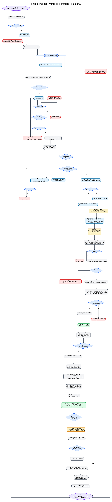

# Flujo 4 - Venta de confitería/cafetería

---
## Objetivo
Permitir que el administrador registre ventas de productos de confitería o cafetería, tanto a clientes registrados como
a personas eventuales, descontando stock automáticamente y registrando el ingreso en caja diaria.

Este flujo tiene como finalidad controlar las ventas de bebidas, golosinas, snacks, cafetería y otros productos,
evitando errores de stock y permitiendo consultar posteriormente qué se vendió, cuándo, a quién, por qué monto y con qué
método de pago.

Se define que en la primera versión el saldo a favor del cliente solo se utilizará para cuotas mensuales. Por lo tanto,
las ventas de confitería/cafetería no podrán pagarse con saldo a favor.

Este flujo depende de que previamente exista un módulo de productos y stock que permita cargar productos, modificar
precios, definir stock inicial, ajustar stock y detectar productos con stock bajo.
---

## Actor principal
    Administrador del sistema.
---

## Situación inicial
Una persona compra uno o más productos en el complejo. La persona puede ser:

- Cliente registrado.
- Responsable de un cliente.
- Persona eventual.
- Jugador que alquiló cancha.
- Invitado de un cumpleaños.
- Público general.

>La venta puede realizarse de manera rápida desde la confitería/cafetería, sin necesidad de que el comprador esté registrado
como cliente permanente.
---

## Condición para iniciar el flujo
Deben existir productos activos cargados en el sistema. Cada producto deberá tener, como mínimo:

- Nombre.
- Categoría.
- Precio de venta.
- Stock actual.
- Stock mínimo.
- Estado activo.
- Indicación sobre si controla stock.

El administrador debe ingresar al sistema con un usuario autorizado y tener permiso para registrar ventas. 
Si no existen productos activos cargados, el sistema deberá informar:

    - [ "No hay productos activos disponibles para vender. Primero debe cargar productos." ]

>En ese caso, el sistema podrá ofrecer un acceso directo al módulo de productos.
---

## Dependencia con otro flujo
Este flujo presupone que los productos ya fueron cargados previamente. Por lo tanto, antes de implementar completamente 
este flujo, deberá existir un flujo específico para:

- Alta de productos.
- Modificación de productos.
- Baja lógica de productos.
- Carga de stock inicial.
- Ajustes manuales de stock.
- Control de stock mínimo.
- Historial de movimientos de stock.

Ese flujo podrá documentarse como:

    - Flujo 10 - ABM de productos, stock y ajustes.
---

## Regla sobre saldo a favor
En la primera versión:

- El saldo a favor del cliente no podrá usarse para ventas de confitería/cafetería.
- Toda venta deberá cobrarse mediante un método de pago real.
- Toda venta deberá generar movimiento de caja.
- El saldo a favor se reserva únicamente para cuotas mensuales.

Ejemplo:
Si un cliente tiene $30.000 de saldo a favor por cuotas, no podrá usar ese saldo para comprar bebidas, golosinas o 
productos de cafetería en la versión inicial.

>El sistema podrá mostrar el saldo a favor únicamente como dato informativo, pero no deberá permitir seleccionarlo como
medio de pago para esta operación.
---

## Regla sobre método de pago
Para la primera versión, cada venta tendrá un único método de pago:

- Efectivo.
- Débito.
- Crédito.
- Transferencia.
- Mercado Pago.
- Otro.

Más adelante podrá agregarse pago mixto. Ejemplo:

- Parte en efectivo.
- Parte por transferencia.

>Para dejar el sistema preparado, el diseño no deberá impedir que en el futuro se agregue una entidad de detalle de métodos
de pago por venta.
---

## Regla sobre venta cobrada
Para la primera versión, una venta de confitería/cafetería se registrará únicamente cuando se cobre. Esto significa:

- No existirán ventas fiadas en este flujo.
- No existirán ventas pendientes de pago.
- No se generará deuda por confitería/cafetería en la versión 1.
- Si más adelante se permite fiar productos, deberá crearse un flujo específico de deuda por ventas o cuenta corriente.

>Esta decisión mantiene simple la caja diaria y evita mezclar deudas de cuotas con deudas de productos.
---

## Estados de la venta
Toda venta deberá tener un estado. Estados recomendados:

- REGISTRADA.
- ANULADA.

Una venta nueva queda inicialmente en estado REGISTRADA. Si una venta se cargó por error, no debe borrarse físicamente. 
Debe anularse mediante un flujo separado o una acción de anulación controlada.
---

## Pantalla - Venta rápida

    Buscar producto:

    [ Coca Cola                         ] [Buscar]

    Productos seleccionados:
    --------------------------------------------------------------------------
    Producto        Precio unitario    Cantidad       Subtotal      Acciones
    --------------------------------------------------------------------------
    Coca Cola       $2.000             [ 2 ]          $4.000       [Quitar]
    Alfajor         $1.500             [ 1 ]          $1.500       [Quitar]
    --------------------------------------------------------------------------

    Total: $5.500

    Comprador:
        ( ) Cliente registrado
        ( ) Persona eventual

    Cliente:             [ Buscar cliente       ]
    Persona eventual:    [ Nombre opcional      ]
    Método de pago:      [ Efectivo             ]
    Observación:         [ Opcional             ]

    Aviso:
            El saldo a favor del cliente no puede utilizarse para ventas de confitería/cafetería.

    [Confirmar venta]
    [Cancelar]
---

## Funciones disponibles en el carrito
Antes de confirmar la venta, el administrador deberá poder:

- Agregar productos.
- Cambiar la cantidad de un producto ya agregado.
- Quitar productos del carrito.
- Cancelar la venta completa.
- Ver el total actualizado automáticamente.

Si el administrador modifica la cantidad, el sistema deberá recalcular el subtotal del producto y el total general.
Si el administrador quita todos los productos del carrito, el sistema no deberá permitir confirmar la venta.
---

## Regla sobre precio utilizado
Para la primera versión, el precio utilizado en la venta será el precio vigente al momento de confirmar la venta. Reglas:

- El sistema mostrará el precio actual del producto en el carrito.
- Antes de confirmar, el sistema podrá volver a tomar el precio vigente.
- El precio aceptado en el resumen final será el que se guardará como precio unitario histórico en DetalleVenta.
- Cambios posteriores en el precio del producto no modificarán ventas ya registradas.

>Esta regla evita que una venta vieja cambie si luego se modifica el precio del producto.
---

## Regla sobre producto repetido en el carrito
Si el administrador agrega un producto que ya está en el carrito, el sistema deberá aumentar la cantidad existente en lugar
de crear una línea duplicada. Ejemplo:

    - El administrador agrega Coca Cola x1.
    - Luego vuelve a agregar Coca Cola x2.
    - El carrito deberá mostrar Coca Cola x3.

>Esta decisión simplifica el uso rápido en confitería y evita errores en el detalle de venta.
---

## Pasos del flujo

    1. El administrador ingresa al sistema.
    2. El administrador accede a la pantalla "Venta rápida".
    3. El sistema muestra un buscador de productos.
    4. El administrador busca o selecciona un producto.
    5. El sistema muestra los productos activos que coinciden con la búsqueda.
    6. El administrador agrega un producto a la venta.
    7. El administrador ingresa la cantidad.
    8. El sistema verifica que la cantidad sea mayor a cero.
    9. El sistema verifica si el producto controla stock.
    10. Si el producto controla stock, el sistema verifica que tenga stock suficiente.
    11. Si no hay stock suficiente, el sistema muestra un mensaje de error:
        - [ "No hay stock suficiente para este producto." ]

    12. Si hay stock suficiente, o si el producto no controla stock, el sistema agrega el producto al detalle de venta.
    12.1. Si el producto ya estaba en el carrito, el sistema aumenta la cantidad existente en lugar de duplicar la línea.
    13. El administrador puede seguir agregando más productos.
    14. El administrador puede modificar la cantidad de un producto agregado.
    15. El administrador puede quitar un producto del carrito antes de confirmar.
    16. Por cada producto agregado, el sistema calcula:

        - Precio unitario.
        - Cantidad.
        - Subtotal.

    17. El sistema calcula el total general de la venta.
    18. El administrador indica el tipo de comprador:

        - Cliente registrado.
        - Persona eventual.

    19. Si la venta es a cliente registrado, el administrador busca y selecciona el cliente.
    20. Si el cliente tiene saldo a favor, el sistema podrá mostrarlo solo como dato informativo.
    21. El sistema deberá aclarar que el saldo a favor no se puede utilizar para esta venta.
    22. Si la venta es a persona eventual, el administrador puede cargar un nombre opcional.
    23. Si la persona eventual no tiene nombre cargado, la venta quedará registrada como:
        - [ "Persona eventual" ]

    24. El administrador selecciona el método de pago:

        - Efectivo.
        - Débito.
        - Crédito.
        - Transferencia.
        - Mercado Pago.
        - Otro.

    25. El sistema valida que la venta tenga al menos un producto.
    26. El sistema valida que todas las cantidades sean mayores a cero.
    27. El sistema valida que el total sea mayor a cero.
    28. El sistema valida que se haya seleccionado método de pago.
    29. El sistema valida nuevamente el stock antes de confirmar, para evitar errores.
    29.1. El sistema toma el precio vigente al momento de confirmar y lo muestra en el resumen.
    30. El sistema muestra un resumen de la venta.
    31. El resumen muestra:

        - Productos.
        - Cantidades.
        - Subtotales.
        - Total.
        - Comprador.
        - Método de pago.
        - Aclaración de que no se utiliza saldo a favor.
        - Estado inicial de la venta: REGISTRADA.

    32. El administrador confirma la venta.
    33. El sistema registra la venta con estado REGISTRADA.
    34. El sistema registra el detalle de venta de cada producto.
    35. El sistema guarda el precio unitario histórico de cada producto vendido.
    36. El sistema descuenta el stock de cada producto que controle stock.
    37. Por cada descuento de stock, el sistema registra un movimiento de stock.
    38. El sistema registra un movimiento de caja de tipo INGRESO.
    39. El movimiento de caja debe tener concepto CONFITERIA_CAFETERIA.
    40. El movimiento de caja queda asociado a la venta.
    41. El sistema guarda:

        - Fecha.
        - Hora.
        - Usuario que registró la operación.
        - Método de pago.
        - Observación, si existe.
        - Comprador asociado o persona eventual.

    42. El sistema muestra un resumen final de venta.
    43. El administrador puede:

        - Registrar otra venta.
        - Ver caja diaria.
        - Ver historial del cliente, si la venta fue asociada a un cliente.
        - Volver al inicio.
---

## Validación final de stock
El sistema deberá validar stock en dos momentos:

1. Al agregar el producto al carrito.
2. Al confirmar definitivamente la venta.

La segunda validación es importante porque el stock pudo haber cambiado mientras la venta estaba siendo cargada.
Si al confirmar la venta ya no hay stock suficiente, el sistema no deberá guardar la venta y deberá mostrar un mensaje:

    - [ "El stock disponible cambió. Revise las cantidades antes de confirmar." ]
---

## Movimiento de stock
Cuando una venta descuenta stock, deberá registrarse un movimiento de stock. Ejemplo:

    Producto: Coca Cola.
    Tipo de movimiento: SALIDA_POR_VENTA.
    Cantidad: 2.
    Venta asociada: Venta #15.
    Usuario: Administrador.
    Fecha y hora: 10/06/2026 18:35.

>Esto permite saber por qué bajó el stock de un producto y reconstruir el historial.
---

## Producto sin control de stock
En la primera versión se recomienda que todos los productos físicos controlen stock. Sin embargo, el sistema puede 
quedar preparado para productos sin control de stock, como casos especiales de cafetería o servicios consumibles difíciles 
de medir. Regla recomendada:

- Si producto.controlaStock = true, validar y descontar stock.
- Si producto.controlaStock = false, permitir venta sin validar stock.
- En ambos casos, guardar el detalle de venta y registrar el ingreso en caja.

Ejemplo de producto sin control de stock:

- Café servido.
- Agua caliente.
- Servicio de cafetería especial.

>Si se decide que todos los productos controlan stock en la versión inicial, este atributo puede dejarse previsto para una
versión futura.
---

## Ejemplo - venta a cliente registrado

    Cliente: Mateo Gómez
    Saldo a favor disponible: $30.000

    Productos:
        - Coca Cola x1 = $2.000
        - Alfajor x2 = $3.000

    Total: $5.000
    Método de pago: Efectivo

    Resultado:
        - Se registra la venta con estado REGISTRADA.
        - No se utiliza saldo a favor.
        - Se descuenta stock.
        - Se registra movimiento de stock por cada producto vendido.
        - Se registra ingreso real en caja por $5.000.
        - El movimiento de caja queda con concepto CONFITERIA_CAFETERIA.
        - La venta queda visible en el historial de compras del cliente.
---

## Ejemplo - venta a persona eventual

    Comprador eventual: Juan

    Productos:
        - Café x1 = $1.500
        - Agua x1 = $1.200

    Total: $2.700
    Método de pago: Mercado Pago

    Resultado:
        - Se registra la venta sin cliente asociado.
        - Se registra comprador eventual "Juan".
        - Se descuenta stock si los productos controlan stock.
        - Se registra ingreso real en caja por $2.700.
        - El movimiento de caja queda con concepto CONFITERIA_CAFETERIA.
        - La venta aparece en informes de confitería/cafetería.
---

## Ejemplo - venta a persona eventual sin nombre

    Comprador eventual: sin cargar.

    Productos:
        - Coca Cola x1 = $2.000

    Total: $2.000
    Método de pago: Efectivo

    Resultado:
        - Se registra la venta sin cliente asociado.
        - En caja e informes se muestra como "Persona eventual".
        - Se descuenta stock.
        - Se registra ingreso real en caja por $2.000.
---

## Subflujo - Modificar cantidad antes de confirmar

    1. El administrador agrega un producto al carrito.
    2. El administrador cambia la cantidad.
    3. El sistema valida que la nueva cantidad sea mayor a cero.
    4. Si el producto controla stock, el sistema valida stock suficiente.
    5. El sistema recalcula subtotal.
    6. El sistema recalcula total general.
    7. La venta queda lista para confirmar.
---

## Subflujo - Quitar producto antes de confirmar

    1. El administrador agrega uno o más productos al carrito.
    2. El administrador presiona [Quitar] sobre un producto.
    3. El sistema elimina ese producto del carrito.
    4. El sistema recalcula el total.
    5. Si no quedan productos, el sistema deshabilita el botón [Confirmar venta].
---

## Subflujo futuro - Anulación de venta
La anulación de venta deberá documentarse con más detalle en un flujo separado, pero este flujo deja definidas las reglas
mínimas necesarias.

Cuando una venta se anula:

- La venta no debe borrarse físicamente.
- La venta cambia su estado de REGISTRADA a ANULADA.
- El sistema debe registrar fecha y hora de anulación.
- El sistema debe registrar usuario que anuló la venta.
- El sistema debe registrar motivo de anulación.
- El sistema debe restaurar el stock de los productos vendidos, si correspondiera.
- El sistema debe registrar movimientos de stock de tipo ENTRADA_POR_ANULACION_VENTA.
- En la versión 1, el sistema debe registrar un movimiento de caja de tipo ANULACION.
- No se usará EGRESO libre para anular ventas, salvo que en el futuro se implemente un módulo contable más avanzado.
- El movimiento de caja de anulación debe quedar relacionado con la venta anulada.
- La venta anulada debe seguir visible en auditoría e informes administrativos.

Ejemplo:

    Venta #15:
        - Coca Cola x2.
        - Total: $4.000.
        - Estado original: REGISTRADA.

    Se anula la venta:

        - Estado final: ANULADA.
        - Stock de Coca Cola aumenta en 2.
        - Caja registra anulación por $4.000.
---

## Pantalla - Resumen final de venta

    Venta registrada correctamente.

    Venta N°: 15
    Estado: REGISTRADA
    Fecha y hora: 10/06/2026 18:35
    Comprador: Mateo Gómez
    Método de pago: Efectivo

    Productos:
    ------------------------------------------------------------
    Producto        Cantidad    Precio unitario    Subtotal
    ------------------------------------------------------------
    Coca Cola       1           $2.000             $2.000
    Alfajor         2           $1.500             $3.000
    ------------------------------------------------------------

    Total: $5.000

    Caja:
        - Movimiento generado: INGRESO.
        - Concepto: CONFITERIA_CAFETERIA.
        - Monto: $5.000.

    [Registrar otra venta]
    [Ver caja diaria]
    [Volver al inicio]
---

## Decisiones importantes

- ¿El administrador tiene permiso para registrar ventas?
- ¿Existen productos activos cargados?
- ¿El producto existe?
- ¿El producto está activo?
- ¿El producto controla stock?
- ¿La cantidad es válida?
- ¿Hay stock suficiente?
- ¿El administrador modificó la cantidad antes de confirmar?
- ¿El administrador quitó productos del carrito?
- ¿La venta tiene al menos un producto?
- ¿La venta es a cliente registrado o persona eventual?
- ¿El cliente tiene saldo a favor?
- ¿El sistema debe impedir usar saldo a favor para esta venta?
- ¿El método de pago fue seleccionado?
- ¿El total es mayor a cero?
- ¿El administrador confirma la venta?
- ¿La venta deberá poder anularse posteriormente?
- Si se anula la venta, ¿debe restaurarse stock?
---

## Datos que intervienen

- Producto.
- CategoríaProducto.
- Venta.
- DetalleVenta.
- Cliente, si corresponde.
- Persona eventual, si corresponde.
- Método de pago.
- MovimientoCaja.
- MovimientoStock.
- Usuario administrador.
- Auditoria.
- ResumenVenta o ComprobanteVenta.
---

## Nuevos conceptos detectados

- [ MovimientoStock ]

Este concepto representa cada cambio de stock de un producto. Ejemplos:

- ENTRADA_POR_COMPRA.
- SALIDA_POR_VENTA.
- ENTRADA_POR_ANULACION_VENTA.
- AJUSTE_MANUAL_POSITIVO.
- AJUSTE_MANUAL_NEGATIVO.

Es necesario para saber por qué cambió el stock de un producto y para auditar errores.
---

## Nuevos conceptos detectados

- [ EstadoVenta ]

Estados recomendados:

- REGISTRADA.
- ANULADA.

Permite conservar historial sin borrar ventas y habilita futuras anulaciones controladas.
---

## Nuevos conceptos detectados

- [ Producto.controlaStock ]

Permite definir si un producto debe descontar stock automáticamente o no. Para la versión inicial, se recomienda que 
todos los productos físicos tengan control de stock.
---

## Nuevos conceptos detectados

- [ ResumenVenta / ComprobanteVenta ]

Este concepto representa el resumen visible de una venta registrada. No equivale a una factura fiscal. Debe mostrar:

- Número de venta.
- Fecha y hora.
- Comprador o persona eventual.
- Productos vendidos.
- Cantidades.
- Precio unitario histórico.
- Subtotal por producto.
- Total.
- Método de pago.
- Movimiento de caja generado.
- Usuario que registró la venta.
---

## Reglas de negocio detectadas

- Una venta debe tener al menos un producto.
- No se puede vender un producto con cantidad cero o negativa.
- No se puede vender un producto sin stock suficiente si controla stock.
- Solo se deben vender productos activos.
- Toda venta debe guardar el precio unitario histórico.
- Toda venta debe calcular subtotal por producto.
- Toda venta debe calcular total general.
- Toda venta puede estar asociada a un cliente registrado o a una persona eventual.
- Si una venta eventual no tiene nombre cargado, se mostrará como "Persona eventual".
- Toda venta debe tener método de pago.
- Toda venta debe descontar stock de productos que controlen stock.
- Toda venta debe generar movimiento de stock cuando descuenta stock.
- Toda venta debe generar movimiento de caja.
- El movimiento de caja de una venta debe tener concepto CONFITERIA_CAFETERIA.
- Toda venta debe quedar con estado REGISTRADA al confirmarse.
- Toda venta debe guardar fecha, hora y usuario que la registró.
- En la primera versión, el saldo a favor no se puede usar para ventas de confitería/cafetería.
- El saldo a favor puede mostrarse como dato informativo, pero no puede aplicarse a la venta.
- Los informes de ventas deberán calcularse desde ventas y movimientos de caja, no desde saldos a favor.
- El administrador debe poder modificar cantidades antes de confirmar.
- El administrador debe poder quitar productos antes de confirmar.
- Si una venta se anula, debe restaurarse stock cuando corresponda.
- Si una venta se anula, debe registrarse movimiento de caja de anulación.
- Una venta anulada no debe borrarse físicamente.
- Toda venta registrada deberá generar auditoría.
- Toda modificación de stock por venta deberá quedar auditada.
- En la versión 1, una venta de confitería/cafetería se registra únicamente cuando se cobra.
- En la versión 1, no existirán ventas fiadas ni ventas pendientes de pago.
- Si el administrador agrega un producto que ya está en el carrito, el sistema deberá aumentar la cantidad existente en lugar de duplicar la línea.
- El precio de venta utilizado será el precio vigente al momento de confirmar la venta.
- El sistema deberá mostrar un resumen final de la venta registrada.
- El resumen de venta no representa factura fiscal.
- En la versión 1, la anulación de una venta deberá registrar un MovimientoCaja de tipo ANULACION.
---

## Impacto en entidades
Confirmar o agregar estos atributos:

    Producto:
        - id.
        - nombre.
        - categoria.
        - precioVenta.
        - stockActual.
        - stockMinimo.
        - activo.
        - controlaStock.

    Venta:
        - id.
        - cliente.
        - compradorEventual.
        - fechaHora.
        - total.
        - metodoPago.
        - estado.
        - usuarioRegistro.
        - observacion.
        - fechaAnulacion.
        - usuarioAnulacion.
        - motivoAnulacion.

    DetalleVenta:
        - id.
        - venta.
        - producto.
        - cantidad.
        - precioUnitarioHistorico.
        - nombreProductoHistorico.
        - subtotal.

    MovimientoCaja:
        - id.
        - tipoMovimiento.
        - concepto.
        - monto.
        - metodoPago.
        - venta.
        - fechaHora.
        - usuario.

    MovimientoStock:
        - id.
        - producto.
        - tipoMovimientoStock.
        - cantidad.
        - stockAnterior.
        - stockNuevo.
        - venta.
        - observacion.
        - fechaHora.
        - usuario.
---

## Resultado final
El sistema registra una venta de confitería/cafetería, guarda el detalle de productos vendidos, conserva el precio unitario
histórico, descuenta stock automáticamente cuando corresponde y registra el ingreso en caja diaria con concepto
CONFITERIA_CAFETERIA. La venta queda disponible para informes, historial de compras y control de productos más vendidos.

La venta queda inicialmente en estado REGISTRADA. Si se anula posteriormente, no se borra: se cambia a estado ANULADA, se
restaura stock cuando corresponda y se registra un movimiento de caja de anulación.

La venta no utiliza saldo a favor del cliente en la primera versión.

