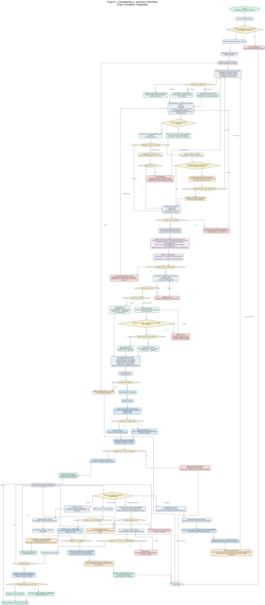

# Flujo 6 - Cumpleaños y eventos

---
## Objetivo
Permitir que el administrador registre cumpleaños deportivos, cumpleaños mixtos, cumpleaños en salón infantil y eventos
particulares infantiles, controlando automáticamente la disponibilidad del espacio correspondiente, los datos del
cumpleañero, los datos del responsable, la seña, el saldo pendiente, los pagos y el estado del evento. Este flujo tiene
como finalidad reemplazar el control manual de cumpleaños y eventos, evitar superposición de horarios, controlar señas y
saldos, y permitir saber qué eventos están próximos y cuánto falta cobrar.
---

## Actor principal
    Administrador del sistema.
---

## Situación inicial
Una persona consulta para reservar un cumpleaños o evento en el complejo. El evento puede utilizar distintos espacios del
complejo:

- Cancha de fútbol 5.
- Salón infantil del segundo piso.
- Otro espacio definido en el futuro.

Los tipos iniciales de evento son:

- Cumpleaños deportivo varones.
- Cumpleaños deportivo mixto.
- Cumpleaños en salón infantil.
- Evento particular infantil.
---

## Diferencia con el Flujo 5
Este flujo no representa una reserva simple de cancha. Aunque un cumpleaños deportivo use la cancha, debe registrarse
como evento, porque tiene datos y reglas adicionales:

- Tipo de cumpleaños.
- Nombre del cumpleañero.
- Edad del cumpleañero.
- Responsable.
- Teléfono.
- Seña.
- Saldo pendiente.
- Observaciones.
- Estado del evento.

>El Flujo 5 queda reservado para alquileres simples de cancha, educación física escolar y usos deportivos comunes.
---

## Condición para iniciar el flujo
El administrador debe tener permiso para registrar eventos. El sistema debe permitir consultar disponibilidad del
espacio correspondiente. El sistema debe permitir registrar eventos de:

- Clientes registrados.
- Personas eventuales.

En la primera versión, el saldo a favor del cliente no se aplicará a cumpleaños ni eventos. Los pagos de eventos deberán
registrarse como pagos específicos del evento.

## Regla sobre edad del salón infantil
Para la primera versión, el cumpleaños en salón infantil tendrá una validación de edad **bloqueante**:

- Edad mínima: 3 años.
- Edad máxima: 7 años.

Si la edad del cumpleañero está fuera de ese rango, el sistema no deberá permitir registrar el evento como cumpleaños en
salón infantil. El administrador podrá elegir otro tipo de evento compatible, por ejemplo `Evento particular infantil`,
si corresponde.

Esta decisión evita cargar por error un cumpleaños en un servicio que no corresponde al público objetivo del salón.

## Regla sobre evento particular infantil
El `Evento particular infantil` representa un evento infantil no necesariamente asociado a un cumpleaños tradicional.
Por lo tanto:

- Puede tener nombre de cumpleañero, si corresponde.
- Puede tener edad, si corresponde.
- No será obligatorio cargar cumpleañero ni edad cuando el evento no sea un cumpleaños.
- Si usa el salón infantil y se informa edad, el sistema deberá advertir si está fuera del rango orientativo de 3 a 7 años.
- Para la primera versión, esa advertencia no será bloqueante en eventos particulares, pero deberá quedar registrada en observaciones si el administrador decide continuar.

## Concepto central - disponibilidad de espacios
Antes de registrar cualquier cumpleaños o evento, el sistema deberá verificar si el espacio está disponible. La
disponibilidad no debe revisarse solamente contra otros eventos. El sistema debe verificar el espacio contra cualquier
ocupación activa del mismo espacio. Por ejemplo:

- Un cumpleaños deportivo usa la cancha.
- Una reserva simple de cancha también usa la cancha.
- La escuela de fútbol también usa la cancha.
- La educación física escolar también usa la cancha.

Por lo tanto, todos esos usos deben bloquear la disponibilidad de la cancha.

## Tipos de ocupación generados por este flujo

- EVENTO_CANCHA, si el evento usa la cancha.
- EVENTO_SALON, si el evento usa el salón infantil.
- EVENTO_OTRO, si el evento usa otro espacio futuro.

## Tipos de evento y espacio utilizado

    Cumpleaños deportivo varones:
        - Espacio principal: Cancha de fútbol 5.

    Cumpleaños deportivo mixto:
        - Espacio principal: Cancha de fútbol 5.

    Cumpleaños en salón infantil:
        - Espacio principal: Salón infantil.

    Evento particular infantil:
        - Espacio principal: Salón infantil u otro espacio definido por el administrador.

## Regla técnica sobre espacios del evento
Para la primera versión, cada evento tendrá un solo espacio principal y generará una sola ocupación de espacio:

    Evento 1 --- 1 OcupaciónEspacio

Más adelante, si un evento utiliza más de un espacio al mismo tiempo, por ejemplo salón infantil + cancha + sector de
confitería, el modelo podrá evolucionar a:

    Evento 1 --- N OcupaciónEspacio

>Por ahora, el sistema deberá trabajar con un espacio principal para simplificar la agenda y evitar duplicidad de reservas.

## Regla sobre duración y fecha del evento
Para la versión 1, un evento no podrá cruzar de un día a otro. Reglas:

- La fecha de inicio y fin será la misma.
- La hora de inicio deberá ser anterior a la hora de fin.
- Si se necesita registrar un evento de varios días, deberá documentarse un flujo especial futuro.
- La disponibilidad se verificará por fecha, espacio y rango horario.

Ejemplo no permitido en versión 1:

    Fecha: 10/06/2026
    Hora inicio: 23:00
    Hora fin: 01:00
---

## Ejemplo con conflicto inverso

    Ocupación existente:
        Cumpleaños deportivo
        17:00 a 19:00

    Nueva reserva:
        Reserva simple de cancha
        18:00 a 19:00

    Resultado:
        Hay conflicto.
---

## Ejemplo sin conflicto

    Ocupación existente:
        Cumpleaños deportivo
        17:00 a 19:00

    Nueva reserva:
        Reserva simple de cancha
        19:00 a 20:00

    Resultado:
        No hay conflicto.
---

## Pantalla - Nuevo cumpleaños o evento

    Nuevo cumpleaños o evento

    Tipo de evento:          [ Cumpleaños en salón infantil ]
    Espacio:                 [ Salón infantil               ]

    Fecha:                   [ 20/05/2026                   ]
    Hora inicio:             [ 17:00                        ]
    Hora fin:                [ 20:00                        ]

    Nombre cumpleañero:      [ Benjamín                     ]
    Edad cumpleañero:        [ 5                            ]

    Responsable:             [ Marina López                 ]
    Teléfono responsable:    [ 11-5555-5555                 ]

    Cliente registrado:      [ No                           ]

    Importe total:           [ $120.000                     ]

    Tipo de pago inicial:
        ( ) Sin pago inicial
        (x) Seña
        ( ) Pago total

    Monto pagado:            [ $40.000                      ]
    Método de pago:          [ Débito                       ]

    Observaciones:           [ Incluye pelotero             ]

    [Verificar disponibilidad]
    [Guardar evento]
    [Cancelar]

## Regla sobre pago inicial del evento
La pantalla deberá permitir diferenciar claramente entre:

- Sin pago inicial.
- Seña.
- Pago total.

Reglas:

- Si no hay pago inicial, el evento queda `PENDIENTE`.
- Si el pago inicial es menor al importe total, el evento queda `SEÑADO`.
- Si el pago inicial es igual al importe total, el evento queda `PAGADO`.
- El pago inicial no podrá superar el importe total.
- Todo pago inicial deberá generar `PagoEvento` y `MovimientoCaja` de tipo `INGRESO`.
---

## Pasos

    1. El administrador ingresa al sistema.
    2. El administrador accede al módulo "Eventos".
    3. El sistema muestra una agenda de eventos.
    4. El administrador selecciona:

        - [ Nuevo evento ]

    5. El sistema muestra el formulario de cumpleaños o evento.
    6. El administrador selecciona el tipo de evento:

       - Cumpleaños deportivo varones.
       - Cumpleaños deportivo mixto.
       - Cumpleaños en salón infantil.
       - Evento particular infantil.

    7. El sistema determina el espacio principal según el tipo de evento.
    8. Si el tipo es cumpleaños deportivo varones, el espacio será la cancha de fútbol 5.
    9. Si el tipo es cumpleaños deportivo mixto, el espacio será la cancha de fútbol 5.
    10. Si el tipo es cumpleaños en salón infantil, el espacio será el salón infantil.
    11. Si el tipo es evento particular infantil, el administrador podrá seleccionar el espacio correspondiente.
    12. El administrador ingresa la fecha del evento.
    13. El administrador ingresa la hora de inicio.
    14. El administrador ingresa la hora de fin.
    15. El administrador carga el nombre del cumpleañero, si corresponde.
    16. El administrador carga la edad del cumpleañero, si corresponde.
    17. El administrador carga los datos del responsable:

        - Nombre.
        - Teléfono.

    18. El administrador indica si el evento está asociado a un cliente registrado.
    19. Si está asociado a cliente registrado, el administrador busca y selecciona el cliente.
    20. Si es una persona eventual, el sistema permite continuar con los datos del responsable.
    21. El administrador puede agregar observaciones.
    22. El sistema verifica si el tipo de evento tiene restricción de edad.
    23. Para cumpleaños en salón infantil, el sistema debe validar que la edad esté dentro del rango permitido.
    24. Para la primera versión, el cumpleaños en salón infantil estará permitido para niños de 3 a 7 años.
    25. Si el tipo es cumpleaños en salón infantil y la edad está fuera del rango, el sistema muestra un error bloqueante:
        - [ "El salón infantil está habilitado para cumpleaños de niños entre 3 y 7 años." ]

    26. Si el evento es particular infantil, el nombre y la edad del niño serán opcionales.
    27. Si el evento particular infantil usa el salón infantil y se carga una edad fuera del rango orientativo, el sistema muestra una advertencia:
        - [ "La edad informada está fuera del rango orientativo del salón infantil. Verifique si corresponde continuar." ]

    28. Si la edad es válida, si el evento no requiere validación o si la advertencia fue aceptada, el sistema continúa.
    29. El sistema valida que la fecha sea válida.
    30. El sistema valida que la hora de inicio sea anterior a la hora de fin.
    31. El sistema determina el espacio que utilizará el evento.
    32. El sistema ejecuta la verificación automática de disponibilidad para el espacio seleccionado.
    33. Si el evento usa la cancha, el sistema debe considerar ocupaciones activas como:

        - Reservas simples de cancha.
        - Cumpleaños deportivos existentes.
        - Escuela de fútbol.
        - Educación física escolar.
        - Eventos deportivos.
        - Bloqueos manuales.
        - Mantenimiento.
        - Otros usos futuros de la cancha.

    34. Si el evento usa el salón infantil, el sistema debe considerar ocupaciones activas como:

        - Cumpleaños en salón infantil.
        - Eventos particulares infantiles.
        - Bloqueos manuales.
        - Mantenimiento.
        - Otros usos del salón.

    35. Si el evento usa el área de Taekwondo, el sistema debe considerar ocupaciones activas como:

        - Clases de Taekwondo.
        - Eventos o bloqueos cargados sobre ese espacio.
        - Mantenimiento.

    36. El sistema busca todas las ocupaciones activas del espacio en la fecha seleccionada.
    37. El sistema compara el horario solicitado contra cada ocupación existente.
    38. Si existe una ocupación activa con horario superpuesto, el sistema no permite registrar el evento.
    39. El sistema muestra un mensaje indicando qué ocupa el espacio. Ejemplo:

        No se puede registrar el cumpleaños deportivo.
        La cancha está ocupada en ese horario.

        Ocupación existente: Escuela de fútbol
        Horario: 17:00 a 19:00.

    40. Si no existe conflicto, el sistema permite continuar con importe, seña y datos económicos.
    41. El administrador ingresa el importe total del evento.
    42. El sistema valida que el importe total sea mayor a cero.
    43. El administrador indica el tipo de pago inicial: sin pago, seña o pago total.
    44. Si no hay pago inicial, el evento queda inicialmente como PENDIENTE.
    45. Si hay seña o pago total, el administrador ingresa el monto pagado.
    46. El sistema valida que el monto pagado sea mayor a cero cuando exista pago inicial.
    47. El sistema valida que el monto pagado no supere el importe total.
    48. Si hay pago inicial, el administrador selecciona el método de pago.
    49. El sistema calcula el saldo pendiente.
    50. El sistema muestra una previsualización del evento.
    51. La previsualización muestra:

        - Tipo de evento.
        - Espacio utilizado.
        - Fecha.
        - Horario.
        - Cumpleañero, si corresponde.
        - Edad, si corresponde.
        - Responsable.
        - Teléfono.
        - Cliente asociado, si corresponde.
        - Importe total.
        - Seña.
        - Saldo pendiente.
        - Método de pago, si corresponde.
        - Observaciones.
        - Estado inicial.
        - Espacio a bloquear.
        - Advertencias aceptadas, si existieran.

    52. El administrador revisa la previsualización.
    53. Si detecta un error, puede volver atrás y corregir.
    54. Si todo está correcto, el administrador confirma la operación.
    55. El sistema registra el evento.
    56. El sistema crea una `OcupaciónEspacio` asociada al evento.
    57. Si hubo seña o pago total, el sistema registra un pago asociado al evento.
    58. Si hubo pago, el sistema registra un movimiento de caja de tipo INGRESO.
    59. El sistema asigna el estado correspondiente:

        - PENDIENTE, si no hubo seña ni pago.
        - SEÑADO, si hubo seña y queda saldo pendiente.
        - PAGADO, si se abonó el importe total.

    60. El sistema guarda:

        - Fecha de creación.
        - Hora de creación.
        - Usuario que registró el evento.

    61. La ocupación creada bloquea el espacio para futuras reservas, eventos o actividades en el mismo horario.
    62. La creación del evento, la ocupación, el pago y el movimiento de caja deberán realizarse en una única transacción.
    63. Si falla cualquiera de esas operaciones, no deberá guardarse ninguna parte del evento.
    64. El sistema muestra el resumen final.
    65. El evento queda visible en la agenda de eventos.
    66. El evento también debe impactar en la disponibilidad del espacio usado.
---

# Subflujo - Registrar pago final o pago de saldo pendiente

    1. El administrador ingresa a la ficha del evento.
    2. El sistema muestra:

        - Importe total.
        - Pagos registrados.
        - Saldo pendiente.
        - Estado actual.

    3. El administrador selecciona:
        - [ Registrar pago de saldo ]

    4. El sistema solicita:

        - Monto recibido.
        - Método de pago.
        - Observación opcional.

    5. El sistema valida que el monto sea mayor a cero.
    6. El sistema valida que el monto no supere el saldo pendiente del evento.
    7. El sistema muestra una previsualización del pago.
    8. El administrador confirma.
    9. El sistema registra un pago asociado al evento.
    10. El sistema registra un movimiento de caja de tipo INGRESO.
    11. El sistema recalcula el saldo pendiente.
    12. Si el saldo pendiente queda en cero, el evento queda en estado PAGADO.
    13. Si todavía queda saldo, el evento conserva estado SEÑADO o PENDIENTE según corresponda.
    14. El sistema muestra un resumen final del pago.
---

# Subflujo - Cancelar evento

    1. El administrador ingresa a la ficha del evento.
    2. El administrador selecciona:
        - [ Cancelar evento ]

    3. El sistema muestra una advertencia:
        - [ "El evento será cancelado y el espacio quedará liberado. Los pagos ya registrados no se eliminarán." ]

    4. Si el evento tiene pagos registrados, el sistema muestra:

        - Total pagado.
        - Saldo pendiente actual.
        - Método o métodos de pago utilizados.
        - Fecha de los pagos.

    5. Para la primera versión, cancelar el evento no elimina pagos ni modifica caja automáticamente.
    6. Si se decide devolver dinero, esa devolución deberá registrarse mediante un flujo específico de anulación/devolución de pagos.
    7. El administrador debe indicar el motivo de cancelación.
    8. El administrador confirma.
    9. El sistema cambia el estado del evento a CANCELADO.
    10. El sistema cancela o libera la `OcupaciónEspacio` asociada.
    11. El evento queda visible como historial.
    12. El espacio queda disponible para nuevas reservas o eventos en ese horario.
---

# Subflujo - Reprogramar evento

Para la versión 1, se recomienda tratar una reprogramación como:

    Cancelación del evento original + creación de un nuevo evento.

Pasos recomendados:

    1. El administrador abre la ficha del evento original.
    2. Selecciona:
        - [ Reprogramar evento ]

    3. El sistema advierte que se conservará historial del evento original.
    4. El administrador ingresa motivo de reprogramación.
    5. El sistema cambia el estado del evento original a `CANCELADO` o `REPROGRAMADO`, según se defina.
    6. El sistema libera o cancela la `OcupacionEspacio` original.
    7. El sistema abre la carga de un nuevo evento con los datos copiados.
    8. El administrador define nueva fecha y horario.
    9. El sistema verifica disponibilidad del nuevo horario.
    10. El sistema crea un nuevo evento y una nueva `OcupacionEspacio`.
    11. Si existían pagos previos, el tratamiento del dinero deberá quedar registrado como `REPROGRAMADO`.
    12. La asociación del pago original con el nuevo evento deberá resolverse mediante un flujo específico de ajuste o reprogramación económica.

Regla recomendada:

- No modificar directamente fecha y horario de un evento con pagos u ocupación activa sin dejar historial.
---

# Subflujo - Marcar evento como realizado

    1. El evento llega a su fecha y horario de finalización.
    2. El sistema podrá sugerir marcarlo como realizado.
    3. Para la primera versión, el administrador podrá marcarlo manualmente desde la ficha del evento.
    4. El sistema cambiará el estado a REALIZADO.
    5. La ocupación quedará como historial de uso del espacio, no como ocupación futura disponible para edición común.

## Estados posibles de evento

- PENDIENTE: El evento fue registrado, pero no tiene seña ni pago.
- SEÑADO: El evento tiene una seña registrada y queda saldo pendiente.
- PAGADO: El evento fue pagado completamente.
- CANCELADO: El evento fue cancelado. Si tenía pagos, esos pagos quedan como historial y no se eliminan.
- REALIZADO: El evento ya ocurrió y fue marcado como realizado por el administrador o por un proceso automático futuro.

Importante:

- Un evento CANCELADO debe liberar su ocupación de espacio.
- Un evento REALIZADO conserva su ocupación como historial.
- Los pagos de eventos no se borran al cancelar; cualquier devolución o anulación deberá quedar registrada contablemente.

## Pantalla - Resumen final de evento

    Evento registrado correctamente.
    
    Evento N°: 8
    Estado: SEÑADO
    Tipo: Cumpleaños en salón infantil
    Espacio: Salón infantil
    Fecha: 20/05/2026
    Horario: 17:00 a 20:00
    
    Cumpleañero: Benjamín
    Edad: 5
    Responsable: Marina López
    Teléfono: 11-5555-5555
    
    Importe total: $120.000
    Monto pagado: $40.000
    Saldo pendiente: $80.000
    Método de pago: Débito
    
    Caja:
        - Movimiento generado: INGRESO.
        - Concepto: SALON_INFANTIL.
        - Monto: $40.000.
    
    Ocupación:
        - Salón infantil bloqueado de 17:00 a 20:00.
    
    Usuario que registró: Administrador

>El resumen de evento no representa factura fiscal.
---

## Ejemplo 1 - cumpleaños deportivo

    Tipo de evento: Cumpleaños deportivo mixto
    Espacio: Cancha de fútbol 5
    Fecha: 18/05/2026
    Horario: 17:00 a 19:00
    Cumpleañero: Mateo
    Edad: 8
    Responsable: Laura Pérez
    Importe total: $90.000
    Seña: $30.000

    Resultado:

        - Se registra el evento.
        - Se crea una ocupación de cancha de 17:00 a 19:00.
        - La cancha queda bloqueada de 17:00 a 19:00.
        - Se registra un pago por $30.000.
        - Se registra un movimiento de caja por $30.000.
        - El evento queda en estado SEÑADO.
        - Queda saldo pendiente de $60.000.
---

## Ejemplo 2 - cumpleaños en salón infantil

    Tipo de evento: Cumpleaños en salón infantil
    Espacio: Salón infantil
    Fecha: 20/05/2026
    Horario: 17:00 a 20:00
    Cumpleañero: Benjamín
    Edad: 5
    Responsable: Marina López
    Importe total: $120.000
    Seña: $40.000

    Resultado:

        - Se registra el evento.
        - Se crea una ocupación de salón infantil de 17:00 a 20:00.
        - El salón infantil queda bloqueado de 17:00 a 20:00.
        - Se registra un pago por $40.000.
        - Se registra un movimiento de caja por $40.000.
        - El evento queda en estado SEÑADO.
        - Queda saldo pendiente de $80.000.
---

## Ejemplo 3 - evento infantil sin seña

    Tipo de evento: Evento particular infantil
    Espacio: Salón infantil
    Fecha: 25/05/2026
    Horario: 18:00 a 21:00
    Responsable: Carlos Gómez
    Importe total: $100.000
    Seña: $0

    Resultado:

        - Se registra el evento.
        - Se crea una ocupación de salón infantil.
        - El salón queda bloqueado en la agenda.
        - No se registra pago.
        - No se registra movimiento de caja.
        - El evento queda en estado PENDIENTE.
---

## Ejemplo 4 - conflicto entre reserva simple y cumpleaños deportivo

    Existe:

        Reserva simple de cancha:
        18:00 a 19:00

    Se intenta registrar:

        Cumpleaños deportivo:
        18:00 a 20:00

    Resultado:
        El sistema no permite registrar el cumpleaños deportivo porque la cancha ya está ocupada.
---

## Ejemplo 5 - conflicto entre escuela de fútbol y cumpleaños deportivo

    Existe:

        Escuela de fútbol: 17:00 a 19:00
        Espacio: Cancha de fútbol 5

    Se intenta registrar:

        Cumpleaños deportivo:
        18:00 a 20:00

    Resultado:
        El sistema no permite registrar el cumpleaños deportivo porque la cancha está ocupada por la escuela de fútbol.
---

## Ejemplo 6 - sin conflicto por horario contiguo

    Existe:

        Cumpleaños deportivo:
        17:00 a 19:00

    Se intenta registrar:

        Reserva simple de cancha:
        19:00 a 20:00

    Resultado:
        El sistema permite registrar la reserva porque no hay superposición.
---

## Ejemplo 7 - pago final de evento

    Evento: Cumpleaños en salón infantil
    Importe total: $120.000
    Seña registrada: $40.000
    Saldo pendiente: $80.000

    El responsable paga el saldo el día del evento:

        - Monto recibido: $80.000.
        - Método de pago: Transferencia.

    Resultado:

        - Se registra un nuevo pago asociado al evento.
        - Se registra un movimiento de caja por $80.000.
        - El saldo pendiente queda en $0.
        - El evento queda en estado PAGADO.

---

## Ejemplo 8 - cancelación de evento con seña

    Evento: Cumpleaños deportivo mixto
    Importe total: $90.000
    Seña registrada: $30.000
    Estado: SEÑADO

    El responsable cancela el evento.

    Resultado:

        - El evento queda en estado CANCELADO.
        - La ocupación de cancha se libera.
        - La seña queda registrada como historial.
        - No se borra el pago.
        - No se modifica caja automáticamente.
        - Si corresponde devolver dinero, deberá registrarse en un flujo específico de devolución o anulación.
---

## Decisiones importantes

- ¿El administrador tiene permiso para registrar eventos?
- ¿Qué tipo de evento se está registrando?
- ¿Qué espacio utilizará el evento?
- ¿El evento usará la cancha o el salón infantil?
- ¿El evento está asociado a un cliente registrado?
- ¿El evento tiene restricción de edad?
- ¿La edad del cumpleañero es válida?
- ¿La fecha es válida?
- ¿La hora de inicio es anterior a la hora de fin?
- ¿El espacio está disponible?
- ¿Existe una reserva simple que bloquee la cancha?
- ¿Existe escuela de fútbol que bloquee la cancha?
- ¿Existe educación física escolar que bloquee la cancha?
- ¿Existe otro evento que bloquee el espacio?
- ¿Existe bloqueo manual o mantenimiento?
- ¿El importe total es mayor a cero?
- ¿La persona deja seña?
- ¿La seña es válida?
- ¿La seña cubre todo el importe?
- ¿Qué método de pago se utilizó?
- ¿El evento queda pendiente, señado o pagado?
- ¿El administrador confirma la operación?
- ¿El evento tiene saldo pendiente para pagar posteriormente?
- ¿El evento debe cancelarse?
- Si se cancela, ¿tiene pagos registrados?
- Si se cancela, ¿se debe liberar la ocupación del espacio?
- ¿El evento ya ocurrió y debe marcarse como realizado?
---

## Datos que intervienen

- Evento.
- TipoEvento.
- Espacio.
- OcupaciónEspacio.
- Cancha, si corresponde.
- Salón infantil, si corresponde.
- Cliente, si corresponde.
- Persona eventual o responsable.
- Pago, si corresponde.
- PagoEvento o referencia Pago -> Evento.
- MovimientoCaja, si corresponde.
- Método de pago.
- Usuario administrador.
- MotivoCancelacion, si corresponde.
- AdvertenciaEdadAceptada, si corresponde.
- Auditoria.
- ResumenEvento o ComprobanteEvento.
---

## Nuevo concepto detectado

- [ PagoEvento ]

Este concepto representa la asociación entre un pago y un evento. Puede implementarse como una entidad propia o como una
referencia directa desde `Pago` hacia `Evento`. Es necesario porque un evento puede recibir más de un pago:

- Seña.
- Pago parcial posterior.
- Pago final.

Ejemplo:

    Evento #8 - Cumpleaños en salón infantil
    Pago #21 - Seña - $40.000
    Pago #26 - Saldo final - $80.000
---

## Nuevo concepto detectado

- [ MotivoCancelacionEvento ]

Este concepto representa la razón por la cual un evento fue cancelado. Debe conservarse para historial y auditoría. Ejemplos:

    - Cancelado por el responsable.
    - Cambio de fecha.
    - Problema climático.
    - Mantenimiento del espacio.
    - Otro motivo.
---

## Reglas de negocio detectadas

- Los cumpleaños deportivos deben registrarse como eventos, no como reservas simples de cancha.
- Los cumpleaños en salón infantil deben registrarse como eventos.
- El Flujo 6 debe manejar cumpleaños deportivos, cumpleaños mixtos, cumpleaños en salón infantil y eventos particulares infantiles.
- Cada evento debe tener un espacio asociado.
- El sistema debe verificar automáticamente la disponibilidad del espacio antes de registrar un evento.
- Un cumpleaños deportivo debe bloquear la cancha de fútbol 5.
- Un cumpleaños en salón infantil debe bloquear el salón infantil.
- Un evento particular debe bloquear el espacio seleccionado.
- No se puede registrar un evento en un espacio ocupado en el mismo horario.
- Si el evento usa la cancha, la disponibilidad debe considerar reservas simples de cancha, otros eventos, escuela de fútbol, educación física escolar, bloqueos manuales y mantenimiento.
- Si el evento usa el salón infantil, la disponibilidad debe considerar otros eventos del salón, bloqueos manuales y mantenimiento.
- Un cumpleaños deportivo no puede superponerse con una reserva simple de cancha.
- Un cumpleaños deportivo no puede superponerse con escuela de fútbol.
- Un cumpleaños deportivo no puede superponerse con educación física escolar.
- Un cumpleaños deportivo no puede superponerse con otro evento que use la cancha.
- Un cumpleaños en salón infantil no puede superponerse con otro evento del salón.
- El sistema debe mostrar qué ocupación impide registrar el evento.
- La hora de inicio debe ser anterior a la hora de fin.
- El importe total debe ser mayor a cero.
- La seña no puede superar el importe total.
- Un evento puede estar asociado a un cliente registrado o a una persona eventual.
- El salón infantil está orientado a niños de 3 a 7 años.
- Un evento sin seña queda en estado PENDIENTE.
- Un evento con seña y saldo pendiente queda en estado SEÑADO.
- Un evento pagado completamente queda en estado PAGADO.
- Toda seña o pago de evento debe generar movimiento de caja.
- Todo evento debe guardar fecha, hora y usuario que lo registró.
- Los eventos cancelados deben conservarse como historial.
- En la primera versión, el saldo a favor del cliente no se aplicará a eventos.
- Al confirmar un evento, el sistema debe crear una ocupación del espacio correspondiente.
- La creación de Evento + OcupaciónEspacio + Pago + MovimientoCaja debe ejecutarse en una única transacción.
- Si falla la creación de la ocupación, no debe guardarse el evento.
- Si falla el registro del pago o la caja, no debe confirmarse la operación económica.
- Un evento puede recibir pagos posteriores hasta cubrir su saldo pendiente.
- Un pago posterior de saldo debe generar movimiento de caja.
- Si un evento se cancela, su ocupación de espacio debe liberarse.
- Si un evento tiene pagos asociados, no se debe eliminar.
- Cancelar un evento no debe borrar pagos ni modificar caja automáticamente.
- Si se devuelve dinero por una cancelación, la devolución deberá registrarse en un flujo específico.
- El estado REALIZADO podrá asignarse manualmente en la primera versión.
- Para la primera versión, cada evento tendrá un espacio principal.
- Más adelante, un evento podrá tener múltiples ocupaciones si utiliza varios espacios.
- Para cumpleaños en salón infantil, la edad de 3 a 7 años será una regla bloqueante.
- Para evento particular infantil, cumpleañero y edad serán opcionales.
- Si un evento particular usa salón infantil y se informa una edad fuera del rango orientativo, el sistema deberá mostrar advertencia.
- Las referencias a imágenes de este documento son documentación visual pendiente; no afectan la definición funcional del flujo.
- Toda creación de evento deberá generar auditoría.
- Todo pago asociado a evento deberá generar auditoría.
- Toda cancelación de evento deberá generar auditoría con usuario, fecha, hora y motivo.
- Todo cambio de estado a REALIZADO deberá quedar auditado.
- En la versión 1, un evento no podrá cruzar de un día a otro.
- Si no hay pago inicial, el evento queda PENDIENTE.
- Si hay pago menor al importe total, el evento queda SEÑADO.
- Si el pago inicial es igual al importe total, el evento queda PAGADO.
- Marcar un evento como REALIZADO no significa que esté PAGADO.
- Un evento REALIZADO con saldo pendiente deberá seguir apareciendo como saldo pendiente de evento.
- Para la versión 1, se recomienda tratar una reprogramación como cancelación del evento original más creación de un nuevo evento.
- El sistema deberá mostrar un resumen final del evento registrado.
- El resumen de evento no representa factura fiscal.
---

## Impacto en entidades
Confirmar o agregar estos atributos:

Evento:
- id.
- tipoEvento.
- espacioPrincipal.
- fecha.
- horaInicio.
- horaFin.
- nombreCumpleanero.
- edadCumpleanero.
- responsable.
- telefonoResponsable.
- cliente, si corresponde.
- importeTotal.
- totalPagado.
- saldoPendiente.
- estado.
- observaciones.
- advertenciaEdadAceptada.
- observacionAdvertenciaEdad.
- fechaCreacion.
- usuarioCreacion.
- fechaCancelacion.
- usuarioCancelacion.
- motivoCancelacion.
- fechaRealizacion.
- usuarioRealizacion.

OcupacionEspacio:
- id.
- espacio.
- fecha.
- horaInicio.
- horaFin.
- tipoOcupacion.
- estado.
- origenTipo.
- origenId.
- evento.
- reserva.
- actividad.
- observacion.
- fechaCreacion.
- usuarioCreacion.
---

## Resultado final
El sistema registra un cumpleaños o evento, controla la disponibilidad del espacio correspondiente, calcula seña y saldo
pendiente, registra el ingreso en caja si hubo pago y deja el evento visible en agenda. Si el evento utiliza la cancha,
la cancha queda bloqueada para ese horario mediante una `OcupaciónEspacio`. Si el evento utiliza el salón infantil, el
salón queda bloqueado para ese horario mediante una `OcupaciónEspacio`.

La creación del evento, la ocupación, el pago y el movimiento de caja se realiza como una única operación transaccional.
El evento queda disponible para futuras consultas, pagos de saldo, cancelaciones, marcado como realizado e informes.

Si el evento se cancela, no se elimina: queda como historial, se libera la ocupación del espacio y los pagos asociados
se conservan. Cualquier devolución o anulación de dinero deberá registrarse en un flujo económico específico.

