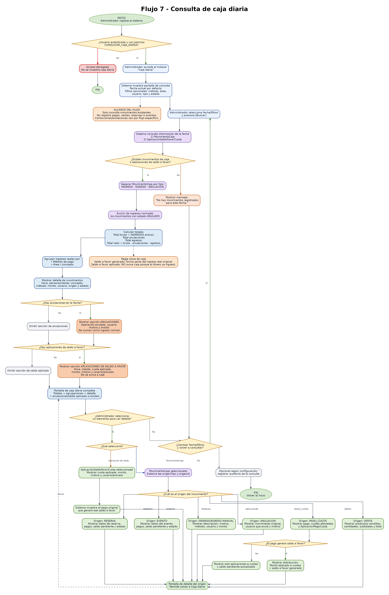

# Flujo 7: Consulta de caja diaria

---
## Objetivo
Permitir que el administrador consulte los ingresos registrados en una fecha determinada, visualizando el total real del
día, el detalle de movimientos, los ingresos por método de pago y los ingresos por área del complejo. Este flujo tiene
como finalidad reemplazar los cálculos manuales diarios y permitir saber con claridad cuánto dinero ingresó realmente al
negocio, de dónde vino, quién pagó, bajo qué concepto y desde qué operación se originó cada movimiento.

Este flujo debe diferenciar claramente entre:

- Dinero real que entra al negocio.
- Dinero real que sale del negocio, si existieran egresos.
- Movimientos anulados.
- Saldo a favor generado.
- Saldo a favor aplicado.

La aplicación de saldo a favor no debe sumarse como ingreso de caja, porque ese dinero ya fue registrado cuando ingresó
originalmente.

La caja diaria deberá basarse en la entidad `MovimientoCaja`. No deberá calcular los ingresos reales directamente desde
cuotas, ventas, reservas o eventos, porque eso podría provocar diferencias o duplicación de importes.
---

## Actor principal
    Administrador del sistema con permiso para consultar caja diaria.
---

## Roles recomendados

Para la primera versión, la consulta de caja diaria debería estar disponible solamente para usuarios autorizados.

Roles sugeridos:

    - ADMINISTRADOR: puede consultar caja diaria completa.
    - ENCARGADO: puede consultar caja diaria completa.
    - EMPLEADO: puede registrar operaciones, pero no necesariamente ver todos los totales.
    - CONSULTA: puede ver informes si el administrador lo permite.

Permiso recomendado:

    - CONSULTAR_CAJA_DIARIA.
---

## Situación inicial
El administrador quiere revisar cuánto dinero ingresó al complejo durante el día o durante una fecha determinada. La caja
diaria debe reunir ingresos reales provenientes de:

- Cuotas.
- Confitería/cafetería.
- Reservas de cancha.
- Cumpleaños deportivos.
- Salón infantil.
- Educación física escolar.
- Otros conceptos registrados.
- Ingresos manuales permitidos.

También puede mostrar, de forma informativa, aplicaciones de saldo a favor realizadas durante esa fecha.
Para la primera versión, el foco del flujo estará en ingresos. Los egresos pueden existir como tipo de movimiento, pero no
se desarrollará todavía un módulo avanzado de gastos.
---

## Condición para iniciar el flujo
El administrador debe tener permiso para consultar caja diaria. Deben existir movimientos de caja generados por operaciones
económicas. Los movimientos pueden originarse en:

- Pagos de cuotas.
- Ventas.
- Señales de reservas.
- Pagos de reservas.
- Señales de eventos.
- Pagos de eventos.
- Ingresos manuales permitidos.
- Anulaciones de movimientos anteriores.
- Egresos manuales, si el sistema los habilita.

Las aplicaciones de saldo a favor no son movimientos de caja, pero pueden mostrarse en una sección separada.

## Alcance del flujo - solo consulta
Este flujo no registra pagos, ventas, reservas, eventos ni operaciones económicas nuevas. Su función es consultar y
mostrar movimientos ya generados por otros flujos del sistema. Reglas:

- Este flujo solo consulta movimientos ya generados por otros flujos.
- Este flujo no registra pagos, ventas, reservas ni eventos.
- Las operaciones económicas deberán registrarse desde sus flujos correspondientes.
- Si se necesita corregir una operación, deberá utilizarse el flujo específico de anulación o corrección económica.

Todo movimiento de caja deberá tener una referencia al origen de la operación, para poder abrir el detalle desde la caja.
Ejemplos:

    - origenTipo = PAGO_CUOTA
      origenId = 15

    - origenTipo = VENTA
      origenId = 25

    - origenTipo = RESERVA
      origenId = 8

    - origenTipo = EVENTO
      origenId = 4
---

# Conceptos importantes

## Movimiento de caja
Representa dinero real que entra o sale del negocio. Ejemplo:

    Un cliente paga $60.000 en efectivo.

    Resultado:
        - Movimiento de caja: ingreso por $60.000.
---

## Saldo a favor generado
Representa dinero real recibido que no se aplicó completamente a cuotas existentes. Ejemplo:

    El cliente debe $30.000 y paga $60.000.

    Resultado:
        - Ingreso real de caja: $60.000.
        - Aplicado a cuota: $30.000.
        - Saldo a favor generado: $30.000.

Importante:
    El saldo a favor generado forma parte del ingreso real del día, porque el dinero efectivamente ingresó.

## Saldo a favor aplicado
Representa el uso posterior de dinero que ya había ingresado.

Ejemplo:

    Al mes siguiente se genera una cuota de $32.000 y se aplican $30.000 de saldo a favor.

    Resultado:
        - No entra dinero nuevo.
        - No se genera movimiento de caja.
        - Se registra aplicación de saldo a favor por $30.000.

Importante:
    El saldo a favor aplicado no se suma a la caja del día.

## Movimiento anulado
Representa una operación que originalmente generó caja, pero luego fue anulada mediante un procedimiento permitido.
Los movimientos anulados no deben sumarse como ingresos normales.

La anulación puede mostrarse de dos formas:

- En una sección separada de anulaciones.
- Como movimiento negativo, si el sistema adopta ese criterio.

Para la primera versión, se recomienda mostrar las anulaciones en una sección separada y calcular un total neto informativo.

## Criterio único de anulación para la versión 1
Para evitar ambigüedades, en la versión 1 se utilizará este criterio:

- El movimiento original quedará con estado ANULADO.
- Se creará un nuevo MovimientoCaja de tipo ANULACION.
- El movimiento de anulación deberá referenciar al movimiento original mediante movimientoOriginalAnuladoId.
- El movimiento original no sumará como ingreso normal.
- El movimiento de tipo ANULACION se mostrará en la sección de anulaciones.
- El total neto considerará ingresos activos menos anulaciones y egresos, si existieran.

> permite mantener historial completo sin borrar movimientos y sin duplicar importes.

## Total bruto y total neto

Total bruto de ingresos:

    Suma de todos los movimientos de tipo INGRESO no anulados.

Total de anulaciones:

    Suma de movimientos anulados o movimientos de tipo ANULACION.

Total neto:

    Total bruto de ingresos - total de anulaciones - egresos, si existieran.

En la primera versión, el total principal de la pantalla será el total real ingresado. Si existen anulaciones, se mostrará
también el total neto para evitar confusiones.

## Origen del movimiento
Cada movimiento de caja debe poder abrir su operación original.

Campos técnicos recomendados:

- origenTipo.
- origenId.
- movimientoOriginalAnuladoId.
- Auditoria.

Ejemplos de origenTipo:

- PAGO_CUOTA.
- VENTA.
- RESERVA.
- EVENTO.
- INGRESO_MANUAL.
- EGRESO_MANUAL.
- ANULACION.

>Esto permite que, al tocar un movimiento, el sistema pueda mostrar el detalle real de lo que ocurrió.
---

## Pantalla: Caja diaria

    Fecha:              [ 01/06/2026 ]
    Método de pago:     [ Todos      ]
    Área/concepto:      [ Todas      ]
    Usuario:            [ Todos      ]
    Tipo movimiento:    [ Todos      ]
    Estado:             [ Todos      ]

    [Buscar]

        Resumen del día

        INGRESOS REALES DEL DÍA

        Total bruto ingresado: $185.000
        Total anulaciones:     $0
        Total egresos:         $0
        Total neto del día:    $185.000

        Por método de pago:
            - Efectivo: $90.000
            - Débito: $40.000
            - Transferencia: $35.000
            - Mercado Pago: $20.000

        Por área:
            - Escuela de fútbol: $60.000
            - Taekwondo: $26.000
            - Confitería/Cafetería: $24.000
            - Alquiler cancha: $35.000
            - Salón infantil: $40.000

        Detalle de movimientos de caja:
        --------------------------------------------------------------------------------------------
        Hora     Persona/Cliente    Concepto              Método      Monto      Origen       Estado
        --------------------------------------------------------------------------------------------
        10:15    Mateo Gómez        Pago de cuota         Efectivo    $60.000    Pago #15     ACTIVO
        11:20    Juan eventual      Confitería            Débito      $5.000     Venta #25    ACTIVO
        15:00    Laura Pérez        Seña salón infantil   Transfer.   $40.000    Evento #4    ACTIVO
        18:30    Grupo cancha       Alquiler cancha       Efectivo    $35.000    Reserva #8   ACTIVO
        --------------------------------------------------------------------------------------------

        ANULACIONES DEL DÍA

        Las anulaciones no se suman como ingresos normales.
        --------------------------------------------------------------------------
        Hora     Origen anulado     Usuario anuló       Motivo          Monto
        --------------------------------------------------------------------------
        19:10    Venta #21          Admin               Error de carga  $3.000
        --------------------------------------------------------------------------

        APLICACIONES DE SALDO A FAVOR

        Estas aplicaciones no se suman a caja porque el dinero ya había ingresado.
        ---------------------------------------------------------------
        Hora     Cliente          Cuota aplicada       Monto aplicado
        ---------------------------------------------------------------
        09:00    Mateo Gómez      Junio fútbol         $30.000
        09:00    Lucas Pérez      Junio taekwondo      $28.000
        ---------------------------------------------------------------
---

## Filtros opcionales recomendados
Para la primera versión puede comenzar solamente con filtro por fecha. Sin embargo, el flujo queda preparado para permitir
filtros adicionales:

- Método de pago.
- Área o concepto.
- Usuario que registró.
- Tipo de movimiento.
- Estado del movimiento.
- Cliente o persona eventual, si corresponde.

>Estos filtros ayudarán a consultar rápidamente operaciones específicas cuando el volumen de movimientos crezca.
---

## Cierre de caja fuera del alcance de este flujo
La versión 1 permite consultar caja diaria, pero no realiza cierre formal de caja. Quedan para una versión futura:

- Apertura de caja.
- Cierre de caja.
- Arqueo.
- Saldo inicial.
- Saldo final.
- Diferencias de caja.
- Control de efectivo físico.
---

## Pasos del flujo

    1. El administrador ingresa al sistema.
    2. El sistema verifica que el usuario tenga permiso CONSULTAR_CAJA_DIARIA.
    3. El administrador accede al módulo "Caja diaria".
    4. El sistema muestra por defecto la fecha actual.
    5. El administrador puede dejar la fecha actual o seleccionar otra fecha.
    6. El administrador presiona:
        - [ Buscar ]

    7. El sistema busca todos los movimientos de caja de la fecha seleccionada.
    8. El sistema separa los movimientos por tipo:

       - INGRESO.
       - EGRESO.
       - ANULACION.

    9. Para la primera versión, el foco principal estará en ingresos.
    10. El sistema excluye de los ingresos normales los movimientos anulados.
    11. El sistema calcula el total bruto real ingresado del día.
    12. El sistema calcula el total de anulaciones del día, si existieran.
    13. El sistema calcula el total de egresos del día, si existieran.
    14. El sistema calcula el total neto:

        - Total bruto de ingresos - anulaciones - egresos.

    15. El sistema agrupa los ingresos reales por método de pago:

        - Efectivo.
        - Débito.
        - Crédito.
        - Transferencia.
        - Mercado Pago.
        - Otro.

    16. El sistema agrupa los ingresos reales por área o concepto:

        - Escuela de fútbol.
        - Taekwondo.
        - Confitería/Cafetería.
        - Alquiler cancha.
        - Cumpleaños deportivo.
        - Salón infantil.
        - Educación física.
        - Otro.

    17. El sistema muestra el detalle de movimientos de caja.
    18. Cada movimiento debe mostrar:

        - Hora.
        - Cliente o persona eventual.
        - Concepto.
        - Método de pago.
        - Monto.
        - Usuario que lo registró.
        - Tipo de origen.
        - ID de origen.
        - Estado del movimiento.

    19. El sistema muestra las anulaciones en una sección separada, si existieran.
    20. Cada anulación debe mostrar:

        - Hora.
        - Operación anulada.
        - Usuario que anuló.
        - Motivo de anulación.
        - Monto anulado.

    21. El sistema busca aplicaciones de saldo a favor realizadas en la fecha seleccionada.
    22. Si existen aplicaciones de saldo a favor, el sistema las muestra en una sección separada.
    23. La sección de saldo a favor aplicado debe indicar claramente:
        - [ "Estas aplicaciones no se suman a caja porque el dinero ya había ingresado previamente." ]

    24. Cada aplicación de saldo a favor debe mostrar:

        - Hora.
        - Cliente.
        - Cuota sobre la que se aplicó.
        - Monto aplicado.
        - Motivo.
        - Usuario o proceso que realizó la aplicación.

    25. El administrador puede seleccionar un movimiento de caja para ver más detalle.
    26. Si el movimiento viene de una cuota, el sistema muestra el pago y las aplicaciones a cuotas.
    27. Si el movimiento generó saldo a favor, el sistema muestra cuánto se aplicó a cuotas y cuánto quedó como saldo a favor.
    28. Si el movimiento viene de una venta, el sistema muestra los productos vendidos.
    29. Si el movimiento viene de una reserva, el sistema muestra datos de la reserva.
    30. Si el movimiento viene de un evento, el sistema muestra datos del evento.
    31. Si el movimiento viene de un ingreso manual, el sistema muestra la descripción cargada.
    32. Si el movimiento corresponde a una anulación, el sistema muestra el movimiento original y el motivo.
    33. El administrador puede seleccionar una aplicación de saldo a favor para ver su origen.
    34. Si se consulta una aplicación de saldo a favor, el sistema muestra el pago original que generó ese saldo.
    35. Si no existen movimientos de caja ni aplicaciones de saldo a favor para la fecha, el sistema muestra:
        - [ "No hay movimientos registrados para esta fecha." ]

    36. El administrador puede cambiar la fecha y volver a consultar.
    37. El administrador puede volver al inicio.
---

## Ejemplo: ingreso con saldo a favor generado

    Fecha: 20/05/2026

    Cliente: Mateo Gómez
    Cuota Mayo: $30.000
    Pago recibido: $60.000
    Método: Efectivo

    Caja del 20/05/2026:
        - Ingreso real: $60.000

    Detalle:
        - Aplicado a cuota Mayo: $30.000
        - Saldo a favor generado: $30.000

Importante:
    En caja se suma $60.000 una sola vez.
    No se suma nuevamente el saldo a favor generado como concepto separado.
---

## Ejemplo: aplicación posterior del saldo a favor

    Fecha: 01/06/2026

    Cliente: Mateo Gómez
    Cuota Junio: $32.000
    Saldo a favor disponible: $30.000
    Saldo aplicado: $30.000

    Caja del 01/06/2026:
        - Ingreso real nuevo: $0 por esta operación.

    Aplicaciones de saldo a favor:
        - Mateo Gómez → Cuota Junio fútbol → $30.000

Importante:
No se suma a caja porque ese dinero ingresó el 20/05/2026.
---

## Ejemplo: venta anulada

    Fecha: 10/06/2026

    Venta registrada:
        - Venta #21
        - Total: $3.000
        - Método: Efectivo

    Luego se detecta un error y se anula la venta.

    Caja del 10/06/2026:
        - Ingreso registrado: $3.000
        - Anulación: $3.000
        - Total neto de esa operación: $0

>La anulación debe quedar visible para auditoría.
---

## Decisiones importantes

- ¿Qué fecha se quiere consultar?
- ¿El usuario tiene permiso para consultar caja diaria?
- ¿Existen movimientos de caja en esa fecha?
- ¿Existen aplicaciones de saldo a favor en esa fecha?
- ¿El movimiento es ingreso, egreso o anulación?
- ¿El movimiento está activo o anulado?
- ¿Qué método de pago se utilizó?
- ¿A qué área pertenece el ingreso?
- ¿El movimiento pertenece a cuota, venta, reserva, evento o ingreso manual?
- ¿El movimiento tiene origenTipo y origenId?
- ¿El pago generó saldo a favor?
- ¿La operación es dinero real ingresado o saldo a favor aplicado?
- ¿Debe mostrarse total neto por anulaciones o egresos?
- ¿El administrador quiere ver detalle del movimiento?
---

## Datos que intervienen

- MovimientoCaja.
- Pago.
- AplicaciónPagoCuota.
- SaldoAFavorCliente.
- AplicaciónSaldoFavorCuota.
- Venta.
- DetalleVenta.
- Cuota.
- Reserva.
- Evento.
- Cliente, si corresponde.
- Persona eventual, si corresponde.
- Método de pago.
- Usuario administrador.
- Usuario que registró el movimiento.
- Usuario que anuló el movimiento, si corresponde.
- Motivo de anulación, si corresponde.
- origenTipo.
- origenId.
- movimientoOriginalAnuladoId.
- Auditoria.
---

## Nuevo concepto detectado

- [ OrigenMovimientoCaja ]

Este concepto representa la operación real que generó el movimiento de caja. Ejemplos:

    MovimientoCaja #100
        origenTipo: VENTA
        origenId: 25

    MovimientoCaja #101
        origenTipo: PAGO_CUOTA
        origenId: 15

    MovimientoCaja #102
        origenTipo: EVENTO
        origenId: 4

>Esto permite abrir el detalle de cada movimiento desde la pantalla de caja diaria.
---

## Nuevo concepto detectado

- [ MovimientoOriginalAnulado ]

Este concepto permite relacionar un movimiento de caja de tipo ANULACION con el movimiento original que fue anulado.
Campo:

- movimientoOriginalAnuladoId.

Ejemplo:

    MovimientoCaja #150
        tipoMovimiento: ANULACION
        movimientoOriginalAnuladoId: 100
        motivo: Error de carga.

>Esto permite abrir desde la anulación el movimiento original y conservar trazabilidad completa.
---

## Nuevo concepto detectado

- [ EstadoMovimientoCaja ]

Este concepto permite diferenciar movimientos normales de movimientos anulados. Estados:

- ACTIVO.
- ANULADO.

>En la primera versión, los movimientos anulados no deben desaparecer de la caja. Deben mostrarse claramente como anulados.
---

## Reglas de negocio detectadas

- Todo ingreso económico real debe generar un movimiento de caja.
- La caja diaria debe poder consultarse por fecha.
- La caja diaria debe mostrar total bruto real ingresado.
- La caja diaria debe mostrar total neto si existen anulaciones o egresos.
- La caja diaria debe agrupar ingresos reales por método de pago.
- La caja diaria debe agrupar ingresos reales por área o concepto.
- Cada movimiento debe mostrar cliente o persona eventual, si corresponde.
- Cada movimiento debe indicar concepto, monto, fecha, hora y método de pago.
- Cada movimiento debe guardar el usuario que lo registró.
- Cada movimiento debe tener una referencia a su origen mediante origenTipo y origenId.
- El sistema debe permitir ver el origen de cada movimiento.
- Los movimientos anulados no deben sumarse como ingresos normales.
- Las anulaciones deben mostrarse en una sección separada o con signo negativo.
- Si se muestra una anulación, debe indicarse usuario que anuló y motivo.
- Para la primera versión, el foco está en ingresos; los egresos quedan previstos pero no desarrollados como módulo avanzado.
- La aplicación de saldo a favor no debe generar movimiento de caja.
- La aplicación de saldo a favor no debe sumarse como ingreso del día.
- La caja puede mostrar aplicaciones de saldo a favor en una sección informativa separada.
- Si un pago genera saldo a favor, la caja debe mostrar el ingreso real total recibido.
- Los informes de caja deben evitar contar dos veces el mismo dinero.
- La consulta de caja diaria debe estar protegida por permisos.
- Este flujo solo consulta movimientos ya generados por otros flujos.
- Este flujo no registra pagos, ventas, reservas ni eventos.
- Las operaciones económicas deberán registrarse desde sus flujos correspondientes.
- Toda anulación visible en caja deberá tener auditoría asociada.
- Todo movimiento de caja deberá poder rastrearse hasta el usuario y operación que lo originó.
- Para la versión 1, los egresos quedan previstos como tipo de movimiento, pero no se implementará un módulo completo de egresos.
- Si se permite un egreso manual, deberá tener permiso especial, motivo obligatorio y auditoría.
- En la versión 1, al anular una operación económica, el movimiento original quedará ANULADO y se creará un MovimientoCaja de tipo ANULACION.
- El movimiento de tipo ANULACION deberá referenciar al movimiento original mediante movimientoOriginalAnuladoId.
- La versión 1 permite consultar caja diaria, pero no realiza cierre formal de caja.
- El cierre de caja con arqueo quedará para una versión futura.
- Toda consulta de caja diaria podrá quedar registrada en auditoría si el sistema lo requiere.
---

## Impacto en entidades
Confirmar o agregar estos atributos en `MovimientoCaja`:

- id.
- fechaHora.
- tipoMovimiento.
- concepto.
- monto.
- metodoPago.
- cliente.
- personaEventual.
- descripcion.
- usuarioRegistro.
- estado.
- origenTipo.
- origenId.
- usuarioAnulacion.
- fechaHoraAnulacion.
- motivoAnulacion.
- movimientoOriginalAnuladoId.
---

## Resultado final
El administrador puede consultar la caja diaria de una fecha determinada, ver el total bruto real ingresado, las
anulaciones si existieran, el total neto, los ingresos agrupados por método de pago, los ingresos agrupados por área y el
detalle completo de cada movimiento.

Además, puede abrir cada movimiento para ver su origen real, ya sea pago de cuota, venta, reserva, evento o ingreso manual.
También puede ver aplicaciones de saldo a favor como información separada, sin que estas se sumen a los ingresos del día.

La caja diaria permite controlar el negocio sin duplicar ingresos, conservando trazabilidad y auditoría.

