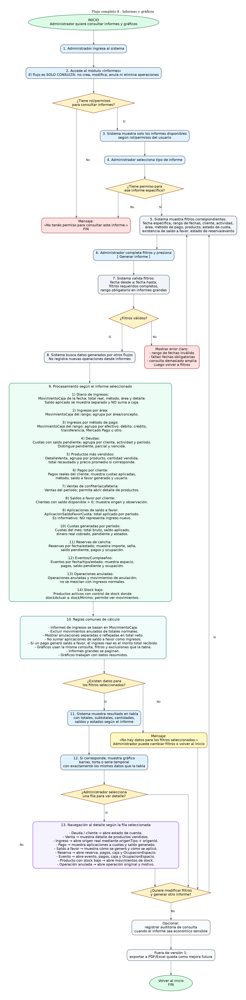

# Flujo 8: Informes y gráficos

---
## Objetivo
Permitir que el administrador consulte informes y gráficos del complejo deportivo para analizar ingresos, deudas, pagos,
ventas, productos más vendidos, rendimiento de cada área del negocio, saldos a favor y aplicaciones de saldo a cuotas. Este
flujo tiene como finalidad transformar los datos cargados diariamente en información clara para tomar decisiones. Los informes 
deben diferenciar correctamente entre:

- Ingresos reales.
- Cuotas generadas.
- Cuotas pagadas con dinero real.
- Cuotas pagadas total o parcialmente con saldo a favor.
- Saldo a favor disponible.
- Saldo a favor aplicado.
---

## Actor principal
    Administrador del sistema.
---

## Permisos requeridos
El acceso a informes deberá depender del rol del usuario. No todos los usuarios del sistema deben poder consultar todos
los datos económicos del complejo. Permisos recomendados para la primera versión:

- ADMINISTRADOR: Puede consultar todos los informes.

- ENCARGADO: Puede consultar caja diaria, pagos, ventas, reservas, eventos y deudas.

- EMPLEADO: Puede consultar información operativa limitada, como ventas del día, reservas del día o stock bajo, pero no
informes económicos generales.

- CONSULTA: Puede ver informes autorizados, sin modificar datos.

El sistema deberá validar el permiso antes de generar cada informe. Si el usuario no tiene permiso suficiente, deberá
mostrar un mensaje claro:

- [ "No tenés permiso para consultar este informe." ]
---

## Alcance del flujo - solo consulta

Este flujo no crea, modifica, anula ni elimina operaciones. Su responsabilidad es consultar información generada por otros
flujos y presentarla en forma de tabla, detalle o gráfico. Reglas:

- Los informes solo consultan información generada por otros flujos.
- Si el usuario necesita corregir una operación, deberá hacerlo desde el flujo correspondiente de anulación o corrección.
- Los informes no deberán permitir modificar datos, solo consultar y navegar al detalle.
- La versión 1 mostrará informes en pantalla.
- Exportar a PDF o Excel quedará como mejora futura.
---

## Situación inicial
El administrador quiere analizar el estado económico y operativo del complejo. Puede necesitar responder preguntas como:

- ¿Cuánto ingresó hoy?
- ¿Cuánto ingresó este mes?
- ¿Qué área genera más ingresos?
- ¿Cuánto se cobró en efectivo?
- ¿Quiénes deben cuotas?
- ¿Qué clientes tienen saldo a favor?
- ¿Cuánto saldo a favor se aplicó este mes?
- ¿Qué cuotas se pagaron con dinero real?
- ¿Qué cuotas se pagaron con saldo a favor?
- ¿Qué productos se venden más?
- ¿Qué productos tienen stock bajo?
- ¿Qué cliente pagó y cuándo?
- ¿Cuánto ingresó por reservas de cancha?
- ¿Cuánto ingresó por cumpleaños o eventos?
- ¿Qué reservas están pendientes, señadas, pagadas o canceladas?
- ¿Qué eventos están próximos?
- ¿Qué operaciones fueron anuladas?
---

## Regla central para informes
Los informes de ingresos deben basarse en movimientos de caja, no solamente en cuotas pagadas. Esto es fundamental porque
una cuota puede quedar pagada con saldo a favor sin que entre dinero nuevo en ese período.

Además, los informes de ingresos deberán excluir los movimientos anulados de los totales normales. Si se muestran
anulaciones, deberán figurar en una sección separada o restarse claramente del total neto.

Los gráficos deberán usar la misma base de datos y los mismos filtros que las tablas. No debe existir diferencia entre lo
que muestra una tabla y lo que representa su gráfico.

Ejemplo:

    - En mayo, un cliente paga $60.000.
    - Se aplican $30.000 a mayo.
    - Quedan $30.000 como saldo a favor.
    - En junio, se genera la cuota de $30.000 y se paga automáticamente con saldo a favor.

    Resultado correcto:
        - Mayo tuvo ingreso real de $60.000.
        - Junio no tuvo ingreso real por esa cuota.
        - Junio tuvo aplicación de saldo a favor por $30.000.
---

## Informes iniciales
La primera versión deberá incluir los siguientes informes:

    1. Informe diario de ingresos.
    2. Informe de ingresos por área.
    3. Informe de ingresos por método de pago.
    4. Informe de deudas.
    5. Informe de productos más vendidos.
    6. Informe de pagos por cliente.
    7. Informe de ventas de confitería/cafetería.
    8. Informe de saldos a favor por cliente.
    9. Informe de aplicaciones de saldo a favor.
    10. Informe de cuotas generadas por período.
    11. Informe de reservas de cancha.
    12. Informe de eventos/cumpleaños.
    13. Informe de operaciones anuladas.
    14. Informe de stock bajo.
---

## Gráficos iniciales
La primera versión deberá incluir gráficos simples para:

- Ingresos reales por área.
- Ingresos reales por método de pago.
- Productos más vendidos.
- Deudas por actividad.
- Ingresos reales por día.
- Saldos a favor disponibles por cliente.
- Saldo a favor aplicado por período.
- Cuotas pendientes, parciales y pagadas.
- Reservas por estado.
- Eventos por estado.
- Stock bajo por categoría.
- Operaciones anuladas por concepto.
---

## Rendimiento de informes
Para evitar que el sistema se vuelva lento cuando haya muchos datos:

- En informes grandes, el rango de fechas será obligatorio.
- Los informes deberán paginar resultados cuando haya muchos registros.
- Los gráficos deberán trabajar con datos resumidos, no con listados completos.
- Los gráficos deberán usar la misma consulta, filtros y exclusiones que la tabla.
- Si una consulta es demasiado amplia, el sistema deberá pedir filtros más específicos.
---

## Pantalla: Informes

    Tipo de informe:

    [ Informe diario de ingresos        v ]

    Filtros:
        Fecha desde:       [ 01/05/2026 ]
        Fecha hasta:       [ 31/05/2026 ]
        Actividad:         [ Todas      ]
        Método de pago:    [ Todos      ]
        Cliente:           [ Opcional   ]

    Nota:
        En informes grandes, el rango de fechas será obligatorio para evitar consultas demasiado pesadas.

    [Generar informe]

    Resultado:
        Total ingresos reales: $1.850.000
        Total saldo a favor generado: $120.000
        Total saldo a favor aplicado: $90.000

    Tabla:
    ------------------------------------------------------------
    Área                 Ingreso real
    ------------------------------------------------------------
    Escuela de fútbol    $900.000
    Taekwondo            $420.000
    Confitería           $180.000
    Alquiler cancha      $250.000
    Salón infantil       $100.000
    ------------------------------------------------------------

    Gráfico:
    [Gráfico de barras o torta]
---

## Pasos del flujo

    1. El administrador ingresa al sistema.
    2. El administrador accede al módulo "Informes".
    3. El sistema verifica el rol y los permisos del usuario.
    4. El sistema muestra solamente los tipos de informes disponibles para ese usuario.
    5. El administrador selecciona un tipo de informe.
    6. El sistema muestra los filtros correspondientes al informe elegido.
    7. Los filtros posibles son:

       - Fecha específica.
       - Rango de fechas.
       - Cliente.
       - Actividad.
       - Área.
       - Método de pago.
       - Producto.
       - Estado de cuota.
       - Existencia de saldo a favor.

    8. El administrador completa los filtros necesarios.
    9. El administrador presiona:
        - [ Generar informe ]

    10. El sistema valida los filtros.
    11. Si el rango de fechas es inválido, el sistema muestra un error.
    12. Si el informe puede traer muchos datos y no se ingresó rango de fechas, el sistema solicita completar fecha desde y fecha hasta.
    13. Si el usuario no tiene permiso para el informe solicitado, el sistema no permite continuar.
    14. Si los filtros son válidos, el sistema busca los datos correspondientes.
    15. El sistema procesa la información.
    16. Según el tipo de informe, el sistema calcula:

        - Ingresos reales.
        - Totales.
        - Subtotales.
        - Cantidades.
        - Agrupaciones.
        - Saldos pendientes.
        - Productos vendidos.
        - Ingresos reales por día.
        - Ingresos reales por área.
        - Ingresos reales por método de pago.
        - Saldo a favor generado.
        - Saldo a favor disponible.
        - Saldo a favor aplicado.
        - Cuotas pagadas con dinero real.
        - Cuotas pagadas con saldo a favor.
        - Reservas por estado.
        - Eventos por estado.
        - Operaciones anuladas.
        - Productos con stock bajo.

    17. El sistema muestra el resultado en formato de tabla.
    18. Si corresponde, el sistema muestra un gráfico.
    19. El gráfico debe representar exactamente los mismos datos, filtros y exclusiones que la tabla.
    20. Las operaciones anuladas no deben mezclarse con los totales normales; deben excluirse o mostrarse por separado.
    21. Si no hay datos para los filtros seleccionados, el sistema muestra:
        - [ "No hay datos para los filtros seleccionados." ]

    22. El administrador puede modificar filtros y volver a generar el informe.
    23. El administrador puede ingresar al detalle de una fila.
    24. Si el informe es de deuda, al seleccionar un cliente se abre su estado de cuenta.
    25. Si el informe es de ventas, al seleccionar una venta se muestra el detalle de productos.
    26. Si el informe es de ingresos, al seleccionar un movimiento se muestra el origen mediante origenTipo y origenId.
    27. Si el informe es de saldo a favor, al seleccionar un cliente se muestra cómo se generó y cómo se aplicó.
    28. El administrador puede volver al inicio.
---

# Subflujo 8.1: Informe diario de ingresos

### Objetivo
Mostrar todos los ingresos reales de una fecha determinada.

### Pasos

    1. El administrador selecciona "Informe diario de ingresos".
    2. Selecciona una fecha.
    3. El sistema busca movimientos de caja de esa fecha.
    4. El sistema calcula el total real ingresado.
    5. El sistema agrupa por método de pago.
    6. El sistema agrupa por área.
    7. El sistema muestra el detalle de movimientos.
    8. El sistema puede mostrar aplicaciones de saldo a favor en una sección separada.
    9. El sistema muestra gráfico si corresponde.

### Resultado
El administrador puede ver cuánto dinero real ingresó en un día y de dónde vino. Las aplicaciones de saldo a favor se
muestran como información separada y no se suman al ingreso del día.
---

# Subflujo 8.2: Informe de ingresos por área

### Objetivo
Mostrar cuánto dinero real generó cada sector del complejo.

### Áreas iniciales

    - Escuela de fútbol.
    - Taekwondo.
    - Confitería/Cafetería.
    - Alquiler de cancha.
    - Cumpleaños deportivo.
    - Salón infantil.
    - Educación física.
    - Otro.

### Pasos

    1. El administrador selecciona "Ingresos por área".
    2. Selecciona rango de fechas.
    3. El sistema busca movimientos de caja del período.
    4. El sistema agrupa los movimientos por área.
    5. El sistema calcula total real por área.
    6. El sistema calcula total general real.
    7. El sistema muestra tabla.
    8. El sistema muestra gráfico de barras o torta.

### Resultado
El administrador puede comparar qué área genera más ingresos reales.

---

# Subflujo 8.3: Informe de ingresos por método de pago

### Objetivo
Mostrar cuánto dinero real ingresó por cada medio de pago.

### Métodos iniciales

    - Efectivo.
    - Débito.
    - Crédito.
    - Transferencia.
    - Mercado Pago.
    - Otro.

### Pasos

    1. El administrador selecciona "Ingresos por método de pago".
    2. Selecciona fecha o rango de fechas.
    3. El sistema busca movimientos de caja.
    4. El sistema agrupa por método de pago.
    5. El sistema calcula total real por método.
    6. El sistema muestra tabla.
    7. El sistema muestra gráfico.

### Resultado
El administrador puede controlar cuánto dinero real entró por cada medio de pago.

---

# Subflujo 8.4: Informe de deudas

### Objetivo
Mostrar clientes con cuotas pendientes, parciales o vencidas.

### Pasos

    1. El administrador selecciona "Informe de deudas".
    2. Puede filtrar por actividad o estado.
    3. El sistema busca cuotas con saldo pendiente.
    4. El sistema agrupa la información por cliente.
    5. El sistema muestra:

       - Cliente.
       - Actividad.
       - Períodos adeudados.
       - Importe original.
       - Saldo a favor aplicado, si corresponde.
       - Total adeudado.
       - Estado de las cuotas.

    6. El administrador puede seleccionar un cliente.
    7. El sistema abre el estado de cuenta del cliente.

### Resultado
El administrador puede saber quién debe, cuánto debe, qué meses debe y si alguna cuota fue reducida parcialmente por
saldo a favor.
---

# Subflujo 8.5: Informe de productos más vendidos

### Objetivo
Mostrar qué productos de confitería/cafetería se venden más.

### Pasos

    1. El administrador selecciona "Productos más vendidos".
    2. Selecciona rango de fechas.
    3. El sistema busca detalles de ventas.
    4. El sistema agrupa por producto.
    5. El sistema calcula:

       - Cantidad vendida.
       - Total recaudado.
       - Precio promedio, si corresponde.

    6. El sistema ordena de mayor a menor cantidad vendida.
    7. El sistema muestra tabla.
    8. El sistema muestra gráfico de barras.

### Resultado
El administrador puede saber qué productos conviene reponer o destacar. El saldo a favor no interviene en este informe
en la primera versión.
---

# Subflujo 8.6: Informe de pagos por cliente

### Objetivo
Mostrar el historial de pagos reales de un cliente específico.

### Pasos

    1. El administrador selecciona "Pagos por cliente".
    2. Busca y selecciona un cliente.
    3. Puede elegir rango de fechas.
    4. El sistema busca pagos asociados al cliente.
    5. El sistema muestra:

       - Fecha.
       - Hora.
       - Concepto.
       - Monto recibido.
       - Método de pago.
       - Cuotas a las que se aplicó.
       - Saldo a favor generado, si corresponde.
       - Observación.
       - Usuario que registró.

    6. El administrador puede seleccionar un pago para ver detalle.

### Resultado
El administrador puede consultar el historial económico real de un cliente.

---

# Subflujo 8.7: Informe de ventas de confitería/cafetería

### Objetivo
Mostrar ventas realizadas en confitería/cafetería durante un período.

### Pasos

    1. El administrador selecciona "Ventas de confitería/cafetería".
    2. Selecciona fecha o rango de fechas.
    3. El sistema busca ventas.
    4. El sistema muestra:

       - Fecha.
       - Hora.
       - Cliente o comprador eventual.
       - Total.
       - Método de pago.

    5. El administrador puede seleccionar una venta.
    6. El sistema muestra el detalle de productos vendidos.

### Resultado
El administrador puede controlar ventas y productos vendidos.

---

# Subflujo 8.8: Informe de saldos a favor por cliente

### Objetivo
Mostrar qué clientes tienen saldo a favor disponible.

### Pasos

    1. El administrador selecciona "Saldos a favor".
    2. El sistema busca clientes con saldo a favor mayor a cero.
    3. El sistema muestra:

       - Cliente.
       - Actividad relacionada, si se conoce.
       - Saldo a favor disponible.
       - Fecha en que se generó.
       - Pago original que generó el saldo.
       - Observación.

    4. El administrador puede seleccionar un cliente.
    5. El sistema muestra el detalle de generación y aplicación de saldo.

### Resultado
El administrador puede saber qué clientes tienen dinero adelantado disponible para futuras cuotas.

---

# Subflujo 8.9: Informe de aplicaciones de saldo a favor

### Objetivo
Mostrar cuánto saldo a favor fue aplicado a cuotas en un período determinado.

### Pasos

    1. El administrador selecciona "Aplicaciones de saldo a favor".
    2. Selecciona rango de fechas.
    3. El sistema busca aplicaciones de saldo a favor.
    4. El sistema muestra:

       - Fecha de aplicación.
       - Cliente.
       - Cuota.
       - Actividad.
       - Período.
       - Monto aplicado.
       - Pago original que generó el saldo, si corresponde.

    5. El sistema calcula total aplicado en el período.
    6. El sistema muestra tabla y gráfico si corresponde.

### Resultado
El administrador puede saber cuánto saldo adelantado fue utilizado para cubrir cuotas. 
Importante: Este total no representa ingreso nuevo del período.
---

# Subflujo 8.10: Informe de cuotas generadas por período

### Objetivo
Mostrar las cuotas generadas en un mes, sus estados y cómo fueron cubiertas.

### Pasos

    1. El administrador selecciona "Cuotas generadas por período".
    2. Selecciona un período.
    3. El sistema busca cuotas del período.
    4. El sistema muestra:

       - Cliente.
       - Actividad.
       - Importe original.
       - Saldo a favor aplicado.
       - Pagos reales aplicados.
       - Saldo pendiente.
       - Estado.

    5. El sistema calcula:

       - Total bruto generado.
       - Total aplicado con saldo a favor.
       - Total cobrado con dinero real.
       - Total pendiente.
       - Cantidad de cuotas pagadas.
       - Cantidad de cuotas parciales.
       - Cantidad de cuotas pendientes.

### Resultado
El administrador puede entender el estado real de las cuotas generadas en un mes.

---

# Subflujo 8.11: Informe de reservas de cancha

### Objetivo
Mostrar reservas simples de cancha dentro de un período, permitiendo controlar estados, saldos pendientes, señas,
pagos realizados y disponibilidad operativa.

### Pasos

    1. El administrador selecciona "Reservas de cancha".
    2. Selecciona fecha o rango de fechas.
    3. Puede filtrar por estado:

       - PENDIENTE.
       - SEÑADA.
       - PAGADA.
       - CANCELADA.
       - REALIZADA.

    4. El sistema busca reservas simples de cancha.
    5. El sistema muestra:

       - Fecha.
       - Horario.
       - Responsable.
       - Cliente asociado, si corresponde.
       - Tipo de reserva.
       - Importe total.
       - Seña.
       - Saldo pendiente.
       - Estado.
       - Usuario que registró.

    6. El administrador puede seleccionar una reserva.
    7. El sistema abre el detalle de la reserva, sus pagos, su movimiento de caja y su ocupación de espacio.

### Resultado
El administrador puede controlar reservas de cancha, pagos pendientes, reservas canceladas y reservas realizadas.

---

# Subflujo 8.12: Informe de eventos/cumpleaños

### Objetivo
Mostrar cumpleaños deportivos, cumpleaños en salón infantil y eventos particulares dentro de un período.

### Pasos

    1. El administrador selecciona "Eventos/Cumpleaños".
    2. Selecciona fecha o rango de fechas.
    3. Puede filtrar por tipo de evento:

       - Cumpleaños deportivo varones.
       - Cumpleaños deportivo mixto.
       - Cumpleaños en salón infantil.
       - Evento particular infantil.

    4. Puede filtrar por estado:

       - PENDIENTE.
       - SEÑADO.
       - PAGADO.
       - CANCELADO.
       - REALIZADO.

    5. El sistema busca eventos.
    6. El sistema muestra:

       - Fecha.
       - Horario.
       - Tipo de evento.
       - Espacio utilizado.
       - Cumpleañero, si corresponde.
       - Responsable.
       - Importe total.
       - Seña.
       - Saldo pendiente.
       - Estado.
       - Usuario que registró.

    7. El administrador puede seleccionar un evento.
    8. El sistema abre el detalle del evento, sus pagos, su movimiento de caja y su ocupación de espacio.

### Resultado
El administrador puede controlar próximos eventos, eventos cobrados, eventos pendientes y eventos cancelados.

---

# Subflujo 8.13: Informe de operaciones anuladas

### Objetivo
Mostrar pagos, ventas, reservas, eventos o movimientos de caja anulados durante un período, sin mezclarlos con los
ingresos normales.

### Pasos

    1. El administrador selecciona "Operaciones anuladas".
    2. Selecciona rango de fechas.
    3. Puede filtrar por tipo de operación:

       - Pago de cuota.
       - Venta.
       - Reserva.
       - Evento.
       - Movimiento de caja manual.

    4. El sistema busca operaciones anuladas.
    5. El sistema muestra:

       - Fecha de operación original.
       - Fecha de anulación.
       - Tipo de operación.
       - Cliente o persona eventual.
       - Concepto.
       - Monto.
       - Usuario que registró.
       - Usuario que anuló.
       - Motivo de anulación.

    6. Si la anulación afectó caja, el sistema muestra el movimiento de anulación correspondiente.
    7. El administrador puede abrir el detalle de la operación original.

### Resultado
El administrador puede auditar operaciones anuladas y evitar que se mezclen con ingresos normales.

---

# Subflujo 8.14: Informe de stock bajo

### Objetivo
Mostrar productos cuyo stock actual se encuentra en el mínimo configurado o por debajo de él.

### Pasos

    1. El administrador selecciona "Stock bajo".
    2. El sistema busca productos activos con control de stock.
    3. El sistema identifica productos donde:
       - stockActual <= stockMinimo.

    4. El sistema muestra:

       - Producto.
       - Categoría.
       - Stock actual.
       - Stock mínimo.
       - Precio de venta.
       - Estado.
       - Última venta, si corresponde.

    5. El administrador puede seleccionar un producto para ver movimientos de stock.
    6. El sistema puede mostrar gráfico por categoría.

### Resultado
El administrador puede saber qué productos conviene reponer.

---

## Decisiones importantes

- ¿Qué informe quiere consultar el administrador?
- ¿Qué filtros requiere ese informe?
- ¿El rango de fechas es válido?
- ¿Existen datos para los filtros seleccionados?
- ¿El dato representa dinero real ingresado o saldo aplicado?
- ¿El informe debe mostrar tabla, gráfico o ambos?
- ¿El administrador quiere ver detalle de una fila?
- ¿El dato seleccionado corresponde a cliente, venta, cuota, pago, reserva, evento o saldo a favor?
- ¿El saldo a favor debe mostrarse como ingreso o como aplicación informativa?
- ¿El informe necesita distinguir entre cuota pagada con dinero real y cuota pagada con saldo a favor?
- ¿El usuario tiene permiso para consultar ese informe?
- ¿La operación está anulada?
- ¿La operación anulada debe excluirse del total o mostrarse separada?
- ¿El informe requiere rango de fechas obligatorio por rendimiento?
- ¿El gráfico usa exactamente la misma consulta que la tabla?
- ¿El informe corresponde a reservas, eventos, stock o anulaciones?
---

## Datos que intervienen

- MovimientoCaja.
- EstadoMovimientoCaja.
- OrigenMovimientoCaja.
- Pago.
- AplicacionPagoCuota.
- Cuota.
- Cliente.
- Actividad.
- Producto.
- Venta.
- DetalleVenta.
- MovimientoStock.
- Reserva.
- Evento.
- SaldoAFavorCliente.
- AplicacionSaldoFavorCuota.
- MetodoPago.
- Usuario.
- Rol.
- Permiso.
- Auditoria.
---

## Nuevo concepto detectado

- [ OrigenMovimientoCaja ]

Este concepto permite que los informes de ingresos abran el detalle real de la operación que generó un movimiento. Campos:

- origenTipo.
- origenId.

Ejemplos:

- Movimiento de caja originado en una venta.
- Movimiento de caja originado en un pago de cuota.
- Movimiento de caja originado en una reserva.
- Movimiento de caja originado en un evento.
---

## Reglas de negocio detectadas

- Los informes deben permitir filtros por fecha o rango de fechas.
- El sistema debe validar que la fecha desde no sea posterior a la fecha hasta.
- Los informes deben mostrar mensajes claros cuando no haya datos.
- Los ingresos por área deben basarse en movimientos de caja.
- Los ingresos por método de pago deben basarse en movimientos de caja.
- Los informes de ingresos deben mostrar dinero real ingresado.
- Las aplicaciones de saldo a favor no deben sumarse como ingresos reales.
- El informe de deudas debe considerar cuotas con saldo pendiente.
- Las cuotas pagadas no deben aparecer como deuda.
- Las cuotas pagadas con saldo a favor deben diferenciarse de las pagadas con dinero real.
- Los productos más vendidos deben calcularse desde detalles de ventas.
- Los informes deben permitir ver detalle cuando sea necesario.
- Los gráficos deben representar los mismos datos que las tablas.
- Los informes deben ser entendibles para usuarios sin experiencia.
- Debe existir un informe de clientes con saldo a favor disponible.
- Debe existir un informe de aplicaciones de saldo a favor.
- Debe existir un informe de cuotas generadas por período.
- Debe existir un informe de reservas de cancha.
- Debe existir un informe de eventos/cumpleaños.
- Debe existir un informe de operaciones anuladas.
- Debe existir un informe de stock bajo.
- Los informes deben evitar contar dos veces el mismo dinero.
- Los movimientos anulados no deben sumarse como ingresos normales.
- Si se muestran anulaciones, deben mostrarse separadas o con impacto claro en el total neto.
- Cada informe debe respetar permisos de usuario.
- En informes grandes, el rango de fechas debe ser obligatorio.
- Los gráficos deben usar la misma consulta y los mismos filtros que las tablas.
- Los informes de reservas y eventos deben permitir ver pagos, saldos, estados y ocupaciones asociadas.
- Este flujo no crea, modifica, anula ni elimina operaciones.
- Los informes solo consultan información generada por otros flujos.
- Si el usuario necesita corregir una operación, deberá hacerlo desde el flujo correspondiente de anulación o corrección.
- Toda generación de informe económico sensible podrá quedar registrada en auditoría si el sistema lo requiere.
- Las consultas de operaciones anuladas deberán estar protegidas por permisos.
- Los informes no deberán permitir modificar datos, solo consultar y navegar al detalle.
- Los informes de ingresos deberán permitir abrir el origen real del movimiento mediante origenTipo y origenId.
- La versión 1 mostrará informes en pantalla.
- Exportar a PDF o Excel quedará como mejora futura.
- Los informes deberán paginar resultados cuando haya muchos registros.
- Los gráficos deberán trabajar con datos resumidos, no con listados completos.
- Los informes de reservas y eventos deberán permitir identificar operaciones con saldo pendiente.
---

## Resultado final
El administrador puede consultar informes y gráficos para analizar ingresos reales, deudas, ventas, productos, desempeño
de las áreas del complejo, saldos a favor, aplicaciones de saldo a cuotas, reservas de cancha, eventos/cumpleaños, stock
bajo y operaciones anuladas. El sistema transforma los datos diarios en información clara para la toma de decisiones,
evitando contar dos veces el mismo dinero, separando correctamente los movimientos anulados de los ingresos normales y 
manteniendo el flujo como una herramienta de consulta, sin modificación directa de datos.

