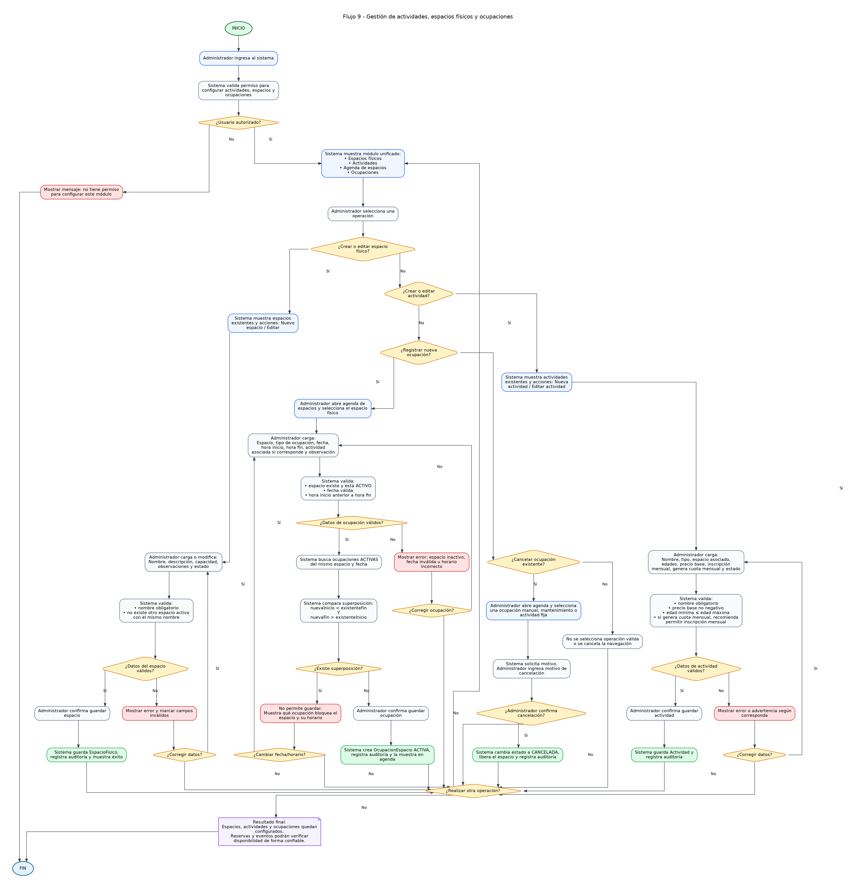

# Flujo 9 - Gestión de actividades, espacios físicos y ocupaciones

---
## Objetivo
Permitir que el administrador configure las actividades del complejo, los espacios físicos disponibles y las ocupaciones
que bloquean esos espacios en fechas y horarios determinados. Este flujo tiene como finalidad que el sistema pueda evitar
reservas, eventos o usos superpuestos en la cancha, el salón infantil, el piso intermedio de Taekwondo u otros espacios
futuros.

Este flujo es necesario porque los Flujos 5 y 6 verifican disponibilidad contra ocupaciones existentes. Para que esa
verificación funcione correctamente, el sistema debe permitir registrar ocupaciones originadas por actividades fijas,
bloqueos manuales, mantenimiento, educación física escolar recurrente u otros usos internos.
---

## Actor principal
    Administrador del sistema.
---

## Situación inicial
El complejo posee distintos espacios físicos que pueden ser utilizados por actividades, reservas o eventos.

Espacios iniciales:

- Cancha de fútbol 5.
- Piso intermedio / sala de Taekwondo.
- Salón infantil del segundo piso.

Algunas actividades ocupan un espacio en horarios fijos. Por ejemplo:

- Escuela de fútbol: cancha de fútbol 5.
- Taekwondo: piso intermedio.
- Educación física escolar: cancha de fútbol 5.
- Mantenimiento: cualquier espacio.
- Bloqueo manual: cualquier espacio.
---

## Condición para iniciar el flujo
El administrador debe tener permiso para configurar actividades, espacios y ocupaciones. El sistema debe permitir iniciar 
este flujo desde:

- Módulo de configuración.
- Módulo de actividades.
- Módulo de reservas.
- Módulo de eventos.
- Agenda de espacios.
---

## Concepto central - EspacioFisico
Un espacio físico representa una zona real del complejo que puede ser usada o bloqueada.

Datos mínimos:
- Nombre.
- Descripción.
- Estado.
- Capacidad, si corresponde.
- Observaciones.

Estados posibles:
- ACTIVO.
- INACTIVO.

Ejemplos:
- Cancha de fútbol 5.
- Salón infantil.
- Sala de Taekwondo.
---

## Concepto central - Actividad
Una actividad representa un servicio ofrecido por el complejo.

Datos mínimos:
- Nombre.
- Tipo.
- Espacio físico asociado, si corresponde.
- Edad mínima, si corresponde.
- Edad máxima, si corresponde.
- Precio base.
- Permite inscripción mensual.
- Genera cuota mensual.
- Estado.

Estados posibles:
- ACTIVA.
- INACTIVA.
---

## Concepto central - OcupacionEspacio
Una ocupación de espacio representa un bloqueo concreto de un espacio físico en una fecha y horario.

Datos mínimos:
- Espacio físico.
- Fecha.
- Hora de inicio.
- Hora de fin.
- Tipo de ocupación.
- Origen de la ocupación.
- Estado.
- Observación.
- Usuario que la registró.

Tipos iniciales:
- RESERVA_CANCHA.
- EVENTO_CANCHA.
- EVENTO_SALON.
- ACTIVIDAD_FIJA.
- EDUCACION_FISICA_ESCOLAR.
- MANTENIMIENTO.
- BLOQUEO_MANUAL.
- OTRO.

Estados posibles:
- ACTIVA.
- CANCELADA.
- FINALIZADA.
---

## Pantalla - Gestión de espacios

    Espacios físicos

    ----------------------------------------------------------
    Nombre                         Estado       Acciones
    ----------------------------------------------------------
    Cancha de fútbol 5             ACTIVO       [Editar]
    Sala de Taekwondo              ACTIVO       [Editar]
    Salón infantil                 ACTIVO       [Editar]
    Confitería / cafetería         ACTIVO       [Editar]
    ----------------------------------------------------------

    [Nuevo espacio]
---

## Pantalla - Gestión de actividades

    Actividades

    ----------------------------------------------------------------------------------------------------
    Actividad               Espacio                 Mensual   Genera cuota   Edad       Estado
    ----------------------------------------------------------------------------------------------------
    Escuela de fútbol       Cancha de fútbol 5      Sí        Sí             5 a 9      ACTIVA
    Taekwondo               Sala de Taekwondo       Sí        Sí             -          ACTIVA
    Alquiler fútbol 5       Cancha de fútbol 5      No        No             -          ACTIVA
    Salón infantil          Salón infantil          No        No             3 a 7      ACTIVA
    ----------------------------------------------------------------------------------------------------

    [Nueva actividad]
---

## Pantalla - Nueva ocupación de espacio

    Nueva ocupación de espacio

    Espacio:             [ Cancha de fútbol 5       ]
    Tipo de ocupación:   [ ACTIVIDAD_FIJA           ]

    Fecha:               [ 05/06/2026               ]
    Hora inicio:         [ 17:00                    ]
    Hora fin:            [ 19:00                    ]

    Actividad asociada:  [ Escuela de fútbol        ]
    Observación:         [ Clase habitual           ]

    [Verificar disponibilidad]
    [Guardar ocupación]
    [Cancelar]
---

## Pasos del flujo - Crear o editar espacio físico

    1. El administrador ingresa al sistema.
    2. Accede al módulo "Espacios físicos".
    3. El sistema muestra los espacios existentes.
    4. El administrador selecciona:
        - [Nuevo espacio] o [Editar]

    5. El sistema muestra el formulario de espacio.
    6. El administrador carga o modifica:
        - Nombre.
        - Descripción.
        - Capacidad, si corresponde.
        - Observaciones.
        - Estado.

    7. El sistema valida que el nombre no esté vacío.
    8. El sistema valida que no exista otro espacio activo con el mismo nombre.
    9. El administrador confirma.
    10. El sistema guarda el espacio.
    11. El sistema registra auditoría de la operación.
    12. El sistema muestra mensaje de éxito.
---

## Pasos del flujo - Crear o editar actividad

    1. El administrador accede al módulo "Actividades".
    2. El sistema muestra actividades existentes.
    3. El administrador selecciona:
        - [Nueva actividad] o - [Editar actividad]

    4. El sistema muestra el formulario de actividad.
    5. El administrador carga:
        - Nombre.
        - Tipo.
        - Espacio físico asociado, si corresponde.
        - Edad mínima.
        - Edad máxima.
        - Precio base.
        - Si permite inscripción mensual.
        - Si genera cuota mensual.
        - Estado.

    6. El sistema valida que el nombre no esté vacío.
    7. El sistema valida que el precio base no sea negativo.
    8. Si se cargan edades, el sistema valida que edad mínima no sea mayor a edad máxima.
    9. Si la actividad genera cuota mensual, el sistema recomienda que también permita inscripción mensual.
    10. El administrador confirma.
    11. El sistema guarda la actividad.
    12. El sistema registra auditoría.
---

## Pasos del flujo - Registrar ocupación manual o actividad fija

    1. El administrador accede a la agenda de espacios.
    2. Selecciona el espacio físico.
    3. Selecciona la opción:
        - [Nueva ocupación]

    4. El sistema muestra el formulario.
    5. El administrador carga:
        - Espacio.
        - Tipo de ocupación.
        - Fecha.
        - Hora de inicio.
        - Hora de fin.
        - Actividad asociada, si corresponde.
        - Observación.

    6. El sistema valida que el espacio exista y esté activo.
    7. El sistema valida que la fecha sea válida.
    8. El sistema valida que la hora de inicio sea anterior a la hora de fin.
    9. El sistema busca ocupaciones activas del mismo espacio en la misma fecha.
    10. El sistema compara los horarios.
    11. Si existe superposición, el sistema muestra un error:

        "El espacio ya está ocupado en ese horario."

    12. El sistema muestra la ocupación que genera el conflicto.
    13. Si no hay conflicto, el sistema permite guardar.
    14. El administrador confirma.
    15. El sistema crea la OcupacionEspacio.
    16. El sistema registra auditoría.
    17. El sistema muestra la ocupación en la agenda.
---

## Subflujo - Cancelar ocupación manual

    1. El administrador abre la agenda de espacios.
    2. Selecciona una ocupación manual, de mantenimiento o actividad fija.
    3. Presiona:
        - [Cancelar ocupación]

    4. El sistema solicita motivo.
    5. El administrador ingresa motivo.
    6. El sistema cambia el estado de la ocupación a CANCELADA.
    7. El sistema libera el espacio para futuras reservas o eventos.
    8. El sistema registra auditoría.
---

## Ejemplo 1 - Bloqueo por escuela de fútbol

    Espacio:
        - Cancha de fútbol 5.

    Ocupación:
        - Escuela de fútbol.
        - Fecha: 05/06/2026.
        - Horario: 17:00 a 19:00.

    Resultado:
        - La cancha queda bloqueada de 17:00 a 19:00.
        - No se podrá cargar una reserva simple ni cumpleaños deportivo en ese horario.
---

## Ejemplo 2 - Mantenimiento de salón infantil

    Espacio:
        - Salón infantil.

    Ocupación:
        - Mantenimiento.
        - Fecha: 08/06/2026.
        - Horario: 10:00 a 13:00.

    Resultado:
        - No se podrán cargar eventos en el salón durante ese horario.
---

## Decisiones importantes

- ¿El usuario tiene permiso para configurar espacios?
- ¿El espacio está activo?
- ¿La actividad permite inscripción mensual?
- ¿La actividad genera cuota mensual?
- ¿La ocupación tiene fecha y horario válidos?
- ¿Existe superposición con otra ocupación?
- ¿La ocupación se origina en actividad fija, reserva, evento, mantenimiento o bloqueo manual?
- ¿El administrador confirma la operación?
---

## Datos que intervienen

- EspacioFisico.
- Actividad.
- OcupacionEspacio.
- Usuario administrador.
- Auditoria.
---

## Reglas de negocio detectadas

- No se podrá crear una ocupación si el espacio está inactivo.
- No se podrá crear una ocupación con hora de inicio posterior o igual a la hora de fin.
- No se podrá crear una ocupación superpuesta con otra ocupación activa del mismo espacio.
- Las ocupaciones canceladas no bloquean disponibilidad.
- Las reservas y eventos también deberán crear ocupaciones de espacio.
- Las actividades fijas deberán bloquear el espacio en los horarios cargados.
- Los bloqueos de mantenimiento deberán impedir reservas y eventos.
- Toda creación, modificación o cancelación de ocupación deberá quedar auditada.
---

## Resultado final
El sistema permite configurar espacios físicos, actividades y ocupaciones. A partir de este flujo, las reservas simples,
cumpleaños, eventos, actividades fijas y bloqueos manuales pueden convivir en una misma agenda sin superponerse. Esto permite
que los Flujos 5 y 6 verifiquen disponibilidad de manera confiable.

