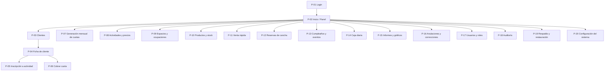

# 🖥️ Pantallas del Sistema — Complejo Deportivo (Versión 1.0)

---

## 📑 Tabla de contenidos
1. [Propósito de este documento](#1-propósito-de-este-documento)
2. [Cómo leer cada ficha de pantalla](#2-cómo-leer-cada-ficha-de-pantalla)
3. [Principios de diseño que atraviesan todas las pantallas](#3-principios-de-diseño-que-atraviesan-todas-las-pantallas)
4. [Mapa de navegación (sitemap)](#4-mapa-de-navegación-sitemap)
5. [Catálogo de pantallas](#5-catálogo-de-pantallas)
6. [Matriz de acceso por rol](#6-matriz-de-acceso-por-rol)
7. [Componentes compartidos de interfaz](#7-componentes-compartidos-de-interfaz)
8. [Lenguaje de estados y colores](#8-lenguaje-de-estados-y-colores)
9. [Estados transversales de pantalla](#9-estados-transversales-de-pantalla)
10. [Trazabilidad pantalla → flujo → reglas](#10-trazabilidad-pantalla--flujo--reglas)
---

## 1. Propósito de este documento
El sistema reemplaza el **papel y lapicera** en la administración diaria del complejo. Para
que ese reemplazo funcione, las personas que hoy anotan a mano (sin formación técnica) deben
poder hacer su trabajo en **pantallas claras, predecibles y difíciles de usar mal**.

Este documento define, para **cada pantalla** del sistema:

- **Qué es** (definición).
- **Por qué existe** (qué problema concreto del negocio resuelve).
- **Qué contiene** (elementos visibles).
- **Qué hace** (acciones e interacciones del usuario).
- **Qué reglas de negocio aplica** (referencia a los códigos `RN-XXX-NN`).

> 📌 **No es un documento de estética**, sino de **comportamiento**: describe qué ve y qué
> puede hacer el usuario en cada lugar, y qué validaciones lo protegen. El diseño visual fino
> (colores exactos, tipografías) se decide en la etapa de frontend (Semana 16), respetando los
> principios de la sección 3.

### Relación con los otros documentos
| Documento | Aporta a las pantallas |
|---|---|
| `alcance-version-1.md` | Qué módulos existen, qué datos mínimos pide cada uno, los 4 roles, requisitos de usabilidad (sección 17). |
| `reglas-negocio.md` | Las validaciones y mensajes que cada pantalla debe respetar (`RN-XXX-NN`). |
| `entidades.md` | Los datos reales que muestra y edita cada pantalla (atributos, estados, value objects). |
| `flujo-1` … `flujo-13` | El paso a paso que recorre el usuario dentro de cada pantalla. |
---

## 2. Cómo leer cada ficha de pantalla
Cada pantalla del [catálogo](#5-catálogo-de-pantallas) usa **la misma plantilla**, para que
sea fácil de comparar y de implementar:

| Campo | Qué responde |
|---|---|
| **Código** | Identificador corto y estable (`P-01`, `P-02`…). Se usa para referenciarla en código y pruebas. |
| **Definición** | En una frase, qué es la pantalla. |
| **Por qué existe** | El problema del negocio que resuelve (sale de `alcance`, sección 4). |
| **Roles con acceso** | Qué roles entran y con qué nivel (ver/operar). |
| **Contenido** | Qué hay en la pantalla (campos, listas, tarjetas, botones). |
| **Qué hace** | Las acciones del usuario y lo que el sistema hace en respuesta. |
| **Reglas aplicadas** | Códigos `RN-XXX-NN` que esta pantalla debe cumplir. |
| **Navegación** | Desde dónde se llega y hacia dónde lleva. |
---

## 3. Principios de diseño que atraviesan todas las pantallas
Estos principios **no se repiten** en cada ficha: se asumen siempre. Salen de los requisitos
de usabilidad (`alcance`, sección 17) y de las reglas generales (`RN-GEN`).

1. **Lenguaje humano, nunca técnico.** Botones como *Cobrar cuota*, *Registrar venta*, *Ver
   caja del día*. Nunca *Persistir entidad* ni *Ejecutar transacción*. (`RN-GEN-08`)
2. **Las acciones más usadas, siempre a la vista.** La pantalla de Inicio prioriza cobrar,
   vender, reservar y ver la caja. (`alcance` 17)
3. **Confirmación antes de toda operación importante.** Cobros, anulaciones, bajas,
   restauraciones: siempre con un paso de confirmación que resume qué va a pasar. (`RN-GEN-09`)
4. **El dinero se muestra siempre con 2 decimales y su moneda.** Nunca un número "pelado".
   Internamente es el value object `Dinero` (BigDecimal, escala 2). (`RN-GEN-05`)
5. **Nada se borra: se inactiva o se anula.** Las pantallas no ofrecen "Eliminar" para datos
   con valor económico o histórico; ofrecen *Dar de baja*, *Inactivar* o *Anular*. (`RN-GEN-02`)
6. **Toda operación económica registra quién, cuándo y por qué.** El usuario logueado queda
   asociado automáticamente; las anulaciones piden motivo. (`RN-GEN-01`, `RN-GEN-03`)
7. **Estados con color claro.** Verde = al día/pagado, amarillo = parcial/por vencer, rojo =
   vencido/deuda, gris = inactivo/anulado. (ver [sección 8](#8-lenguaje-de-estados-y-colores))
8. **Búsqueda rápida en todo listado largo.** Por nombre, apellido o DNI donde aplique.
9. **Mensajes de error amables.** "No se puede vender: no hay stock suficiente de Coca 500ml",
   nunca un error técnico ni un código. (`RN-GEN-08`)
10. **Cada usuario ve solo lo que su rol permite.** Las acciones no autorizadas no se muestran
    o aparecen deshabilitadas con una explicación. (`RN-USR-06`)
11. **Operaciones atómicas y sin estados a medias.** Si una operación de varios pasos falla, la
    pantalla informa que **no se guardó nada** y el usuario puede reintentar. (`RN-GEN-04`)
---

## 4. Mapa de navegación (sitemap)
Toda sesión comienza en **Login** y desemboca en **Inicio**, desde donde se accede al resto.

### Resumen del catálogo
| Código | Pantalla | Módulo / Flujo | Día(s) de la hoja de ruta |
|---|---|---|---|
| P-01 | Login | Seguridad / Flujo 12 | 17 |
| P-02 | Inicio / Panel principal | Transversal | 107 |
| P-03 | Clientes (listado) | Clientes / Flujo 1 | 26 |
| P-04 | Ficha de cliente | Clientes / Flujo 1 | 26, 47 |
| P-05 | Inscripción a actividad | Inscripciones / Flujo 1 | 38 |
| P-06 | Cobrar cuota | Pagos / Flujo 3 | 52–56, 109 |
| P-07 | Generación mensual de cuotas | Cuotas / Flujo 2 | 44–45 |
| P-08 | Actividades y precios | Actividades / Flujo 1 | 33 |
| P-09 | Espacios y ocupaciones | Espacios / Flujo 9 | 73–74 |
| P-10 | Productos y stock | Productos / Flujo 10 | 67–68 |
| P-11 | Venta rápida (confitería) | Ventas / Flujo 4 | 70, 109 |
| P-12 | Reservas de cancha | Reservas / Flujo 5 | 76–79, 109 |
| P-13 | Cumpleaños y eventos | Eventos / Flujo 6 | 83–86, 109 |
| P-14 | Caja diaria | Caja / Flujo 7 | 61–63, 109 |
| P-15 | Informes y gráficos | Informes / Flujo 8 | 94–99, 110 |
| P-16 | Anulaciones y correcciones | Anulaciones / Flujo 11 | 88–92 |
| P-17 | Usuarios y roles | Seguridad / Flujo 12 | 15–18 |
| P-18 | Auditoría | Auditoría / Flujo 12 | 20 |
| P-19 | Respaldo y restauración | Backup / Flujo 13 | 103–104 |
| P-20 | Configuración del sistema | Configuración | — |
---

## 5. Catálogo de pantallas
> Cada ficha sigue la plantilla de la [sección 2](#2-cómo-leer-cada-ficha-de-pantalla).
> Los principios de la [sección 3](#3-principios-de-diseño-que-atraviesan-todas-las-pantallas)
> se asumen en todas y no se repiten.
---

### P-01 · Login (Iniciar sesión)
**Definición:** Puerta de entrada al sistema. Pide usuario y contraseña y abre una sesión.

**Por qué existe:** El sistema guarda datos de **menores de edad** y operaciones económicas;
nadie puede usarlo de forma anónima. Cada operación debe quedar atada a un usuario responsable.
(`alcance` 12, `RN-USR-01`)

**Roles con acceso:** Todos (antes de tener rol asignado en la sesión).

**Contenido:**
- Nombre del complejo / logo.
- Campo **Usuario**.
- Campo **Contraseña** (oculta).
- Botón **Ingresar**.
- Zona de mensaje de error.

**Qué hace:**
- Valida usuario + contraseña contra credenciales hasheadas; **nunca** compara texto plano
  (`RN-USR-02`).
- Si son correctas y el usuario está **activo**, abre la sesión y lleva a **Inicio (P-02)**.
- Si el usuario está **inactivo**, niega el ingreso (`RN-USR-01`).
- Si fallan, muestra un mensaje genérico ("Usuario o contraseña incorrectos"), sin revelar
  cuál de los dos falló.

**Reglas aplicadas:** `RN-USR-01`, `RN-USR-02`, `RN-USR-05`, `RN-USR-11`.

**Navegación:** Entrada del sistema → **P-02 Inicio**. El cierre de sesión vuelve aquí.

---

### P-02 · Inicio / Panel principal
**Definición:** Pantalla central post-login. Resume el día y da acceso rápido a lo más usado.

**Por qué existe:** Reemplaza la "primera mirada al cuaderno": qué pasó hoy y qué se hace
ahora. Prioriza las acciones frecuentes para que el trabajo diario sea de uno o dos clics.
(`alcance` 17)

**Roles con acceso:** Todos; el contenido se adapta al rol (`RN-USR-06`).

**Contenido:**
- Saludo con nombre del usuario y su rol.
- **Accesos directos grandes:** *Cobrar cuota*, *Registrar venta*, *Nueva reserva*,
  *Nuevo evento*, *Ver caja del día*.
- **Resumen del día:** total ingresado hoy, cantidad de operaciones, (opcional) ingresos por
  área.
- **Avisos:** productos con **stock bajo**; aviso de **generar cuotas** del período cuando
  corresponde y el usuario tiene permiso (`RN-GCU-18`, `RN-GCU-19`).
- Menú de navegación a todos los módulos permitidos.

**Qué hace:**
- Cada acceso directo abre la pantalla correspondiente.
- El aviso de generación de cuotas lleva a **P-07**; desaparece una vez generado el período.
- Los avisos de stock bajo enlazan a **P-10**.

**Reglas aplicadas:** `RN-USR-06`, `RN-GCU-18`, `RN-GCU-19`, principios de usabilidad.

**Navegación:** Centro de la estrella: desde aquí se llega a P-03…P-20. Es el destino tras el login.

---

### P-03 · Clientes (listado y alta)
**Definición:** Lista de clientes del complejo, con búsqueda, y alta de nuevos clientes.

**Por qué existe:** Hoy no se sabe con certeza quién es cliente, quién está activo ni cómo
ubicarlo rápido. Esta pantalla resuelve "encontrar a una persona" y "darla de alta".
(`alcance` 4 y 6.1)

**Roles con acceso:** Administrador y Encargado operan; Consulta solo ve. Empleado no entra.

**Contenido:**
- **Buscador** por nombre, apellido o DNI (`RN-CLI-14`).
- Filtro por estado: **Activos / Inactivos**.
- **Tabla** con: nombre y apellido, DNI (si tiene), edad, estado (🟢 activo / ⚪ inactivo),
  y un indicador de **deuda** (🔴 si debe).
- Botón **Nuevo cliente**.

**Qué hace:**
- **Alta de cliente:** formulario con nombre, apellido, DNI (opcional), fecha de nacimiento,
  teléfono, observaciones. Permite agregar **responsable(s)** y su parentesco en el mismo paso
  (Flujo 1).
- La fecha de nacimiento no puede ser futura (`RN-CLI-06`).
- Si se carga DNI, se evita duplicado (`RN-CLI-03`); si no se carga, se permite, pero se
  **advierte** posible duplicado por nombre + apellido + fecha de nacimiento + responsable
  (advertencia, no bloqueo) (`RN-CLI-04`, `RN-CLI-05`).
- Un cliente menor debe quedar con al menos un **responsable principal**; si se carga uno
  solo, queda principal automáticamente (`RN-CLI-09`).
- Cliente + responsable + vínculo se guardan en **una sola transacción** (`RN-GEN-04`).
- Todo cliente nuevo arranca con **saldo a favor en cero** (`RN-CLI-10`).
- **Baja:** cambia el estado a **inactivo**, nunca borra (`RN-CLI-01`, `RN-CLI-02`).
- Abrir una fila lleva a la **Ficha de cliente (P-04)**.

**Reglas aplicadas:** `RN-CLI-01…14`, `RN-RES-01…09`, `RN-GEN-02`, `RN-GEN-04`.

**Navegación:** Desde **P-02**. Cada cliente → **P-04**.

---

### P-04 · Ficha de cliente
**Definición:** Vista 360° de un cliente: datos, responsables, actividades, deuda, saldo a
favor e historial.

**Por qué existe:** Responde de un vistazo las preguntas clave del negocio: *¿qué actividad
hace?, ¿pagó?, ¿debe?, ¿qué meses debe?, ¿tiene saldo a favor?* (`alcance` 1 y 6.1)

**Roles con acceso.** Administrador y Encargado operan; Consulta solo ve.

**Contenido:**
- **Encabezado:** nombre, apellido, edad, estado, DNI; **deuda total** (🔴) y **saldo a favor
  disponible** (🔵) bien visibles (`RN-CLI-12`).
- **Responsables** asociados con parentesco y teléfono de contacto.
- **Inscripciones**: actividad, precio mensual, día de vencimiento, estado (activa / suspendida
  / finalizada).
- **Cuotas**: período, importe, saldo pendiente, estado de pago (🟢🟡🔵) y de vencimiento
  (🔴 vencida) por separado (`RN-CUO-07`).
- **Historial de pagos** y **de compras**.
- **Movimientos de saldo a favor** (generación, aplicación, ajustes) (`alcance` 6.6.1).

**Qué hace:**
- **Editar datos** del cliente y de contacto de responsables sin perder historial (`RN-RES-09`).
- **Inscribir** a una actividad → abre **P-05**.
- **Cobrar** → abre **P-06** ya apuntado a este cliente.
- **Dar de baja** (inactivar) con confirmación.
- Consultar el detalle de cada pago, cuota o movimiento de saldo.

**Reglas aplicadas:** `RN-CLI-12`, `RN-CUO-07`, `RN-CUO-11`, `RN-RES-09`, reglas de saldo a favor.

**Navegación:** Desde **P-03**. Lleva a **P-05** (inscribir) y **P-06** (cobrar).

---

### P-05 · Inscripción a actividad
**Definición:** Asocia un cliente a una actividad mensual y define su precio y vencimiento.

**Por qué existe:** La inscripción es lo que **habilita la generación de cuotas**: sin ella, no
hay deuda mensual que cobrar. (`alcance` 6.4, Flujo 1)

**Roles con acceso:** Administrador y Encargado.

**Contenido:**
- Cliente (precargado desde P-04).
- Selector de **actividad**: solo activas que permiten inscripción mensual (`RN-ACT-02`).
- **Precio mensual** (propuesto desde el precio de la actividad, editable).
- **Día de vencimiento** (1 a 28).
- Fecha de inicio y observaciones.

**Qué hace:**
- Valida que el cliente cumpla el **rango de edad** de la actividad cuando exista (`RN-INS-03`,
  p. ej. escuela de fútbol 5–9 años `RN-ACT-05`).
- Impide **inscripción activa duplicada** del mismo cliente en la misma actividad (`RN-INS-02`).
- Exige **precio mensual > 0** (`RN-INS-04`) y **día de vencimiento entre 1 y 28** (`RN-INS-05`).
- La inscripción nace **activa** (`RN-INS-08`).

**Reglas aplicadas:** `RN-INS-01…12`, `RN-ACT-02`, `RN-ACT-05`, `RN-PRE-04`.

**Navegación:** Desde **P-04**. Vuelve a la ficha con la inscripción ya cargada.

---

### P-06 · Cobrar cuota (registrar pago)
**Definición:** Pantalla de cobro: selecciona cuotas adeudadas, recibe el dinero y aplica el
pago, generando el ingreso en caja.

**Por qué existe:** Es **la operación más frecuente y sensible** del complejo. Resuelve "quién
pagó, cuánto y qué mes", elimina los errores de cuentas a mano y deja todo registrado.
(`alcance` 4 y 6.6, Flujo 3)

**Roles con acceso:** Administrador y Encargado; Empleado solo **pagos simples**.

**Contenido:**
- Cliente seleccionado y su **deuda**: cuotas pendientes/parciales/vencidas con período,
  importe y saldo.
- **Selección múltiple** de cuotas a cobrar (`RN-PAG-06`).
- **Monto recibido** y **método de pago** (efectivo, débito, crédito, transferencia, Mercado
  Pago, otro).
- **Previsualización de la distribución** del pago entre cuotas (`RN-PAG-10`).
- Saldo a favor disponible del cliente (informativo, aplicable a cuotas).
- Botón **Confirmar cobro** (con resumen).

**Qué hace:**
- Exige **monto > 0** y método seleccionado (`RN-PAG-01`, `RN-PAG-08`).
- Distribuye el pago: **primero vencidas, luego pendientes más antiguas, luego recientes**
  (`RN-PAG-09`), y deja **previsualizar** antes de confirmar (`RN-PAG-10`).
- Recalcula saldo y estado de cada cuota: queda **🟡 parcial** o **🟢 pagada** (`RN-CUO-05`,
  `RN-CUO-06`).
- Si el **monto supera** lo seleccionado, el excedente solo puede ir a **saldo a favor** y
  pide **confirmación explícita** (`RN-PAG-11`).
- Genera **un único movimiento de caja** por el total recibido, aunque salde varias cuotas
  (`RN-PAG-14`), y un **comprobante** correlativo (`RN-CMP-01`).
- Permite **aplicar saldo a favor** existente a cuotas, **sin** duplicar ingreso en caja
  (`RN-CAJ-05`).
- Todo el cobro (pago + aplicaciones + caja + comprobante) ocurre en **una transacción**
  (`RN-GEN-04`).

**Reglas aplicadas:** `RN-PAG-01…14`, `RN-CUO-05/06`, `RN-CAJ-02/05/14`, `RN-CMP-01`, `RN-GEN-01/04`.

**Navegación:** Desde **P-02** (acceso directo) o **P-04**. Tras confirmar, ofrece ver el
comprobante y vuelve a la ficha.

### P-07 · Generación mensual de cuotas
**Definición:** Genera las cuotas del mes para todas las inscripciones activas, con
**previsualización** y **confirmación atómica**.

**Por qué existe:** Evita cargar cuota por cuota a mano y, sobre todo, evita **duplicados** y
**olvidos**. Es el motor que llena la deuda mensual del complejo. (`alcance` 6.5, Flujo 2)

**Roles con acceso:** Solo **Administrador** (`RN-GCU-19`).

**Contenido:**
- Selector de **período** (mes/año).
- Botón **Previsualizar**.
- Tabla de **previsualización**: qué cuotas se generarían (cliente, actividad, importe,
  vencimiento) y cuáles se **omiten** con su **motivo** (duplicado, sin precio vigente,
  inscripción inactiva, inicio posterior, etc.) (`RN-GCU-09`).
- Opción **aplicar saldo a favor automáticamente** a las cuotas del período (`RN-GCU-14/15`).
- Botón **Confirmar generación** + **resumen final** por estado.

**Qué hace:**
- Solo desde el **primer día hábil** del mes (configurable) (`RN-GCU-01`).
- Incluye únicamente **actividades activas** con `generaCuotaMensual = true` e **inscripciones
  activas** (`RN-GCU-04`, `RN-GCU-06`).
- Exige **precio > 0** para el período (`RN-GCU-05`); calcula vencimiento con el día de la
  inscripción (`RN-GCU-10`).
- **Confirmación atómica**: genera todo o nada (`RN-GCU-12`); impide **doble generación** del
  período (`RN-GCU-02`) y generaciones simultáneas (`RN-GCU-03`).
- **No genera ingreso de caja** por sí sola (`RN-GCU-13`); el saldo a favor aplicado tampoco
  (`RN-GCU-17`).
- Resumen: pendientes + parciales + pagadas = total (`RN-GCU-20`).

**Reglas aplicadas:** `RN-GCU-01…20`, `RN-PRE-01…04`, `RN-CUO-02`.

**Navegación:** Desde **P-02** (aviso de generación). Tras confirmar, el aviso desaparece para
ese período (`RN-GCU-18`).

---

### P-08 · Actividades y precios
**Definición:** Administra las actividades del complejo y sus precios mensuales versionados.

**Por qué existe:** Las actividades y sus precios son la base de inscripciones y cuotas. El
precio debe poder cambiar **sin alterar la historia** ya cobrada. (`alcance` 6.3, Flujo 1)

**Roles con acceso:** Administrador administra; el resto consulta.

**Contenido:**
- Lista de actividades: nombre, tipo, espacio asociado, edades, precio vigente, estado.
- Alta/edición de actividad: nombre, tipo, espacio, edad mín/máx, precio base, flags
  *permite inscripción* / *genera cuota mensual*.
- **Histórico de precios** por actividad.

**Qué hace:**
- Las actividades **no se borran**: se **inactivan** (`RN-ACT-01`).
- Valida edad mínima ≤ máxima (`RN-ACT-08`) y precio base ≥ 0 (`RN-ACT-09`).
- Invariante: si `permiteInscripcion = false` ⇒ `generaCuotaMensual = false` (`RN-ACT-03`).
- Al **cambiar el precio**, se guarda el nuevo período de vigencia; las **cuotas ya generadas
  conservan su precio** (`RN-ACT-07`, `RN-PRE-02/03`).

**Reglas aplicadas:** `RN-ACT-01…09`, `RN-PRE-01…04`.

**Navegación:** Desde **P-02**.

---

### P-09 · Espacios y ocupaciones
**Definición:** Administra los espacios físicos (cancha, sala de Taekwondo, salón infantil,
confitería) y su **agenda de ocupaciones**, que es lo que evita superposiciones.

**Por qué existe:** Reservas y eventos **no se validan entre sí**: validan contra
**ocupaciones**. Centralizar la agenda evita choques de horario y permite bloqueos de
mantenimiento. (`alcance` 3 y 6.11, Flujo 9)

**Roles con acceso:** Administrador administra; Encargado registra ocupaciones internas;
Consulta ve la agenda.

**Contenido:**
- Lista de **espacios** (estado activo/inactivo).
- **Agenda/calendario** por espacio y fecha con sus ocupaciones (origen: reserva, evento,
  escuela de fútbol, educación física, actividad fija, mantenimiento, bloqueo manual).
- Alta de **ocupación interna** o **bloqueo de mantenimiento**.

**Qué hace:**
- Los espacios **no se borran**: se inactivan (`RN-ESP-02`); no puede haber dos activos con el
  mismo nombre (`RN-ESP-03`).
- Solo ocupaciones **activas** bloquean; las canceladas quedan como historial (`RN-ESP-05`).
- Detecta superposición por **mismo espacio + fecha + rango horario solapado** (`RN-ESP-06`);
  exige inicio < fin (`RN-ESP-07`); valida **antes** de crear (`RN-ESP-13`).
- Bloqueos de mantenimiento impiden reservas y eventos en ese horario (`RN-ESP-11`).
- Toda alta/modificación/cancelación de ocupación queda auditada (`RN-ESP-12`).

**Reglas aplicadas:** `RN-ESP-01…13`.

**Navegación:** Desde **P-02**. Es la base que consultan **P-12** y **P-13**.

---

### P-10 · Productos y stock
**Definición:** Administra los productos de confitería/cafetería, su stock y los ajustes de
inventario.

**Por qué existe:** Hoy no hay control de stock ni forma de saber qué falta. Esta pantalla
controla existencias y avisa de **stock bajo**. (`alcance` 6.7, Flujo 10)

**Roles con acceso:** Administrador y Encargado administran; Empleado y Consulta ven.

**Contenido:**
- Lista de productos: nombre, categoría, precio, **stock actual**, **stock mínimo**, estado.
- **Filtro de stock bajo** (stock actual ≤ mínimo) (`alcance` 6.7).
- Alta/edición de producto y de categorías.
- **Ajustes de inventario**: reposición, corrección ±, pérdida, devolución → `MovimientoStock`.

**Qué hace:**
- Marca 🟡 los productos con **stock bajo**.
- Los productos **no se borran** si tienen ventas asociadas: se **inactivan** (`alcance` 6.7).
- Cada ajuste registra un **movimiento de stock** con su motivo y usuario (Flujo 10).
- El **precio histórico** queda conservado dentro de cada venta, no aquí (`RN-VEN-07`).

**Reglas aplicadas:** Reglas de productos/stock de `alcance` 6.7, `RN-VEN-07/11`.

**Navegación:** Desde **P-02** y desde los avisos de stock bajo de **P-02**.

---

### P-11 · Venta rápida (confitería / cafetería)
**Definición:** Carrito de venta de productos: arma la compra, cobra y descuenta stock al
instante.

**Por qué existe:** La confitería vende seguido y rápido; necesita una pantalla ágil que cobre,
descuente stock y registre el ingreso sin fricción. (`alcance` 6.8, Flujo 4)

**Roles con acceso:** Administrador, Encargado y Empleado.

**Contenido:**
- Buscador de productos y **carrito** (producto, cantidad, precio unitario, subtotal).
- **Total** calculado automáticamente.
- Cliente registrado **o** persona eventual (opcional).
- Método de pago.
- Botón **Confirmar venta**.

**Qué hace:**
- Una venta necesita **al menos un producto** (`RN-VEN-01`) y cantidad > 0 (`RN-VEN-02`).
- **No vende sin stock suficiente**; valida stock **al agregar y al confirmar** (`RN-VEN-03`,
  `RN-VEN-09/10`).
- Si se agrega un producto ya presente, **suma cantidad** en vez de duplicar línea (`RN-VEN-08`).
- Calcula subtotal y total (`RN-VEN-06`) y guarda **precio histórico** (`RN-VEN-07`).
- Se cobra con **método real**; el saldo a favor **no** aplica a ventas (`RN-VEN-05`). En V1 no
  se fía (`RN-VEN-13`).
- Al confirmar: descuenta stock + registra movimiento de salida (`RN-VEN-11`) y genera
  **movimiento de caja** del área confitería (`RN-VEN-12`), todo en una transacción.

**Reglas aplicadas:** `RN-VEN-01…17`, `RN-CAJ-02`.

**Navegación:** Desde **P-02** (acceso directo). Una venta cargada por error se anula en **P-16**.

---

### P-12 · Reservas de cancha
**Definición:** Registra y administra reservas simples de la cancha de fútbol 5, con seña y
saldo, validando disponibilidad.

**Por qué existe:** Evita el problema más caro de la agenda en papel: **reservas superpuestas**.
Además ordena señas y saldos. (`alcance` 6.9, Flujo 5)

**Roles con acceso:** Administrador y Encargado operan; Empleado consulta las del día;
Consulta ve.

**Contenido:**
- Selección de **fecha, hora inicio, hora fin, tipo de reserva** (alquiler / educación física).
- Datos de contacto del responsable.
- **Importe total**, **seña**, saldo pendiente (calculado), método de pago.
- Vista de **disponibilidad** del espacio en ese horario.

**Qué hace:**
- **No es para cumpleaños deportivos** (esos van como evento) (`RN-REV-01`).
- Valida disponibilidad **contra cualquier ocupación activa**; si hay solape, **no permite**
  reservar y muestra qué lo impide (`RN-REV-02/03`).
- Exige inicio < fin (`RN-REV-04`), importe > 0 (`RN-REV-06`) y seña ≤ total (`RN-REV-07`); en
  V1 **sin excedente** (`RN-REV-08`) y **sin saldo a favor** (`RN-REV-10`).
- Al confirmar: crea la **reserva + ocupación + pago de seña + movimiento de caja** en una
  transacción (`RN-REV-12/13`). Estado pasa a **🟡 señada** y, al saldar, **🟢 pagada**
  (`RN-REV-09`).
- **Cancelar** libera la ocupación, conserva historial y registra el **tratamiento del dinero**
  (retenido, devolución, reprogramado) (`RN-REV-15/16/17`).

**Reglas aplicadas:** `RN-REV-01…19`, `RN-ESP-04…13`, `RN-CAJ-02`.

**Navegación:** Desde **P-02**. Cancelaciones/anulaciones de pago, vía **P-16**.

---

### P-13 · Cumpleaños y eventos
**Definición:** Registra cumpleaños deportivos, de salón infantil y eventos particulares, con
servicios, seña y saldo.

**Por qué existe:** Los eventos son operaciones de mayor monto con seña y saldo; necesitan
control de superposición, edades y dinero. (`alcance` 6.10, Flujo 6)

**Roles con acceso:** Administrador y Encargado operan; Consulta ve.

**Contenido:**
- **Tipo de evento** (cumpleaños deportivo varones/mixto, salón infantil, evento particular).
- Espacio físico, fecha, hora inicio/fin.
- Datos del cumpleañero (nombre, edad) y del responsable.
- **Servicios del evento**, cantidad de invitados, importe total, seña, saldo.

**Qué hace:**
- Valida disponibilidad contra ocupaciones; muestra qué impide el horario (`RN-EVT-02/03`).
- **Salón infantil 3–7 años** es validación **bloqueante** para cumpleaños; fuera de rango no
  se registra como cumpleaños de salón (`RN-EVT-04`). Para eventos particulares es solo
  **advertencia** que queda en observaciones (`RN-EVT-05`).
- Cumpleaños: nombre y edad **obligatorios**; eventos particulares: opcionales (`RN-EVT-06`).
- Exige inicio < fin (`RN-EVT-07`), total > 0 (`RN-EVT-08`), seña ≤ total (`RN-EVT-09`).
- Crea **evento + ocupación + pago + caja** en una transacción (`RN-EVT-13`); estado 🟡 señado
  → 🟢 pagado (`RN-EVT-14`). **Realizado no implica pagado** (`RN-EVT-18`).
- **Cancelar/reprogramar** libera ocupación y registra tratamiento del dinero (`RN-EVT-16/17`).

**Reglas aplicadas:** `RN-EVT-01…19`, `RN-ESP-04…13`, `RN-CAJ-02`.

**Navegación:** Desde **P-02**. Cancelaciones/anulaciones de pago, vía **P-16**.

---

### P-14 · Caja diaria
**Definición:** Consulta de los ingresos del día, con detalle por movimiento y agrupaciones por
método de pago y por área.

**Por qué existe:** Responde "¿cuánto entró hoy y por qué área/método?" sin sumar a mano.
Es **solo lectura**: muestra lo que otros flujos ya registraron. (`alcance` 6.12, Flujo 7)

**Roles con acceso:** Administrador y Consulta ven; Encargado consulta. (Empleado no.)

**Contenido:**
- Selector de **fecha**.
- **Total ingresado** del día.
- **Detalle de movimientos**: hora, concepto, cliente/persona, monto, método, **usuario**.
- Agrupación **por método de pago** y **por área del complejo** (usando `AreaComplejo`, no texto
  libre).
- Sección separada de **anulaciones** del día (no suman al total normal).

**Qué hace:**
- Se construye **solo** a partir de los movimientos de caja registrados (`RN-CAJ-01`); no crea
  ni modifica nada (`RN-CAJ-10`).
- Agrupa por método y por área (`RN-CAJ-07`); un pago que cruza áreas se clasifica como "otro"
  y el detalle por área se reconstruye desde las aplicaciones (`RN-CAJ-08`).
- La **aplicación de saldo a favor no suma** como ingreso (`RN-CAJ-05`).
- Los **anulados** se muestran aparte, no como ingreso normal (`RN-CAJ-06`).
- Cada movimiento permite **abrir la operación que lo originó** (`RN-CAJ-09`).

**Reglas aplicadas:** `RN-CAJ-01…11`.

**Navegación:** Desde **P-02** (acceso directo). Cada movimiento enlaza a su operación de origen.

---

### P-15 · Informes y gráficos
**Definición:** Conjunto de informes consultables (con rango de fechas) y gráficos simples.

**Por qué existe:** Da visión de conjunto para tomar decisiones: deudas, productos más
vendidos, ingresos por área/método/día. (`alcance` 6.13 y 6.14, Flujo 8)

**Roles con acceso:** Administrador y Consulta; Encargado solo **informes básicos**; Empleado no.

**Contenido:**
- **Informes:** diario de ingresos, ingresos por área, por método de pago, **deudas**,
  **productos más vendidos**, pagos por cliente, ventas de confitería, reservas, eventos.
- Filtros de **rango de fechas** (obligatorio en informes grandes).
- **Gráficos** (Chart.js): ingresos por área, por método de pago, productos más vendidos,
  deudas por actividad, ingresos por día.
- Resultados **paginados**.

**Qué hace:**
- Solo **consulta** (`RN-INF-01`) y respeta permisos del rol (`RN-INF-02`).
- **Excluye anulados** del total normal; si los muestra, van separados (`RN-INF-03`).
- Los **gráficos usan la misma base y filtros** que las tablas (`RN-INF-04`).
- Valida "desde" ≤ "hasta" (`RN-INF-05`) y exige rango en consultas amplias (`RN-INF-06`).
- El **saldo a favor aplicado** se muestra separado, no se suma al ingreso (`RN-INF-09`).
- Permite **abrir el origen** de cada ingreso (`RN-INF-08`).

**Reglas aplicadas:** `RN-INF-01…09`.

**Navegación:** Desde **P-02**. Cada fila enlaza a su operación.

---

### P-16 · Anulaciones y correcciones
**Definición:** Pantalla para dejar **sin efecto** una operación cargada por error (pago, venta,
reserva o evento) sin borrar historial.

**Por qué existe:** Los errores existen; la respuesta correcta no es borrar (se perdería la
auditoría) sino **anular** dejando rastro y recalculando todo lo afectado. (`alcance` 10,
Flujo 11)

**Roles con acceso:** **Administrador**; Encargado **solo con permiso otorgado** (`RN-ANU-11`).

**Contenido:**
- Buscador de la operación a anular (por cliente, fecha, comprobante).
- Detalle de la operación y su impacto.
- Campo **motivo** (obligatorio) y resumen de lo que se recalculará.
- Botón **Anular** con **confirmación fuerte**.

**Qué hace:**
- Toda anulación pide **motivo, usuario, fecha y hora** (`RN-ANU-02`); no se anula dos veces
  (`RN-ANU-03`).
- **Anular pago de cuota** → recalcula deuda; una cuota pagada puede volver a pendiente/parcial
  o vencida (`RN-ANU-04`). Si había generado saldo a favor, lo **debita** (`RN-ANU-07`).
- **Anular venta** → **restaura stock** y registra movimientos de entrada (`RN-ANU-05`).
- **Anular pago de reserva/evento** → recalcula saldo pendiente (`RN-ANU-06`).
- Toda anulación con dinero real se refleja en caja como **movimiento de anulación**
  (`RN-ANU-08`). Las anuladas siguen visibles en auditoría e informes (`RN-ANU-09`).
- Las **devoluciones de dinero** se registran por un flujo de egreso, **no** borrando pagos
  (`RN-ANU-12`).

**Reglas aplicadas:** `RN-ANU-01…12`, `RN-CAJ-04`.

**Navegación:** Desde **P-02**, **P-11**, **P-12**, **P-13** o desde la **P-04**.

---

### P-17 · Usuarios y roles
**Definición:** Administra las cuentas de usuario y sus roles (Administrador, Encargado,
Empleado, Consulta).

**Por qué existe:** Cada persona usa su propia cuenta; así toda operación queda atada a un
responsable y cada rol ve solo lo suyo. (`alcance` 7 y 12, Flujo 12)

**Roles con acceso:** Solo **Administrador** (`alcance` 7.1).

**Contenido:**
- Lista de usuarios: nombre de usuario, rol, estado (activo/inactivo).
- Alta/edición: usuario, rol, contraseña inicial.
- Acción de **activar/desactivar** usuario.

**Qué hace:**
- Nombre de usuario **único** (`RN-USR-03`); contraseñas **siempre hasheadas** (`RN-USR-02`) y
  con complejidad mínima (`RN-USR-12`).
- **No permite desactivar ni cambiar de rol al último administrador activo** (`RN-USR-04`).
- Un usuario inactivo no puede ingresar (`RN-USR-01`).
- Toda alta/cambio queda **auditado** (`RN-USR-08`).

**Reglas aplicadas:** `RN-USR-01…12`.

**Navegación:** Desde **P-02** (solo visible para Administrador).

---

### P-18 · Auditoría
**Definición:** Consulta del registro de operaciones importantes: quién hizo qué, cuándo y
sobre qué entidad.

**Por qué existe:** Es la base de la confianza del sistema: permite reconstruir qué pasó y
detectar errores o usos indebidos. (`alcance` 13, Flujo 12)

**Roles con acceso:** Solo **Administrador**.

**Contenido:**
- Filtros (`FiltroAuditoria`): **rango de fechas, usuario, tipo de operación** (`RN-USR-10`).
- Tabla: fecha/hora, usuario, acción, entidad afectada, valores anterior/nuevo y motivo cuando
  corresponde.

**Qué hace:**
- **Solo lectura**: los registros de auditoría son **append-only**, nunca se modifican
  (`RN-USR-09`).
- Permite rastrear creaciones, modificaciones, anulaciones, pagos, ventas, reservas, eventos y
  movimientos de caja (`alcance` 13).

**Reglas aplicadas:** `RN-USR-08/09/10`, `RN-ESP-12`, `RN-ANU-10`.

**Navegación:** Desde **P-02** (solo Administrador). Enlaza a la entidad afectada cuando es posible.

---

### P-19 · Respaldo y restauración
**Definición:** Genera copias de seguridad de la base de datos y permite restaurarlas.

**Por qué existe:** La información no puede depender de una sola computadora ni perderse. Sin
respaldo probado, todo el sistema es frágil. (`alcance` 14, Flujo 13)

**Roles con acceso:** Solo **Administrador** (`RN-BCK-08`).

**Contenido:**
- Botón **Hacer backup ahora** (manual).
- Configuración de **backup automático** (frecuencia, destino externo).
- Lista de backups: fecha, tamaño, resultado (exitoso/fallido/incompleto), ubicación, checksum.
- Acción **Restaurar** desde un backup.

**Qué hace:**
- Registra cada backup manual con su resultado y dónde quedó almacenado (`RN-BCK-06`); guarda
  al menos una copia externa (`RN-BCK-03`).
- Antes de restaurar, **valida la integridad** por checksum (`RN-BCK-07`).
- La **restauración** exige **confirmación fuerte**, solo la hace el Administrador (`RN-BCK-08`)
  y queda **registrada** con quién, cuándo, desde qué backup y con qué resultado (`RN-BCK-09`).
- Si un backup automático falla, **avisa al Administrador** en el próximo inicio (`RN-BCK-10`).

**Reglas aplicadas:** `RN-BCK-01…10`.

**Navegación:** Desde **P-02** (solo Administrador).

---

### P-20 · Configuración del sistema
**Definición:** Ajusta las reglas configurables del sistema sin tocar el código.

**Por qué existe:** El negocio cambia (día de vencimiento, recargo por mora, si se permite
saldo a favor o registro sin DNI). Estos parámetros deben editarse desde la aplicación.
(`reglas-negocio.md` RN-CFG)

**Roles con acceso:** Solo **Administrador**.

**Contenido:**
- **Día de vencimiento** por defecto (1 a 28).
- Regla de **primer día hábil** para generación de cuotas.
- **Recargo por mora**.
- Flags: **permitir registro sin DNI**, **permitir saldo a favor**, **aplicación automática de
  saldo a favor**.
- Zona horaria del negocio.

**Qué hace:**
- Es un **singleton lógico**: existe un único registro de configuración activo (`RN-CFG-01`).
- Valida el día de vencimiento entre 1 y 28 (`RN-CFG-03`).
- Todo cambio de configuración crítica queda **auditado** con valor anterior/nuevo (`RN-CFG-04`).

**Reglas aplicadas:** `RN-CFG-01…04`, `RN-GEN-11`.

**Navegación:** Desde **P-02** (solo Administrador).
---

## 6. Matriz de acceso por rol
Define qué rol entra a cada pantalla y con qué alcance. Sale de `alcance`, sección 7, y de
`RN-USR-06`. **V** = solo ver/consultar · **O** = operar (crear, cobrar, registrar) ·
**A** = administrar (incluye anular/configurar) · **—** = sin acceso.

> Recordatorio: el **Encargado** puede anular operaciones críticas **solo si el Administrador
> le otorga el permiso** (`RN-ANU-11`). El **Empleado** registra ventas y pagos simples pero
> no ve informes completos (`alcance` 7.3).

| Pantalla | Administrador | Encargado | Empleado | Consulta |
|---|:---:|:---:|:---:|:---:|
| P-01 Login | ✔ | ✔ | ✔ | ✔ |
| P-02 Inicio | A | O | O | V |
| P-03 Clientes | A | O | — | V |
| P-04 Ficha de cliente | A | O | — | V |
| P-05 Inscripción | A | O | — | — |
| P-06 Cobrar cuota | A | O | O¹ | — |
| P-07 Generación de cuotas | A | — | — | — |
| P-08 Actividades y precios | A | V | V | V |
| P-09 Espacios y ocupaciones | A | O | — | V |
| P-10 Productos y stock | A | O | V | V |
| P-11 Venta rápida | A | O | O | — |
| P-12 Reservas | A | O | V² | V |
| P-13 Eventos | A | O | — | V |
| P-14 Caja diaria | A | V | — | V |
| P-15 Informes y gráficos | A | V³ | — | V |
| P-16 Anulaciones | A | O⁴ | — | — |
| P-17 Usuarios y roles | A | — | — | — |
| P-18 Auditoría | A | — | — | — |
| P-19 Respaldo | A | — | — | — |
| P-20 Configuración | A | — | — | — |

¹ El Empleado solo registra **pagos simples** (`alcance` 7.3).
² El Empleado solo **consulta las reservas del día**.
³ El Encargado ve **informes básicos**, no los completos.
⁴ Solo con permiso otorgado por el Administrador (`RN-ANU-11`).
---

## 7. Componentes compartidos de interfaz
Elementos que se repiten en muchas pantallas. Definirlos una vez asegura **consistencia** y
acelera el frontend (Semana 16).

| Componente | Dónde aparece | Qué hace |
|---|---|---|
| **Barra superior** | Todas (salvo Login) | Nombre del complejo, usuario y rol, botón de cerrar sesión. |
| **Menú de navegación** | Todas (salvo Login) | Acceso a los módulos **según rol**; oculta lo no permitido. |
| **Buscador** | P-03, P-10, P-16, P-18 | Búsqueda rápida por texto (nombre, apellido, DNI, comprobante). |
| **Etiqueta de estado** | Listados y fichas | Estado con color del catálogo de la [sección 8](#8-lenguaje-de-estados-y-colores). |
| **Importe** | Toda pantalla con dinero | Muestra `Dinero` con 2 decimales y moneda; nunca un número suelto. |
| **Diálogo de confirmación** | Cobros, anulaciones, bajas, restauración | Resume la acción y pide confirmar (`RN-GEN-09`). |
| **Campo de motivo** | Anulaciones, ajustes, cancelaciones | Texto obligatorio que queda en auditoría (`RN-GEN-03`). |
| **Aviso (toast)** | Tras cada operación | "Operación registrada" / "No se pudo registrar: …" en lenguaje claro. |
| **Selector de fecha / rango** | P-14, P-15 | Fecha única o rango "desde–hasta" con validación (`RN-INF-05`). |
| **Visor de comprobante** | P-06, P-11, P-12, P-13 | Muestra el `ComprobanteOperacion` correlativo generado. |
| **Indicador de stock bajo** | P-02, P-10 | 🟡 cuando stock actual ≤ mínimo. |
| **Indicador de deuda / saldo a favor** | P-02, P-04 | 🔴 deuda total · 🔵 saldo a favor disponible. |
---

## 8. Lenguaje de estados y colores
Un único código de color en **todas** las pantallas, para que el usuario lo aprenda una vez.

| Color | Significado general | Ejemplos de estado |
|---|---|---|
| 🟢 Verde | Todo en orden / completado | Cuota `PAGADA`, reserva `PAGADA`, cliente `ACTIVO`, `AL_DIA`, stock normal |
| 🟡 Amarillo | Atención / a medias | Cuota `PARCIAL`, reserva/evento `SEÑADA/SEÑADO`, "por vencer", stock bajo |
| 🔴 Rojo | Problema / deuda | Cuota `VENCIDA`, cliente con deuda, sin stock, error bloqueante |
| ⚪ Gris | Inactivo / sin efecto | `INACTIVO`, `ANULADA`, `CANCELADA`, `FINALIZADA` |
| 🔵 Azul | Informativo | `PENDIENTE`, `REALIZADA/REALIZADO`, saldo a favor disponible |

> 📌 **Estado de pago** y **estado de vencimiento** son **dimensiones distintas** (`RN-CUO-07`):
> una cuota puede mostrarse simultáneamente 🟡 *Parcial* (pago) y 🔴 *Vencida* (vencimiento).
> Las pantallas las muestran como **dos etiquetas separadas**, no una sola.
---

## 9. Estados transversales de pantalla
Toda pantalla que liste o cargue datos debe contemplar estos cuatro estados:

| Estado | Cuándo ocurre | Qué muestra |
|---|---|---|
| **Cargando** | Mientras se consultan datos | Indicador simple; nunca la pantalla "rota". |
| **Vacío** | No hay datos todavía | Mensaje claro y acción sugerida ("Aún no hay clientes. Crear el primero"). |
| **Error** | Falló la consulta/operación | Mensaje amable, sin tecnicismos, con opción de reintentar (`RN-GEN-08`). |
| **Sin permiso** | El rol no alcanza | La acción aparece oculta o deshabilitada con explicación (`RN-USR-06`). |
---

## 10. Trazabilidad pantalla → flujo → reglas
Tabla puente para implementación y pruebas: conecta cada pantalla con su flujo de negocio y los
grupos de reglas que debe cumplir. Permite, al testear una pantalla, saber exactamente qué
reglas verificar (y usar sus códigos en los nombres de las pruebas, p. ej. `test_RN_PAG_09_...`).

| Pantalla | Flujo(s) | Grupos de reglas | Entidades principales |
|---|---|---|---|
| P-01 Login | Flujo 12 | `RN-USR` | `Usuario`, `Sesion` |
| P-02 Inicio | Transversal | `RN-GEN`, `RN-USR`, `RN-GCU` | — |
| P-03 Clientes | Flujo 1 | `RN-CLI`, `RN-RES` | `Cliente`, `Responsable`, `ResponsableDelCliente` |
| P-04 Ficha de cliente | Flujo 1 | `RN-CLI`, `RN-CUO`, saldo a favor | `Cliente`, `Cuota`, `SaldoAFavorCliente`, `MovimientoSaldoCliente` |
| P-05 Inscripción | Flujo 1 | `RN-INS`, `RN-ACT`, `RN-PRE` | `Inscripcion`, `Actividad`, `PrecioMensualActividad` |
| P-06 Cobrar cuota | Flujo 3 | `RN-PAG`, `RN-CUO`, `RN-CAJ`, `RN-CMP` | `Pago`, `AplicacionPago`, `Cuota`, `MovimientoCaja`, `ComprobanteOperacion` |
| P-07 Generación de cuotas | Flujo 2 | `RN-GCU`, `RN-PRE`, `RN-CUO` | `GeneracionCuota`, `DetalleGeneracionCuota`, `Cuota` |
| P-08 Actividades y precios | Flujo 1 | `RN-ACT`, `RN-PRE` | `Actividad`, `PrecioMensualActividad` |
| P-09 Espacios y ocupaciones | Flujo 9 | `RN-ESP` | `EspacioFisico`, `OcupacionEspacio` |
| P-10 Productos y stock | Flujo 10 | productos/stock, `RN-VEN` | `Producto`, `CategoriaProducto`, `MovimientoStock` |
| P-11 Venta rápida | Flujo 4 | `RN-VEN`, `RN-CAJ` | `Venta`, `DetalleVenta`, `MovimientoStock`, `MovimientoCaja` |
| P-12 Reservas | Flujo 5 | `RN-REV`, `RN-ESP`, `RN-CAJ` | `Reserva`, `OcupacionEspacio`, `Pago`, `MovimientoCaja` |
| P-13 Eventos | Flujo 6 | `RN-EVT`, `RN-ESP`, `RN-CAJ` | `Evento`, `ServicioEvento`, `OcupacionEspacio` |
| P-14 Caja diaria | Flujo 7 | `RN-CAJ` | `CajaDiaria`, `MovimientoCaja` |
| P-15 Informes y gráficos | Flujo 8 | `RN-INF` | (consulta de todas) |
| P-16 Anulaciones | Flujo 11 | `RN-ANU`, `RN-CAJ` | `CancelacionOperacion`, `Pago`, `Venta`, `Reserva`, `Evento` |
| P-17 Usuarios y roles | Flujo 12 | `RN-USR` | `Usuario`, `Rol`, `Permiso` |
| P-18 Auditoría | Flujo 12 | `RN-USR` | `AuditoriaOperacion` |
| P-19 Respaldo | Flujo 13 | `RN-BCK` | `BackupSistema`, `RestauracionBackup`, `ConfiguracionBackup` |
| P-20 Configuración | — | `RN-CFG` | `ConfiguracionSistema`, `ConfiguracionCuotas` |
---

Regla central del sistema · <b>Toda operación económica queda registrada con fecha, hora,
concepto, monto, método de pago y usuario responsable.</b>

